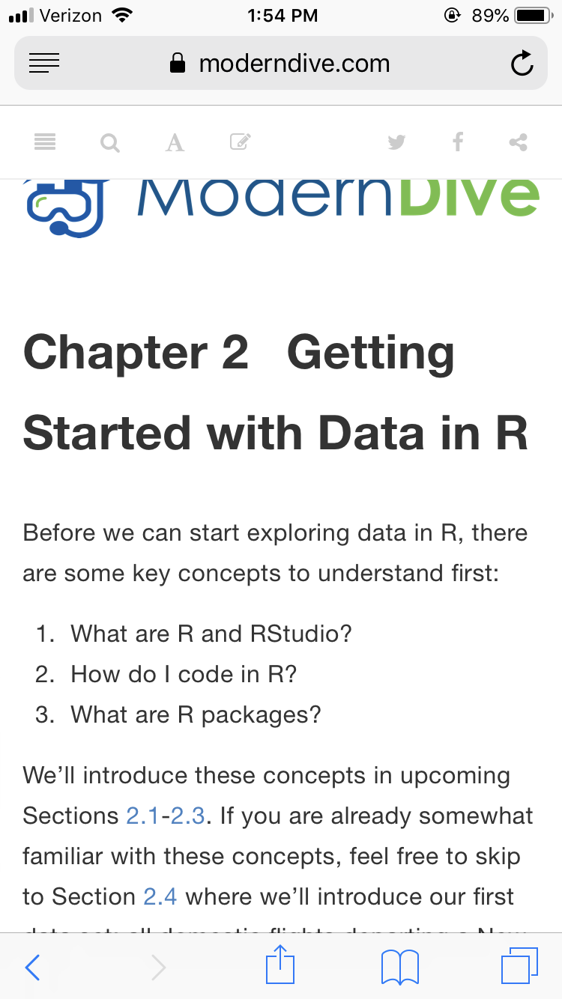
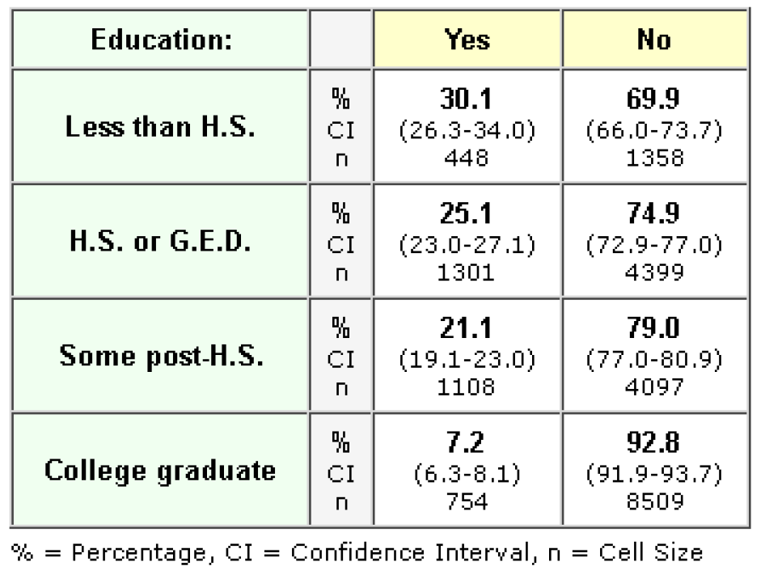
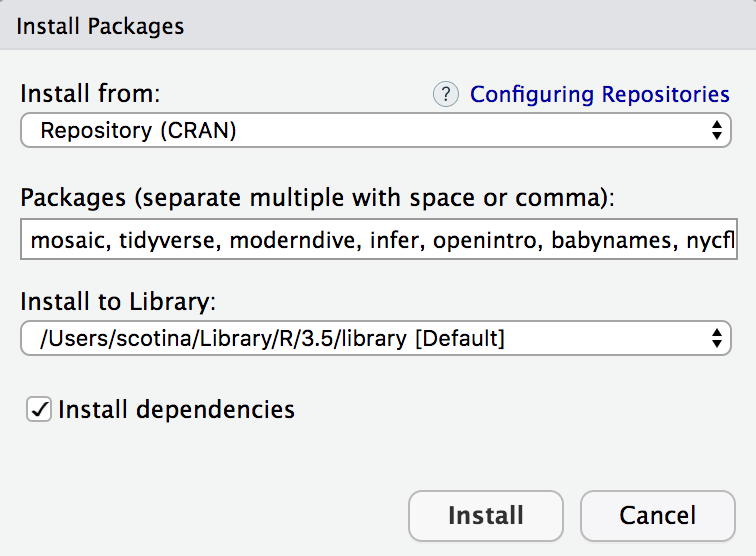
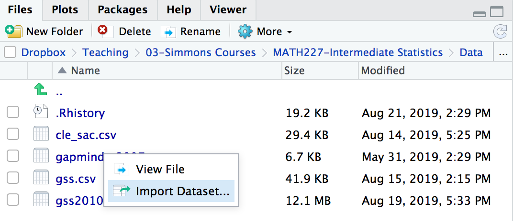
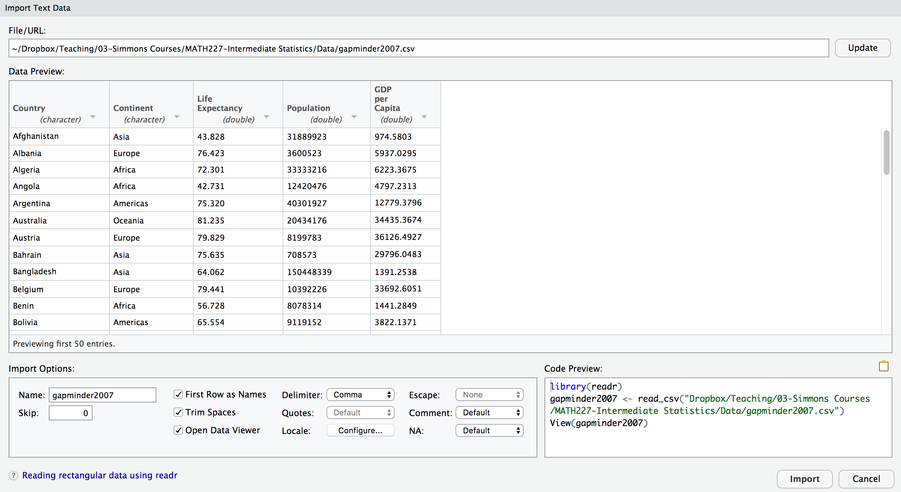

```{r xaringan-themer, include = FALSE}
library(xaringanthemer)
mono_accent(base_color = "#43418A")
```

```{r, include = FALSE}
library(plyr)
library(tidyverse)
library(moderndive)
library(infer)

knitr::opts_chunk$set(warning = FALSE, message = FALSE, 
                      echo = TRUE, dpi = 300)
```

<!--
pagedown::chrome_print("~/Dropbox/Teaching/03-Simmons Courses/STAT227-Statistical Design and Analysis [ONLINE]/Slides/11-Causal_Inference/11-Causal_Inference.html")
-->

class: center, middle, frame

# A Case Study

---

# Sarah the chimp

.pull-left[
- In 1978, researchers Premack and Woodruff published a study in *Science* magazine, reporting an experiment where an adult chimpanzee named Sarah was shown videotapes of eight different scenarios of a human being faced with a problem.

- After each videotape showing, she was presented with two photographs, one of which depicted a possible solution to the problem.

- Sarah could pick the photograph with the correct solution for seven of the eight problems!
]

.pull-right[

]

---

# How?!

What are **two possible explanations** for Sarah getting 7 correct answers out of 8?

--

1. Sarah was just guessing and got lucky. 

2. Sarah can do better than just guessing. 

--

**Which explanation do you think is better?**

--

- I think explanation (1) is better. How can you convince me that (1) is *not* the better explanation?

---

# Refuting Explanation (1)

Let's try to look at what Sarah's results would be, **if she just guessed**. 

- What is a simple way to *model* guessing between two choices?

--
.center[
```{r, echo = FALSE, out.width = "25%"}
knitr::include_graphics("coin_flip.png")
```
]
--

Let's define "heads" as a *correct answer* and "tails" as an *incorrect answer*. 

- If Sarah were just guessing ("flipping a coin"), what would be the **expected** number of correct guesses ("heads")?

---

# Simulating Guessing

If Sarah were just guessing, we would *expect* the number of correct guesses to be 4. 

- However, not every set of 8 coin tosses will result in 4 heads. 

- Let's repeat the set of 8 coin tosses many times, to generate the pattern for correct answers that could happen in the long run, **under the assumption that Sarah is just guessing**. 

--
.center[
```{r, echo = F, message = F, warning = F, out.width = "45%"}
obs.data <- c(rep("correct", 7), rep("incorrect", 1)) %>%
  as_data_frame() %>%
  rename(guess = value)

obs.data %>%
  specify(response = guess, success = "correct") %>% 
  hypothesize(null = "point", p = 0.5) %>% 
  generate(reps = 1000) %>% 
  calculate(stat = "prop") %>%
  visualize(obs_stat = 7/8, direction = "right") +
  labs(x = "Proportion of correct answers", y = "Count") +
  ggtitle("")
```
]

---

# What do you notice?

The **distribution** of the rate of correct answers, **under the assumption that Sarah was guessing**, is centered at 0.50 (50%, or 4 correct answers out of 8). 

- The red line indicates the **observed proportion** of correct answers, 7 out of 8 (87.5%). 

The majority of the distribution lies between 0.25 and 0.75. 

- This means that, if Sarah were actually guessing, then it would be *highly unlikely* to observe 7 out of 8 correct answers. 

- Thus, we are fairly convinced that Sarah is doing better than just guessing. 

--

**What if Sarah got 5 correct answers out of 8 instead?** Would we still be convinced of Sarah's ability to do better than guessing?

---

class: center, middle, frame

# Course Introductions

---

# Who am I?

[Anthony Scotina](https://scotinastats.rbind.io)

- Email: [anthony.scotina@simmons.edu](anthony.scotina@simmons.edu)

- Website: [https://scotinastats.rbind.io/](https://scotinastats.rbind.io/)

- Graduated with a Ph.D. in [Biostatistics](https://www.brown.edu/academics/public-health/biostats/home) from Brown University in 2018

- Second year as an Assistant Professor of Statistics

- Hobbies include **R**, and that's it. I don't like anything else.  
    
---

# Where are you?

Statistical Design and Analysis!

**Some information**

Our textbooks:

1. **ModernDive**: Statistical Inference via Data Science
    - Webpage: [https://moderndive.com](https://moderndive.com)
    - Cost: $0
    
2. **Learning Statistics with R**
    - Webpage: [https://learningstatisticswithr.com/book/](https://learningstatisticswithr.com/book/)
    - Cost: $0
    
3. **OpenIntro Statistics**
    - Webpage: [https://www.openintro.org/stat/textbook.php?stat_book=os](https://www.openintro.org/stat/textbook.php?stat_book=os)
    - Cost: $0
    
4. Other sources may be used throughout the semester.

---

# ModernDive 

.center[
```{r, echo = FALSE, out.width = "65%"}

```
]

---

class: center, middle, frame

# Getting Started

---

# More Case Studies

**Smoking in Massachusetts by Education Level**

*Adults who are current smokers*

```{r, echo = FALSE, out.width = "50%"}

```

---

# More Case Studies

**Smoking in Massachusetts by Education Level**

**Research Question**
In the population of all adult Americans, does the fraction that smoke vary significantly by level of education?

**Statistical Issues**
Can the observed difference in smoking rates be attributed to chance?

**Scope of Inference**
To what extent can we generalize the results of our analysis?

---

# More Case Studies

**The Impact of an Influenza Vaccine on the Incidence of Upper Respiratory Illness**

In 1994 researchers in Minnesota conducted a randomized, double-blind, placebo-controlled trial of vaccination against influenza in healthy, working adults. The results were published in the *New England Journal of Medicine*. 

*Two variables*

1. Number of upper respiratory illness (URI) episodes

2. Group (placebo or vaccine)

---

# More Case Studies

**The Impact of an Influenza Vaccine on the Incidence of Upper Respiratory Illness**

**Research Question**
For healthy Minnesotans, is there a significant causal relationship between the presence or absence of a influenza vaccine and the number of upper respiratory infections (and other response variables)?

**Statistical Issues**
What is the magnitude of the difference in the number of URIs between the placebo and the vaccine subjects?
Can the observed difference be attributed to chance?

**Scope of Inference**
To what extent can we generalize the results of our analysis? Does our analysis establish a causal connection between the provision of an influenza vaccine and the number of URIs?

---

# Course Objectives

These case studies are examples of **comparative studies**, where we want to make explicit the relationship between:
- an **outcome/response** variable *y*, also called the **dependent variable**, and
- an **explanatory** variable *x*, also called an **independent variable** or **covariate**

--

**Outcome/Response** variables: 
- Number of upper respiratory illness (URI) episodes (*numerical*)
- Smoking status (yes or no, *binary categorical*)

**Explanatory** variables
- Education level (*ordinal categorical*)
- Vaccine status (yes or no, *binary categorical*)

--

The *type of outcome and explanatory variables* in a study change the type of statistical analysis we perform!

---

# Course Objectives

In order to foster a conceptual understanding of statistics, use **real data** whenever possible.

**How can we do this?**

- Two engines:
    1. Mathematics: formulas, approximations, probability theory, etc.
    2. Computing: simulations, random number generating, etc.
  

- In *this* class:
    - Less of (1)
    - More of (2)

---

# The "Engine"

.center[
```{r, echo = FALSE, out.width = "50%"}
knitr::include_graphics("rstudio.png")
```
]

---

# What's going on in this graph?

**1.** [Internet Privacy Policies](https://www.nytimes.com/2020/01/02/learning/whats-going-on-in-this-graph-internet-privacy-policies.html)

<br>

**2.** [Ride-Hailing Services](https://www.nytimes.com/2019/10/31/learning/whats-going-on-in-this-graph-nov-6-2019.html)

<br>

**3.** [Change in Working Age](https://www.nytimes.com/2019/09/19/learning/whats-going-on-in-this-graph-sept-25-2019.html)

<br>

- What do you **notice**?

- What do you **wonder**?

- Write a **catchy headline**!

---

class: center, middle

# Getting Started with Data and R

---

# Using R Studio

1. Open **R Studio** (never open **R**). 

2. In the menu bar at the top of your screen: **File** -- **New File** -- **New Script**

.center[
```{r, echo = FALSE, out.width = "75%"}
knitr::include_graphics("r-window.png")
```
]

---

# The R Studio Window

.center[
```{r, echo = FALSE, out.width = "50%"}
knitr::include_graphics("r-window.png")
```
]

**The Four Panels**:

1. **Console** (bottom-left): This is where you can perform simple calculations or run/execute commands. 
    - Either type code directly into the console, or run from a the *editor*...
2. **Editor** (top-left): This is where you can save and edit *R code* and *text* into a **script** or **R Markdown files**.
    - Save all of your code in a script (.R) or R Markdown (.Rmd) files!!!
3. **Files, Packages, Help, Plots** (bottom-right): See your files, packages, help screens, and plots (more in a few...).
4. **Environment** (top-right): Your current workspace (more in a few...).

---

# Before we get started...

Don't worry. This class does not require you to have experience with computer programming, nor is this a computer science class. 

- "Should all statistics students be programmers? **No!**"

- "Should all statistics students program? **Yes!**"
    - Hadley Wickham, Chief Scientist at R Studio
    
--

Learning R is almost like learning a **new language**. It's difficult, but *incredibly rewarding*. 

- You will learn tools that *actual* statisticians and data scientists use in the **real world**!

---

# Basic Programming Concepts

**Vectors**: a series of values, created using the `c()` command. 
- Type
    ```{r, eval = FALSE, comment = ""}
    c(10, 12, 13, 14, 13, 29)
    ```

    into the **console** (bottom-left) and press "Enter".
- Type 
    ```{r, eval = FALSE, comment = ""}
    c(10, 12, 13, 14, 13, 29)
    ```

    into your **script** (top-left) and click "Run" *while your cursor is on the same line*.
    
Think of `c()` as standing for "*concatenate*" or "*combine*".
    
---

# Basic Programming Concepts

- Type 
    ```{r, eval = FALSE, comment = ""}
    c("A", "B", "C", "D", "E")
    ```

    into your **script** and click "Run".
- Type 
    ```{r, echo = TRUE, eval = FALSE, comment = ""}
    c(A, B, C, D, E)
    ```

    into your **script** and click "Run". What happened?
    
--

Make sure any **character** variable (e.g., non-numerical) is surrounded by *quotation marks*! 

--

**Pro-tip**: Press [command] + [return] (Mac) while your cursor is on the same line as your code, and the line will run!

---

# Basic Programming Concepts

**Functions**: take inputs (called *arguments*) and return *outputs*. 
- Example: Type 
    ```{r, eval = FALSE}
    mean(c(10, 12, 13, 14, 13, 29))
    ```

    into your **script** and click "Run". 
    
- Now run the following three lines:
    ```{r, eval = FALSE}
    sd(c(10, 12, 13, 14, 13, 29))
    ```
    ```{r, eval = FALSE}
    median(c(10, 12, 13, 14, 13, 29))
    ```
    ```{r, eval = FALSE}
    summary(c(10, 12, 13, 14, 13, 29))
    ```

---

# Basic Programming Concepts

**Assignment**: Let's *assign* the vector `c(10, 12, 13, 14, 13, 29)` to a variable, so we don't have to keep typing it out. 
- Type 
    ```{r, eval = FALSE}
    enrollment = c(10, 12, 13, 14, 13, 29)
    ```

    and click "Run".
    
    - **Note**: The symbol `<-` also works in place of `=`, so you can use *either* for assignment. 

--

- You might think nothing happened after that last example. But look to the **Environment** panel (top-right). 
    - R Studio now recognizes the list of numbers as stored in an **object** called **enrollment**. 
    - Type 
        ```{r, eval = FALSE}
        mean(enrollment)
        ```
    
        and click "Run".

---

# Arithmetic

At its core, R Studio can act as a simple calculator:
- `+` : addition
- `-` : subtraction
- `*` (shift + 8) : multiplication
- `/` : division
- `^` (shift + 6) : exponent

--

Run the following equations:
- `2+2`
- `753-342`
- `359*315`
- `118/21`
- `5^3`
- `8/2*(2+2)`
- `8/(2*(2+2))`

---

# Tips on Learning to Code

**Copy, paste, and tweak**

- Rather than writing code from *scratch*, take existing code that *definitely works* and modify it to suit your needs. 

--

**Learn by doing**

- Like a foreign language, the best way to learn to code is by *coding*! We will be coding in every class, and you will do some coding in all assignments and exams. 

--

**Practice makes perfect**

- Practice!!!

---

# R Packages

We will be using **R packages** extensively.
- R is *open-source*, which means that members in the community can provide additional functions, data, or documentation in a *package*. 
- Packages are *free* and can be easily downloaded. 

--

**Downloading packages in R Studio**

- **Packages** tab (bottom-right) -- **Install** -- Type package name and press *Install*
- Install the following packages (separate by a comma when typing the names):
    - `mosaic`, `skimr`: packages for data analysis
    - `tidyverse`: set of packages for data visualization and organization
    - `moderndive`: package that accompanies one of the course textbooks
    - `infer`: package for statistical inference
    - `openintro`, `babynames`, `nycflights13`: packages with useful datasets
    - `devtools`: helps with installing some independent packages
    
---

# R Packages

.center[
```{r, echo = FALSE, out.width = "50%"}

```
]

**Note**: Once you install a package, you never have to again!

- But, you have to *load* them every time you open R Studio. 
- To load a package, use the `library` function. Run the following:
```{r, echo = TRUE, eval = FALSE}
library(tidyverse)
library(nycflights13)
```

---

# Using R Packages

One of the most common **error messages** for new R users is some variant of the following:

```
Error: could not find function
```

Chances are, this is because you are using a function from a package **that hasn't been loaded**. 

- *Always* load packages when you start R, before you do anything else!

---

# Data Frames

**Data frames**:  analogous to rectangular spreadsheets you would see in Excel or Google Spreadsheets. 
- Rows of a data frame correspond to *observations*, and columns correspond to *variables*. 

---

# `nycflights13` Package

This package contains five data sets saved in five separate data frames with information about all domestic flights departing from New York City in 2013:

1. `flights`: Information on all 336,776 flights
2. `airlines`: A table matching airline names and their two letter IATA airline codes (also known as carrier codes) for 16 airline companies
3. `planes`: Information about each of 3,322 physical aircrafts used.
4. `weather`: Hourly meteorological data for each of the three NYC airports. 
5. `airports`: Airport names, codes, and locations for 1,458 destination airports.

---

# `flights` Data Frame

Run the following:

```{r, echo = F}
library(nycflights13)
```

```{r, comment = ""}
flights
```

---

# `flights` Data Frame

A few notes on this dataset...

- A "tibble" is a type of data frame in R. The `flights` data frame has:
    - 336,776 **rows**
    - 19 **columns**
    
- The 19 columns correspond to 19 different **variables**. Some of which are: *year*, *month*, *departure time*, *arrival time*, *carrier*, *origin*, etc.

- By default, we are shown the first 10 rows, since the rest can't fit on the screen. 

---

# Exploring Data Frames

There are many ways to explore a data frame besides what we just accomplished. One of which is through the `View` function. 
- Run the following:
```{r, echo = TRUE, eval = FALSE}
View(flights)
```

- **Note**: R is *case sensitive*. So make sure you use an uppercase "V" in `View`, rather than `view`. 

---

# Exploring Variables

The `$` operator allows us to explore a single variable within a data frame. For example, run the following in your console:
```{r, eval = FALSE}
airlines
```

```{r, eval = FALSE}
airlines$name
```

```{r, eval = FALSE}
airlines$carrier
```

- The `$` extracts only the `name` variable from the `airlines` data frame and returns it as a **vector**. 

---

# Exploring Variables

We can use the `$` operator to calculate descriptive statistics for variables within a dataset:

```{r, comment = ""}
mean(flights$distance)
```

--

We can also use the `mosaic` R package to code this slightly differently:

```{r, comment = "", message = FALSE, warning = FALSE}
library(mosaic)
mean( ~ distance, data = flights)
```

---

# Help Files

You can get help in R by entering a `?` before the name of a function or data frame, and a page will appear in the bottom-right panel. 
- Try the following:
```{r}
?flights
```

I use the help files **all the time**, and you should too, especially if you're stuck with a specific function!

---

class: center, middle

# Importing Datasets

---

# Importing Datasets

The `flights` dataset was included in the `nycflights13` R package. 
- As long as you load the package, the dataset is automaticaly available. 

But *sometimes*, datasets are not included in packages and must be **imported** separately. 

- A simple way to import data is to use the **Files** tab in the *bottom-right* panel in R Studio. 

--

First, download the `gapminder_2007.csv` file from the online campus, and save it in a folder called **Data**. 

---

# Importing Datasets

Next, click on **Files** in the bottom-right panel, and find the data file you just downloaded. 

```{r, echo = FALSE}

```

---

# Importing Datasets

You might have to click **Update** on this screen if you don't see anything in the main window. 

```{r, echo = FALSE, out.width = "70%"}

```

---

# Importing Datasets

```{r, echo = FALSE, message = FALSE}
gapminder2007 <- read_csv("~/Dropbox/Teaching/03-Simmons Courses/STAT227-Statistical Design and Analysis/Data/gapminder2007.csv")
```

```{r, comment = ""}
gapminder2007
```

---

# Importing Datasets

```{r, comment = ""}
mean(gapminder2007$lifeExp)
```

```{r, comment = ""}
sd(gapminder2007$lifeExp)
```

---

# One more thing...

Run the code below. You'll thank me later. 

```{r, eval = FALSE}
devtools::install_github("melissanjohnson/pupR")
pupR()
```

.center[
```{r, echo = FALSE, out.width = "30%"}

```
]


