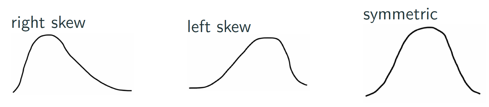

```{r setup, include=FALSE}
knitr::opts_chunk$set(message = FALSE, warning = FALSE)
```

```{r xaringan-themer, include = FALSE}
library(xaringanthemer)
mono_accent(base_color = "#43418A")
```

```{r, include = FALSE}
library(nycflights13)
library(mosaic)
library(openintro)

knitr::opts_chunk$set(warning = FALSE, message = FALSE, 
                      echo = TRUE, dpi = 300)
```

# Needed Packages

```{r}
library(nycflights13)
library(mosaic)
library(skimr)
library(tidyverse)
```

---

# Exploratory Data Analysis (EDA)

EDA should *always* be a first step in data analysis or modeling. 

**Three approaches**:

1. Just look at the "raw" data in a spreadsheet. 
    - We already do this using `View()`!
    
2. Computing **summary statistics**, such as the *mean*, *median*, and *standard deviation*. 
    - In R: `mean()`, `median()`, `sd()`, and *many others*

3. Creating **data visualizations**. 

---

# Exploratory Data Analysis (EDA)

From *R for Data Science*, by Grolemund and Wickham (2017):

> EDA is not a formal process with a strict set of rules. More than anything, EDA is a state of mind. During the initial phases of EDA you should feel free to investigate every idea that occurs to you. Some of these ideas will pan out, and some will be dead ends. As your exploration continues, you will home in on a few particularly productive areas that you’ll eventually write up and communicate to others.

---

# 'Raw' Data

```{r, eval = FALSE}
View(flights)
?flights
```

--

**Some variables of interest**

`dep_delay`: **Numerical** variable that measures the depature delay, in minutes, of flights leaving New York in 2013

`carrier`: **Categorical** (nominal) variable consisting of two letter carrier abbreviations

`dest`: **Categorical** (nominal) variable consisting of the destination for each flight, using a city abbreviation


---

class: center, middle, frame

# Summary Statistics 

---

# Measures of Center

Here are the metabolic rates for 8 individuals taking part in a study of dieting: $$1792, 1669, 1362, 1614, 1460, 1867, 1439, 1870$$

The **mean** is the *sum* of all of the observations divided by the *sample size*: $$\bar{x}=\frac{1}{n}\sum_{i=1}^{n}x_{i}=\frac{1792+1669+\cdots+1870}{8}=1634.125\ cal/24hrs$$

---

# Measures of Center

Here are the metabolic rates for 8 individuals taking part in a study of dieting: $$1792, 1669, 1362, 1614, 1460, 1867, 1439, 1870$$

The **median** represents the *50th percentile*, or the middle observation in an **ordered dataset**. 
- If there is an *even* number of observations, the median is the *average of the two middle values*. 

- What is the median in this dataset?

---

# Robustness

The **mean** and **median** are each measures of *center* in a distribution for a numerical variable. 

- The median is a **robust** measure of center; it is *not* sensitive to extreme skewness or outliers. 

- The mean is **non-robust** and is quite sensitive to extreme skewness or outliers. 

.center[
```{r, echo = FALSE}

```
]

---

# Skewness

**Incomes of 42 patrons in a coffee shop**

.center[
```{r, echo = FALSE, out.width = "50%"}
set.seed(12)

sal_symmetric = rnorm(40, mean = 65000, sd = 2000)
sal_skewed = c(sal_symmetric, 225000, 250000)

histPlot(sal_skewed, xlab = "Income", ylim = c(0,12), 
         breaks = seq(0, 260000, by = 1000), col = COL[1], 
         axes = TRUE, xlim = c(0,260000), ylab = "Count")
```
]
$$\bar{x}=\$72,991.87,\quad m=\$64,533.51$$

---

# Skewness

**Incomes of 42 patrons in a coffee shop** (outliers removed)

.center[
```{r, echo = FALSE, out.width = "50%"}
set.seed(12)

sal_symmetric = rnorm(40, mean = 65000, sd = 2000)
sal_skewed = c(sal_symmetric, 225000, 250000)

histPlot(sal_symmetric, xlab = "Income", ylim = c(0,12), col = COL[1], 
         axes = TRUE, ylab = "Count")
```
]
$$\bar{x}=\$64,766.46, \quad m=\$64,460.32$$

---

# Measures of Spread

**Range**: *maximum* - *minimum*

**Interquartile Range (IQR)**: *third quartile* - *first quartile*
- The *first quartile* is the *25th percentile* of an ordered dataset. 
- The *third quartile* is the *75th percentile* of an ordered dataset. 

**Standard Deviation**: $s=\sqrt{\frac{1}{n-1}\sum_{i=1}^{n}(x_{i}-\bar{x})^{2}}$

**Variance**: $s^{2}=\frac{1}{n-1}\sum_{i=1}^{n}(x_{i}-\bar{x})^{2}$

From the coffee shop data:

.center[
```{r, echo = FALSE}
summary.data = data.frame(range = c(188995.30, 8139.36), IQR = c(2192.38, 2135.86), SD = c(37373.69, 1782.09))
row.names(summary.data) = c("With Outliers", "Without Outliers")
knitr::kable(summary.data, format = "html", row.names = TRUE)
```
]

---

# Properties of Standard Deviation

1. $s$ is a measure of spread around the *mean*, and should be used when the mean is selected as the best measure of center. 

2. Roughly, the standard deviation can be thought of as the average distance of the observations from the mean.

3. Like the mean, $s$ is non-robust; a few outliers can make $s$ very large. 

4. The units for $s$ are the same as the data. 

---

# Standardized (Z) Scores

You can use the mean and standard deviation together to compare observations *between different sets of variables* using a z-score. 

> One national test has a unimodal and symmetric distribution with a mean of 500 and a standard deviation
of 100, while a second test has a unimodal and symmetric distribution with a mean of 18 and a standard deviation
of 6. A student scored 677 on the first test and 29 on the second. Relative to the respective
distributions, which score is better?

--

A **z-score** for an individual is defined as $$z=\frac{x-\bar{x}}{s}$$

What are the z-scores for the student's two test scores? Is the score of 677 actually *better*?

---

class: center, middle, frame

# Summary Statistics (with R)

---

# Summarizing Qualitative (Categorical) Data

The `tally` function in the `mosaic` package gives a count of each level of a categorical variable:
```{r, comment = ""}
tally( ~ carrier, data = flights)
```

--

If you add `format = "proportion"`, R will give **proportions** rather than **counts**. 

```{r, comment = ""}
tally( ~ origin, format = "proportion", data = flights)
```

---

# Summarizing Quantitative (Numerical) Data

There are many functions in both **base** R and the **mosaic** package that can give numerical summary statistics (`mean`, `sd`, `median`, `min`, `max`, etc.)

- The purpose of each of these functions is given in their name!
    
The `favstats` function from the `mosaic` package gives *all* of these summary statistics in one line:
```{r, comment = ""}
favstats( ~ dep_delay, data = flights)
```

---

# Summarizing by Groups

Summary statistics for departure delays are not very useful on their own. 
- Departure delays may depend on the airline, destination, temperature, etc.
    
It is often useful to calculate summary statistics **by group**. Luckily we can accomplish this with a small adjustment to `favstats`:
```{r, comment = "", eval = FALSE}
delay_summary = favstats(dep_delay ~ carrier, data = flights)
View(delay_summary)
```

--

Notice the *syntax* of the `mosaic` package functions when a *grouping variable* is involved: 

.center[
```{r, eval = FALSE}
function_name(y ~ x, data = DATA_NAME)
```
]

- The *y* is an **outcome** variable of interest.
- The *x* is an **explanatory** (*grouping*) variable.

We'll see syntax similar to this throughout the course. 


---

# Summarizing by Groups

```{r, echo = FALSE, comment = ""}
favstats(dep_delay ~ carrier, data = flights)[1:10,]
```

**What do we notice?**

- **Frontier Airlines** (code F9) has the *highest average departure delay* (in minutes). 
- Most of the *average* departure delays by carrier are much larger than the *medians*. 
    - Departure delays are typically very **right-skewed**. 

---

# Summary Statistics using `skim()`

In addition to the previous function, we can use the `skim()` function from the `skimr` package:

```{r, eval = FALSE, comment = ""}
skim(flights)
```

**Note**: `p0`, `p50`, and `p100` are the *minimum*, *median*, and *maximum* values, respectively. 

---

# Practice

**Now it's your turn!**

1. Use `favstats()` or `skim()` to calculate summary statistics for **arrival delay** separated by carrier. Do you notice anything different from *departure delays*?

2. Using `tally()` find the most frequent **destination** of flights leaving New York in 2013. 

---

# Single Summary Statistics

If you need a single summary statistic, rather than the *set of statistics* given by `summary()`, `favstats()`, or `skim()`, there are functions for that!

```{r, comment = ""}
mean( ~ distance, data = flights)
sd( ~ distance, data = flights)
median( ~ distance, data = flights)
IQR( ~ distance, data = flights)
```

---

# Single Summary Statistics (by group)

```{r, comment = ""}
mean(distance ~ origin, data = flights)
sd(distance ~ origin, data = flights)
median(distance ~ origin, data = flights)
IQR(distance ~ origin, data = flights)
```

---

class: middle, center, frame

# Data Visualization (with R)

---

# Scatterplots

**Scatterplots**, also called **bivariate plots**, allow you to visualize the relationship between two *numerical* variables. 

--

Let's take another look at the `flights` dataset from the `nycflights13` package. 
- **Question**: What do you think is the relationship between flight **departure delay** and **arrival delay**?
    - If a flight is *delayed*, does it *arrive* at a later time than planned? Or does the flight speed up to accommodate?
    
--

I traveled to Denver, CO last year for a conference using **Frontier Airlines**. So let's `filter` the flights dataset to look at only Frontier Airlines flights:
- carrier code: **F9**
```{r}
frontier = filter(flights, carrier == "F9")
```

---

# Scatterplots

Using the `mosaic` package:

```{r, warning = FALSE, out.width = "50%"}
gf_point(arr_delay ~ dep_delay, data = frontier)
```

---

# Scatterplots

```{r, warning = FALSE, out.width = "50%"}
gf_point(arr_delay ~ dep_delay, data = frontier) + 
  labs(x = "Departure Delay (in mins)", "Arrival Delay (in mins)")
```

---

# Scatterplots

```{r, eval = FALSE}
gf_point(arr_delay ~ dep_delay, data = frontier) + 
  labs(x = "Departure Delay (in mins)", "Arrival Delay (in mins)", 
       title = "Relationship between Departure and Arrival Delay", 
       subtitle = "Flights leaving NYC in 2013, Frontier Airlines")
```

**Some notes on syntax**

- `arr_delay ~ dep_delay` follows the `y ~ x` **formula syntax**
    - Specify `data = ...` so R knows which dataset the two variables come from. 
    
- The `labs()` *layer* specifies different **labels**. The labels must be surrounded by **quotation marks**. 
---

# A Note on Overplotting

Go back to the original scatterplot of `dep_delay` versus `arr_delay`. There is a large cluster of points near 0, indicating no delays in departure or arrival of the flight. 

**The problem**: It is difficult to tell how many points are plotted when there are many clustered around the same values!

--

**The solution**: Change the *transparancy* of the points by using `alpha`:
```{r, warning = FALSE, eval = FALSE}
xyplot(arr_delay ~ dep_delay, alpha = 0.2, data = frontier)  + 
  labs(x = "Departure Delay (in mins)", "Arrival Delay (in mins)", 
       title = "Relationship between Departure and Arrival Delay", 
       subtitle = "Flights leaving NYC in 2013, Frontier Airlines")
```

- By default, the `alpha` option is set to `1`.
    - `alpha = 1` means 100% opaque. 
    - `alpha = 0` means 100% transparent. 
    
---

# Practice

Repeat the previous exercise (i.e., construct a scatterplot of `arr_delay` versus `dep_delay`), but do it for a **different airline**. 

This includes using the `filter()` function from several slides back to select only rows in `flights` that match your airline of choice. 

**Hint**: Check this dataset for carrier codes:

```{r, eval = FALSE}
View(airlines)
```

---

# Histograms

**Histograms** provide a visualization of the *distribution* of a single *numerical* variable. 
- You need only specify an `x` variable in a histogram. 
- By default, the `y` variable is *count*. 

--

Suppose we are interested in the *distribution* of hourly temperature recordings in New York. 

**Histograms** share the following information:
- What is the smallest and largest temperatures, and how often are they observed?
- What is the "center" temperature?
- How are the temperatures spread out?
- What are frequent and infrequent values?
- Is there any skewness?

---

# Histograms

```{r, warning = FALSE, message = FALSE, out.width = "50%"}
gf_histogram( ~ temp, data = weather)
```

---

# Histograms

.pull-left[
```{r, warning = FALSE, message = FALSE, echo = F, eval = T}
gf_histogram( ~ temp, data = weather)
```
]

.pull-right[
What do we notice about the histogram?

- The **middle** temperatures are around 55-60 degrees Fahrenheit. 
- The **range** is from ~10 degrees to ~100 degrees. 
- There are **two prominent peaks** at ~30 degrees and ~70 degrees. 
    - What do you think could account for these two peaks?
]

---

# Changing the color of histograms

The `fill` argument changes bar (fill) color in the histogram. 

- Try running this!
```{r, eval = FALSE, echo = TRUE}
gf_histogram( ~ temp, data = weather, fill = "dodgerblue")
```

- R has **many colors**. See [this](http://www.stat.columbia.edu/~tzheng/files/Rcolor.pdf). 

---

# Practice

Construct a histogram for `humid` (humidity). As an added bonus, try to improve the *x*-axis label!

--

**Solution**

```{r, echo = TRUE, eval = FALSE}
gf_histogram( ~ humid, data = weather) + 
  labs(x = "Relative Humidity")
```

---

# Density Plots

**Density Plots** are an alternate way to visualize the distribution of a single *numerical* variable. 

- Rather than grouping observations into **bins**, a density plot is a single continuous curve over the entire set of observations. 

- The *y*-axis is **density**, and the *area under the curve* totals to 1. 

In `mosaic`, we can create density plots using the `gf_density()` function:

```{r, eval = FALSE}
gf_density( ~ temp, data = weather)
```

---

# Density Plots (by group)

You can have different density plots in the same plot window by adding in the `groups` option. 

Let's create 12 density plots of `temp`, one for each `month`:

```{r, eval = FALSE}
gf_density( ~ temp, groups = month, auto.key = TRUE, data = weather)
```

**Note**: This plot might not be ideal for more than several groups...

---

# Boxplots

**Boxplots**, like **histograms**, show the *distribution* of a *numerical* variable. 
- However, boxplots are constructed using information provided by a **five-number summary**. 

**Five-number summary**: Minimum, 1st quartile (25th percentile), Median, 3rd quartile (75th percentile), Maximum

As an example, let's look at temperature at the *only the JFK airport* in *November*:
```{r}
jfk_nov = filter(weather, origin == "JFK" & month == 11)
```

---

# Five-Number Summary

In R, a five-number summary of any numerical variable can be found using the `summary()` function:
```{r, comment = ""}
summary(jfk_nov$temp)
```

(Recall that we can use the `$` operator to view individual variables in a data frame!)

The `favstats()` and `skim()` functions also work here!

---

# Boxplots

```{r, echo = F, eval = T, out.width = "65%", message = FALSE}
five_number <- tibble(
  temp = summary(jfk_nov$temp)[c(1,2,3,5,6)]
)
jfk_nov %>% 
  ggplot(mapping = aes(x = factor(month), y = temp)) +
  #geom_boxplot() +
  geom_hline(data = five_number, aes(yintercept=temp), linetype = "dashed") +
  geom_jitter(width = 0.05, height = 0.5, alpha = 0.1) +
  labs(x = "")
```

---

# Boxplots

```{r, echo = F, eval = T, out.width = "65%", message = FALSE}
five_number <- tibble(
  temp = summary(jfk_nov$temp)[c(1,2,3,5,6)]
)
jfk_nov %>% 
  ggplot(mapping = aes(x = factor(month), y = temp)) +
  geom_boxplot() +
  geom_hline(data = five_number, aes(yintercept=temp), linetype = "dashed") +
  geom_jitter(width = 0.05, height = 0.5, alpha = 0.1) +
  labs(x = "")
```

---

# Boxplots

**What does the boxplot tell us?**

In November, at JFK Airport in New York...
- 25% of points fall below the bottom edge of the box, which is the **first quartile** of 37.04 degrees. 
- 75% of points fall above the top edge of the box, which is the **third quartile** of 51.98 degrees. 
- 50% of points fall between the first and third quartiles, or between 37.04 and 51.98 degrees. 
    - This is the **interquartile range (IQR)**. 

---

# Boxplots

**How can we make a boxplot?**

```{r, echo = TRUE, out.width = "50%"}
gf_boxplot( ~ temp, data = jfk_nov) + 
  labs(y = "Hourly Temperature (in degrees F)")
```

---

# Side-by-side Boxplots

Boxplots are more interesting when you compare several side-by-side. 

Let's use the original `weather` dataset to compare `temp` by `month`. 
- Convert `month` from *numerical* to *categorical* using `factor()`

```{r, eval = FALSE, warning = FALSE}
gf_boxplot(temp ~ factor(month), data = weather) + 
  labs(x = "Month", y = "Hourly Temperature (in degrees F)")
```

---

# Side-by-side Boxplots

```{r, echo = FALSE, eval = TRUE, warning = FALSE, out.width = "50%"}
gf_boxplot(temp ~ factor(month), data = weather) + 
  labs(x = "Month", y = "Hourly Temperature (in degrees F)")
```

- The dots representing values falling outside the whiskers are called outliers. These can be thought of as anomalous values.

---

# Practice

```{r, echo = FALSE, eval = TRUE, warning = FALSE, out.width = "50%"}
weather_filter = filter(weather, wind_speed < 1000)
gf_boxplot( ~ wind_speed, data = weather_filter) + 
  labs(y = "Hourly Wind Speed (in mph)")
```

1. What is the **median** hourly wind speed for airports in New York?
2. What is the **IQR**?
3. Are there any outliers?

---

# Practice

1. Using the filtered `frontier` dataset (or the airline that you chose earlier), create a boxplot of `dep_delay`. 

2. Using the same dataset as in (1), create side-by-side boxplots of `dep_delay` by `month`. Do you notice any *seasonal trends* in departure delays?

--

**Solution**

```{r, eval = FALSE}
gf_boxplot(dep_delay ~ factor(month), fill = "chartreuse", data = frontier) + 
  labs(x = "Month", y = "Departure Delay (in mins)")
```

---

# Barplots

**Barplots** provide a visualization of the distribution of a *categorical variable*. 

- The *x*-axis shows *levels* of the categorical variable. 
- The *y*-axis shows a measure of *frequency* of observations within each level. 

--

Let's go back to the `flights` dataset. 
- The `carrier` variable consists of the carrier for each flight, represented by a two-letter abbreviation. 
- The abbreviation meanings are found in the `airlines` dataset. 
```{r, eval = FALSE}
View(flights)
View(airlines)
```

---

# Barplot of `carrier`

Using the `flights` data frame, let's create a barplot of the `carrier` variable. 

```{r, out.width = "50%"}
gf_bar(~ carrier, data = flights)
```

---

# Multiple Categorical Variables

Suppose we want to make different-colored bars for different airports (`origin`). 

```{r}
carrier_origin_counts = tally(origin ~ carrier, data = flights)
carrier_origin_counts
```

---

# Multiple Categorical Variables

Suppose we want to make different-colored bars for different airports (`origin`). 

- Here, we're "mapping" the *fill* characteristic to the `origin` variable.

```{r, out.width = "45%"}
gf_bar( ~ carrier, fill = ~ origin, data = flights)
```

---

# Flip Axes

```{r, out.width = "50%"}
gf_bar( ~ carrier, fill = ~ origin, data = flights) + 
  coord_flip()
```

---

# Pie Charts

.pull-left[
```{r, echo = FALSE}
knitr::include_graphics("laughing_emoji.jpeg")
```
]

.pull-right[

]

---

# Pie Charts

```{r, echo = FALSE, out.width = "50%"}
carrier_counts = tally( ~ carrier, data = flights)
pie(carrier_counts, col = RPMG::rainbow.colors(16))
```

---

# Why are pie charts bad?

Humans have trouble judging angles!
- For example, we tend to *overestimate* angles greater than 90 degrees, and *underestimate* angles less than 90 degrees (Naomi Robbins, 2013). 

--

Try to answer the following about the pie chart on the previous slide:

- How much larger the portion of the pie is for ExpressJet Airlines (`EV`) compared to US Airways (`US`)?

- What the third largest carrier is in terms of departing flights?

- How many carriers have fewer flights than JetBlue Airways (`B6`)?

--

**Barplots** can answer all of these questions, and more!
- Pie charts only show pieces out of 100%. 

---

# Pie Charts
**The Aquaman of data visualization**

```{r, echo = FALSE, out.width = "75%"}

```

---

# Pie Charts
But...

.center[

]

---

# Pie Charts

**The Batman (Ben Affleck version) of data visualization**

```{r, echo = FALSE, out.width = "75%"}

```

---

# Summary

**Exploratory data analysis (EDA)** should always be the *first step* in any data analysis. 

- View the **raw data**. 

- Generate **summary statistics**. 

- Create **visualizations**. 

--

There is no *single set of rules* to perform EDA, and which summary statistics and visualizations to report is up to the researcher. 

- Though depending on the **research question**, the **types of variables**, and the **distribution** of observations, some summary statistics and visualizations are better to report than others. 

--

Though there is **one type of graph** that is *always bad to use*...

---

# Summary

.center[
```{r, echo = FALSE, out.width = "50%"}
pie(carrier_counts, col = RPMG::rainbow.colors(16))
```

```{r, echo = FALSE, out.width = "10%"}

```
**Pie charts are bad!**
```{r, echo = FALSE, out.width = "10%"}

```
]

