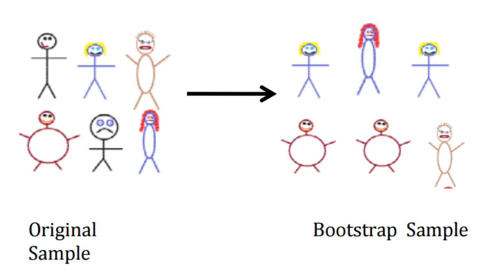
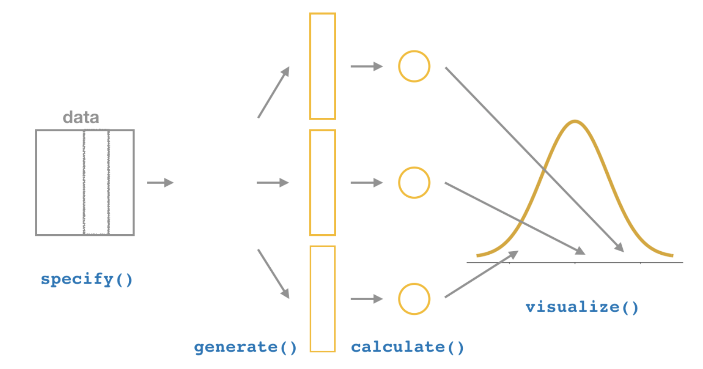

```{r xaringan-themer, include = FALSE}
library(xaringanthemer)
mono_accent(base_color = "#43418A")
```

```{r, include = FALSE}
library(tidyverse)
library(moderndive)
library(infer)
library(mosaic)
library(nycflights13)

knitr::opts_chunk$set(warning = FALSE, message = FALSE, 
                      echo = TRUE, dpi = 300)
```

class: center, middle, frame

# Introduction

---

# Recap

If *sampling* of a sample of size $n$ is done at **random**, then the resulting sample is *unbiased* and **representative** of the **population**. 
- Thus, the **sample statistic** from the representative sample represents a "good guess" of the (unknown) **population parameter**. 

Using the `bowl` data frame in the `moderndive` R package, we used the **sample proportion**, $\hat{p}$, to estimate the **population proportion**, $p$. 

Generally, we will use the *sample* to **infer** about the *population*. 

---

# In reality...

In *most cases*, we don't have the population values like we did with the `bowl` data frame, and we don't take many samples from the population. 

- We only have a single sample of data from a larger population!

While the **sample statistic** represents our single *best guess* at the (unknown) **population parameter**, we would also like to create a *range of plausible values* for the population parameter. 

- This range is called a **confidence interval**. 

--

How do we use a single sample to get some idea of how other samples might vary in terms of their statistic values?

- **Bootstrapping**

---

# Needed Packages 

```{r}
library(mosaic)
library(moderndive)
library(nycflights13)
library(tidyverse)
library(infer)
```

---

class: center, middle, frame

# Bootstrapping

---

# `pennies_sample`

```{r, comment = ""}
pennies_sample
```

--

**Question**: What is the *average year* on US pennies in 2019?

- Can we use the sample of 50 pennies to help answer this question?

---

# Exploratory Data Analysis: Data Visualization

```{r, out.width = "50%", warning = FALSE}
gf_histogram( ~ year, data = pennies_sample)
```

---

# Exploratory Data Analysis: Data Visualization

.pull-left[
```{r, echo = FALSE}
gf_histogram( ~ year, data = pennies_sample)
```
]

.pull-right[
Most of the ages are between 1980 and 2000, though there is a large spike in 2018. 

- If this sample is **representative** of the population of US pennies, we would expect the distribution of *all* pennies' year to have a similar shape. 
]

---

# Exploratory Data Analysis: Summary Statistics

Because we are interested in the **mean** year of *all* US pennies in 2019, let's calculate the **sample mean**, $\bar{x}$, of our 50 pennies using `mean()`:
```{r, comment = ""}
x_bar = mean( ~ year, data = pennies_sample)
```

--

Therefore, our **point estimate** is $\bar{x}=1995.44$. This represents our *best guess* at the **population mean** age of all US pennies, $\mu$. 

---

# The Point Estimate

The point estimate of $\bar{x}=1995.44$ represents a single guess at $\mu$. But what if we'd like another guess?
- For example, using the `bowl` data frame, we took *many samples* and calculated *many sample proportions*. 
- Can we do that here?

--

**No**, because we only have a single sample and *no population data*!

- Luckily, **bootstrapping** allows us to use a *single sample* to generate many different samples that will act as our way of approximating a sampling distribution. 

---

# Sampling Variability

**Why are we interested in this?**

*Every* **sample statistic** has some variability. 
- Suppose you take a random sample of 50 Simmons University students and five are left-handed. 

--

If you take a *different* random sample of 50 Simmons University students, how many would you *expect* to be left-handed?
- Suppose three are left-handed. Is that surprising?
- Would 40 left-handed students out of 50 be surprising?

**Two ways to measure variability**:

1. Theory (Central Limit Theorem, etc.) -- AP/Introductory Statistics
2. **Simulation** (e.g., *bootstrapping*) -- **THIS CLASS**

---

# The Bootstrapping Process

Bootstrapping uses a process of sampling **with replacement** from our original sample to create new bootstrap samples of the **same size** as our original sample.

We can generate a *single bootstrap sample* by using the `rep_sample_n()` function from earlier:
```{r, echo = FALSE}
set.seed(12)
```

```{r, comment = ""}
bootstrap_sample1 = 
  rep_sample_n(pennies_sample, size = 50, reps = 1, replace = TRUE)
```

--

- Notice that `size=50`. This *isn't an arbitrary number*. When bootstrapping, the `size` value will *always be the same as the original sample size*!

- We add a new argument to `rep_sample_n()`, `replace = TRUE`. This means that when a penny is selected for our **bootstrap sample**, it has the chance to be selected *again*. 

---

# Why bootstrap?

Ideally, you are able to take thousands of samples from the same population and obtain an estimate (close to) an *exact* population parameter, and know exactly how much each sample **varies**. 
- **Example**: Taking many samples of red and white balls from a bowl of 2,400 balls

--

But this is **impossible**!
- So we *improvise* and copy our sample many times to **simulate** a population. 

---

# Practice

Using your **bootstrap sample**, perform the following:
- Construct a histogram of `year`. 
- Calculate the sample mean of `year`. 

*Hint*: These are identical calculations to the ones we performed earlier, we are just using the `bootstrap_sample1` data frame here instead of `pennies_sample`. 

---

# Solution

```{r, out.width = "30%"}
gf_histogram( ~ year, data = bootstrap_sample1)
```

```{r, comment = ""}
mean( ~ year, data = bootstrap_sample1)
```

---

# The Bootstrapping Process

Suppose we have a **random sample** of $n=6$ people. 

.center[
```{r, echo = FALSE, out.width = "40%"}

```
]

---

# The Bootstrap Sample

**Bootstrap sample**: Sample *with replacement* from the original sample, using the *same sample size*. 

.center[
```{r, echo = FALSE, out.width = "80%"}

```
]

---

# Taking 6 Bootstrap Samples

You are not limited to a single bootstrap sample. You will likely need *many bootstrap samples* to better understand the variation in pennies' ages between samples. 

Let's take 6 bootstrap samples (using `reps = 6` in `rep_sample_n()`), construct histograms, and generate sample means (**bootstrap statistics**):

```{r}
six_bootstrap_samples =
  rep_sample_n(pennies_sample, size = 50, reps = 6, replace = TRUE)
```

---

# Taking 6 Bootstrap Samples

```{r, out.width = "50%"}
gf_histogram( ~ year, data = six_bootstrap_samples) + 
  facet_wrap( ~ replicate)
```

**Note**: We used the `facet_wrap( ~ replicate)` layer to create separate plots for each `replicate`. 

---

# Taking 6 Bootstrap Samples

```{r, comment = ""}
mean(year ~ replicate, data = six_bootstrap_samples)
```

--

Do you think 6 bootstrap samples is enough?
- We *should* take many more samples, such as 1,000!

Luckily there is a package made specifically to help with this kind of thing: `infer`

---

class: center, middle, frame

# The `infer` Package for Statistical Inference

---

# `infer`

The `infer` package provides a useful resource in building **confidence intervals** and conducting **hypothesis tests** (more on those later). 

There are several *verb-named functions* that build in order. 

.center[
```{r, echo = FALSE, out.width = "30%"}
knitr::include_graphics("infer_hex.png")
```
]

**But first...**

---

# The Pipe Operator `%>%`

Say you want to perform a set of operations on the `flights` data frame:

1. Take `flights`, then...

--

2. `filter` for *only* Jet Blue flights (carrier code "B6"), then...

--

3. `group_by` departure airport (`origin`), then...

--

4. `summarize` the *average flight distance* (`distance`) by departure airport. 

---

# The Pipe Operator `%>%`

Say you want to perform a set of operations on the `flights` data frame:

**Use the pipe operator!** (`%>%`)

```{r, echo = TRUE, eval = TRUE, comment = ""}
flights %>%
  filter(carrier == "B6") %>%
  group_by(origin) %>%
  summarize(mean.distance = mean(distance))
```

(Take STAT 228 this spring for more on `filter()`, `group_by()`, and `summarize()`!)

---

# The Pipe Operator `%>%`

You would read this sequence as:

1. Take `flights`, then...
2. Use this output as the input to the next function, `filter`, then...
3. Use this output as the input to the next function, `group_by`, then...
4. Use this output as the input to the next function, `summarize`.

--

**The starting value will always be the data frame!**

- The sequence of functions that follow will consist of some combination of **verb-named functions** that we will discuss throughout class today. 
- The result will the transformed/modified data frame that you want. For example, 
    - A data frame consisting of only the subset of rows in flights corresponding to Jet Blue flights.
    - A data frame consisting of average flight distance separated by origin. 

---

# Step 1: `specify()`

The `specify()` function is used primarily to choose which variables will be the focus of the statistical inference.
- This is done using the `response = ` argument:

```{r, comment = ""}
pennies_sample %>%
  specify(response = year)
```

---

# Step 2: `generate()` replicates

After `specify()`-ing the main variable of interest, we use `generate()` to generate **bootstrap samples** (i.e., *replicates*) from the original sample. 
- Here, we can easily create 1,000 bootstrap samples:
```{r}
thousand_bootstrap_samples = pennies_sample %>%
  specify(response = year) %>%
  generate(reps = 1000, type = "bootstrap")
```

If you use `View(thousand_bootstrap_samples)`, you will see that there are 50,000 rows! 
- We took 1,000 bootstrap samples, each of size 50. 

---

# Step 3: `calculate()` summary statistics

Once we have 1,000 **bootstrap samples**, we need to calculate a **summary statistic** for each sample. 
- In this example, the *summary statistic* is the **mean**. 
```{r, message = FALSE}
bootstrap_distribution = pennies_sample %>% 
  specify(response = year) %>% 
  generate(reps = 1000, type = "bootstrap") %>% 
  calculate(stat = "mean")
```

--

This generates a data frame with 1,000 rows: each row containing the sample mean of the respective **bootstrap sample**. 
- This set of 1,000 sample means represents a **bootstrap distribution**. 

---

# Step 4: `visualize()` the results

.center[
```{r, echo = FALSE}

```
]

---

# Step 4: `visualize()` the results

```{r, out.width = "50%", warning = FALSE}
visualize(bootstrap_distribution)
```

---

# Comparing `infer` with alternate R code

```{r, eval = FALSE}
# infer pipeline:
pennies_sample %>%
  specify(response = year) %>%
  generate(reps = 1000, type = "bootstrap") %>%            
  calculate(stat = "mean") %>%
  visualize()
```

```{r, eval = FALSE}
# Original workflow
bootstrap_sample = rep_sample_n(pennies_sample, size = 50, reps = 1000, replace = TRUE)
bootstrap_means = mean(year ~ replicate, data = bootstrap_sample)
gf_histogram( ~ bootstrap_means)
```

---

class: center, middle, frame

# Confidence Intervals

---

# Confidence Intervals

A **confidence interval** gives a range of *plausible values* for a population parameter. 
- Using *only* a **sample statistic** to estimate a parameter is like fishing in a murky lake with a spear, and using a confidence interval is like fishing with a net.

.center[
```{r, echo = FALSE, out.width = "50%"}

```
]

---

# Confidence Intervals

Confidence intervals depend on a specified **confidence level**, with...
- *higher* confidence levels corresponding to *wider* confidence intervals, and
- *lower* confidence levels corresponding to *narrower* confidence intervals. 

Common **confidence levels** include 90%, 95%, and 99%.

--

Using the **bootstrap distribution** (i.e., `bootstrap_distribution` from earlier), there are two ways we can obtain a confidence interval for the population mean age of US pennies:

1. The **percentile method**

2. The **standard error method**

---

# The Percentile Method

The only thing you need to do here is to use the `get_ci()` function from the `infer` package:

```{r, comment = ""}
percentile_ci = bootstrap_distribution %>% 
  get_ci(level = 0.95, type = "percentile") 
# 0.95 and "percentile" are default values
percentile_ci
```

--

The **percentile method** gives us the 2.5th and the 97.5th *percentiles* of the bootstrap distribution. 

- Our range of plausible values for the mean year of US pennies in 2019 is between 1991 and 2000 years, with **95% confidence**. 

---

# Visualizing the CI

A cool thing you can do in R is to use the `visualize()` function to plot the *confidence interval* on top of the bootstrap distribution histogram. 
- Run the following:

```{r, eval = FALSE, warning = FALSE}
visualize(bootstrap_distribution) + 
  shade_ci(endpoints = percentile_ci, 
           color = "hotpink", fill = "chartreuse")
```

---

# The Standard Error Method

Our **bootstrap distribution** is close to symmetric and bell-shaped, or **Normally distributed**. 

If this is the case, we can use a shortcut formula to calculate the lower and upper endpoints of the confidence interval: 
$$\bar{x}\pm (multiplier)\cdot SE$$
where $\bar{x}$ is the **sample statistic** (`x_bar`, obtained earlier), and $SE$ stands for **standard error**, or the *standard deviation of the bootstrap distribution*.
- For a 95% confidence interval, the value of *multiplier* is **1.96**. 

---

# Why 1.96?

For any distribution that is **Normally-shaped**, roughly 95% of the values lie within *two standard deviations of the mean*.

- In the case of a bootstrap distribution, these standard deviations are also **standard errors**. 

Thus for a 95% confidence interval for the **mean**, 95% of values of the bootstrap distribution will lie within $\pm$ 1.96 (or nearly 2) *standard errors* of $\bar{x}$. 

--

In a **Normal distribution**, roughly *68%* of the values lie within *one standard deviation of the mean*. 

- What would the *multiplier* be for a 68% confidence interval?


---

# The Standard Error Method

As with the **percentile method**, we use the `get_ci()` function here. But there are a few slight differences:
```{r, comment = ""}
standard_error_ci = bootstrap_distribution %>% 
  get_ci(level = 0.95, type = "se", point_estimate = x_bar) #<<
standard_error_ci
```

- We have to specify that we want a CI using the **standard error method** (using `type = "se"`). 

- We also have to provide the **point estimate**, which you should calculate beforehand. 

---

# The Standard Error Method

As with the **percentile method**, we use the `get_ci()` function here. But there are a few slight differences:
```{r, comment = ""}
standard_error_ci = bootstrap_distribution %>% 
  get_ci(level = 0.95, type = "se", point_estimate = x_bar)
standard_error_ci
```

- Our range of plausible values for the mean year of US pennies in 2019 is between 1991 and 2000 years, with **95% confidence**. 
    - This is *identical* to the CI obtained using the **percentile method** (b/c the bootstrap distribution is **Normal**)!
    
---

class: center, middle, frame

# Interpreting the Confidence Interval

---

# Interpreting the Confidence Interval

We have done a lot of calculations in this module, but *what does it all mean*?

The purpose of confidence intervals is to provide a range of plausible values for an *unknown* parameter (in this case, the population mean $\mu$). 
- Using the **percentile method**, one such interval is $[1991, 2000]$. 

--

Let's modify `pennies_sample` to **simulate** a population of US pennies.
```{r, comment = ""}
pennies_pop = pennies_sample %>%
  sample_n(10000, replace = TRUE)

mean(pennies_pop$year)
```

--

Thus, $\mu=1995$ (approx.) which *falls in the confidence interval*. 

---

# Using a new `pennies_sample`

We can use the `infer` pipeline to re-do the entire set of exercises today, but using a *new* sample of pennies from the `pennies` data frame:
```{r, echo = FALSE}
set.seed(45)
```

```{r, message = FALSE}
bootstrap_distribution_new = pennies_pop %>%
  rep_sample_n(size = 40, reps = 1) %>%
  specify(response = year) %>% 
  generate(reps = 1000) %>% 
  calculate(stat = "mean")
bootstrap_distribution_new %>%
  get_ci()
```

This new confidence interval *also* contains $\mu$ (1995). 

---

# Calculating Many CIs

We can repeat this process 100 times (don't worry about the code), and generate 100 95% confidence intervals:

.center[
```{r, echo = FALSE, dpi = 300, warning = FALSE, out.width = "60%"}
set.seed(12)
  
# Function to run infer pipeline
bootstrap_pipeline <- function(sample_data){
  sample_data %>% 
    specify(formula = year ~ NULL) %>% 
    generate(reps = 100, type = "bootstrap") %>% 
    calculate(stat = "mean")
}

set.seed(12)
  
# Compute nested data frame with sampled data, sample proportions, all 
# bootstrap replicates, and se_ci
pennies_se_cis <- pennies_pop %>% 
  rep_sample_n(size = 50, reps = 100, replace = FALSE) %>% 
  group_by(replicate) %>% 
  nest() %>% 
  mutate(sample_mean = map_dbl(data, ~mean(.x$year))) %>%
  # run infer pipeline on each nested tibble to generated bootstrap replicates
  mutate(bootstraps = map(data, bootstrap_pipeline)) %>% 
  group_by(replicate) %>% 
  # Compute 95% se CI's for each nested element
  mutate(se_ci = map(bootstraps, get_ci, type = "se", level = 0.95,
                     point_estimate = sample_mean))
  
# Identify if confidence interval captured true p
se_cis <- pennies_se_cis %>% 
  unnest(se_ci) %>% 
  mutate(captured = lower <= 1995.133 & 1995.133 <= upper)
# Plot them!
ggplot(se_cis) +
  geom_segment(aes(
    y = replicate, yend = replicate, x = lower, xend = upper, 
    alpha = factor(captured, levels = c("TRUE", "FALSE"))
  )) +
  geom_point(
    aes(
      x = sample_mean, y = replicate,
      alpha = factor(captured, levels = c("TRUE", "FALSE"))
    ), 
    show.legend = FALSE, size = 1) +
  labs(x = expression("Average Year"), y = "Confidence Interval Number", 
       alpha = "Captured") +
  geom_vline(xintercept = 1995.133, color = "red") + 
  #coord_cartesian(xlim = c(0.1, 0.7)) + 
  theme_light() + 
  theme(panel.grid.major.y = element_blank(), panel.grid.minor.y = element_blank(),
        panel.grid.minor.x = element_blank())
```
]

---

# Calculating Many CIs

Using 95% as our **confidence level**, *approximately* 94 of the CIs contained the population mean $\mu=1995.133$, while 6 did not. 

**What does this mean?**

- The procedure we have used to generate confidence intervals is "*95% reliable*" in that we can expect it to include the true population parameter **approximately** 95% of the time *if the process is repeated*.

---

# Back to our example...

**What is a precise interpretation of a confidence interval?**

Recall our *original 95% confidence interval* using the **percentile method**: $[1991, 2000]$. 

**Interpretation**: We are **95% confident** that the average year on US pennies in 2019 is between 1991 and 2000, using the **percentile method**. 

---

# Interpretating a CI

In general...

**Precise interpretation**: If we repeated our sampling procedure a large number of times, we expect about 95% of the resulting confidence intervals to capture the value of the population parameter.

**Short-hand interpretation**: We are 95% “confident” that a 95% confidence interval captures the value of the population parameter.

---

# Width of Confidence Interval

**Confidence level**

In order to be more confident in our best guess of a range of values, we need to widen the range of values.
- The higher the *confidence level*, the wider a confidence interval will be. 

--

```{r}
bootstrap_distribution %>% 
  get_ci(level = 0.80, type = "percentile") 
```

---

# Width of Confidence Interval

**Confidence level**

In order to be more confident in our best guess of a range of values, we need to widen the range of values.
- The higher the *confidence level*, the wider a confidence interval will be. 

```{r}
bootstrap_distribution %>% 
  get_ci(level = 0.95, type = "percentile") 
```

---

# Width of Confidence Interval

**Confidence level**

In order to be more confident in our best guess of a range of values, we need to widen the range of values.
- The higher the *confidence level*, the wider a confidence interval will be. 

```{r}
bootstrap_distribution %>% 
  get_ci(level = 0.99, type = "percentile") 
```

---

# Impact of Sample Size

In general, *larger sample sizes tend to produce narrower confidence intervals*. 
- As our sample size increases, our estimate gets more *precise*. 
    - Also, the **standard error decreases**. 
    
For example, a 95% confidence interval with $n=50$ will be *narrower* than a 95% confidence interval with $n=25$. 

---

class: center, middle

# Bootstrap vs. Sampling Distributions

---

# Comparing Bootstrap and Sampling Distributions

Recall that in the last module, we constructed a **sampling distribution** of the proportion of red balls in a bowl, using the `bowl` dataset. 

- This was done by taking 1,000 *replications* of size 100 (or 10, or 50) *without replacement* from the "population" of 2,400 objects in the bowl. 

The reason the **bootstrap** is so useful in application is that we will never actually take 1,000 unique samples from a population. 

- The **bootstrap distribution** serves as an *approximation* to the sampling distribution that we constructed before. 

--

Let's compare the two distributions and see how well they match!

---

# Sampling Distribution (from Module 3)

```{r, echo = FALSE}
set.seed(12)
```

```{r, out.width = "50%"}
virtual_sample_50 = rep_sample_n(bowl, size = 50, reps = 1000)
prop_red_50 = tally(color ~ replicate, format = "proportion", 
                    data = virtual_sample_50)["red", ]
gf_histogram( ~ prop_red_50)
```

---

# Bootstrap Distribution

```{r, echo = FALSE}
set.seed(12)
```

```{r, message = FALSE, out.width = "40%"}
set.seed(12)
bowl_sample_1 = rep_sample_n(bowl, size = 50, reps = 1)
bootstrap_distribution = bowl_sample_1 %>% 
  specify(response = color, success = "red") %>% 
  generate(reps = 1000, type = "bootstrap") %>% 
  calculate(stat = "prop")
gf_histogram( ~ stat, data = bootstrap_distribution)
```               
            
---

# Comparison

.pull-left[
```{r, echo = FALSE}
gf_histogram( ~ prop_red_50, fill = "hotpink", main = "Sampling Distribution")
```

(1,000 sample proportions)
]

.pull-right[
```{r, echo = FALSE}
gf_histogram( ~ stat, data = bootstrap_distribution, main = "Bootstrap Distribution")
```

(1,000 bootstrap sample proportions)
]

---

# What do we notice?

The **center** of the bootstrap distribution is around ~0.4-0.45. 
- This is because the bootstrap distribution is centered around the *sample proportion*, which is 0.4. 

The **center** of the sampling distribution is around ~0.35-0.40. 
- This is because the sampling distribution is centered around the *population proportion*, which is 0.375. 

--

However, the **spread** is roughly *similar*. 

```{r, comment = ""}
sd( ~ prop_red_50)
sd( ~ stat, data = bootstrap_distribution)
```

---

# What do we notice?

The bootstrap distribution will likely *not have the same center* as the sampling distribution, because we are resampling from the same sample over and over again. 

- In other words, bootstrapping cannot improve the *quality* of an **estimate**.

However even if the bootstrap distribution might not have the same center as the sampling distribution, it will likely have *very similar shape and spread*. 

- In other words, bootstrapping will give you a *good estimate* of the **standard error**.

---

# Summary

The **bootstrap** is a powerful tool that is used to give an idea of how much a statistic *varies from sample to sample*. 

- The **bootstrap distribution** of a sample statistic ( $\bar{x}$, $\hat{p}$, median, difference in means, etc.) is an *approximation* of the **sampling distribution**, and it is centered around the sample statistic. 

We can use the bootstrap to calculate **confidence intervals**, which give a *range of plausible values* for the population parameter with some degree of confidence. 

- The **percentile method** gives the 2.5th and 97.5th *percentiles* of the bootstrap distribution. 

- The **standard error method** can also be used, but the variable must be *Normally distributed*. 

