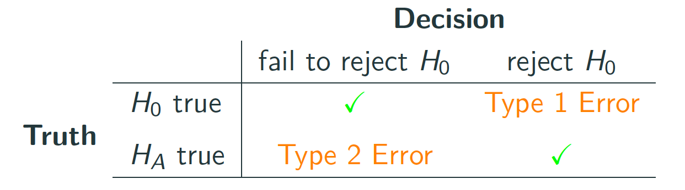

```{r xaringan-themer, include = FALSE}
library(xaringanthemer)
mono_accent(base_color = "#43418A")
```

```{r, include = FALSE}
library(ggplot2)
library(dplyr)
library(infer)
library(nycflights13)
library(ggplot2movies)
library(broom)

knitr::opts_chunk$set(warning = FALSE, message = FALSE, 
                      echo = TRUE, dpi = 300)
```

# Needed Packages 

```{r, message = FALSE, warning = FALSE}
library(mosaic)
library(moderndive)
library(tidyverse)
library(infer)
library(nycflights13)
```

---

class: center, middle, frame

# Is yawning contagious?

---

# Background

In a 2005 episode of the TV show *Mythbusters*, the hosts conducted an experiment to answer the question, "Is yawning contagious?". 

- **If you see someone else yawn, are you more likely to yawn?**

```{r, echo = FALSE}

```

---

# Study Design

Fifty adult partipants were interviewed by a show recruiter.

- The recruiter either *yawned* or *did not yawn*. 

- The participants *thought* they were being considered for an appearance on the show. 

Afterwards, participants sat by themselves in a large van and were asked to wait. 

- Meanwhile, the *Mythbusters* team watched via hidden camera to see if each participant yawned. 

---

# `mythbusters_yawn`

The results of the experiment are available in the `mythbusters_yawn` dataset from the `moderndive` package:

```{r, comment = ""}
mythbusters_yawn
```

---

# `mythbusters_yawn`

The results of the experiment are available in the `mythbusters_yawn` dataset from the `moderndive` package:

```{r, eval = FALSE, comment = ""}
mythbusters_yawn
```

The variables are:

- `subj`: The participant ID (values 1 through 50)
- `group`: A *nominal categorical* variable indicating whether the participant was **exposed to yawning**. 
    - The `seed` level indicated that the participant *was* exposed to yawning. 
    - The `control` level indicated that the participant *was not* exposed to yawning. 
- `yawn`: A *binary* **response** variable indicating whether the participant ultimately yawned. 

---

# Exploratory Data Analysis

Let's use `tally()` to obtain a **continency table** illustrating counts of the four possible outcomes:
```{r, comment = ""}
tally(yawn ~ group, data = mythbusters_yawn)
```

--

**Some Findings**

How many people yawned?

- Out of the 16 people who *were not* exposed to yawning (`group = control`), 4/16 = 0.25 *did* yawn. 
- Out of the 34 people who *were* exposed to yawning (`group = seed`), 10/34 = 0.294 *did* yawn. 

- **Difference in proportions**: 0.294-0.25=0.044

---

# Sampling Scenario

Who is the **study population** here?

- We aren't really sure... Let's assume that the 50 participants are a *representative sample* of all Americans. 

What is the **population parameter** in this study?

- The **response** variable is *whether or not the participant yawned*, which is **categorical**. 
- An **explanatory** variable is *whether or not the participant was exposed to someone else who yawned*. 

In this case, we are interested in estimating the **difference in population proportions**. 
- $p_{seed}-p_{control}$. 

--

The **sample statistic** is the **difference in sample proportions**. 
- $\hat{p}_{seed}-\hat{p}_{control}=0.044$

---

# Conclusive evidence?

In the sample of 50 participants, 4.4% *more* participants yawned when in the presence of someone else who yawned. 

- Does this provide **conclusive evidence** that more people in the general population would yawn in the presence of someone else who yawned, compared to those who were *not* in the presence of someone else who yawned?

- In other words, is yawning contagious???

--

What is the role of **sampling variation** here? 

- Could a difference in yawning proportions of 4.4% *still occur by chance* in a world where yawning were not contagious?

To answer this question, we will use R to perform *simulations* by *resampling* from `mythbusters_yawn`. 

---

# Shuffling Once

In order to see if the 4.4% can be attributed to *more than just chance*, lets first imagine a hypothetical universe where there was **no difference in yawn rates** between people *in the presence of someone who yawned* vs. *not in the presence of someone who yawned*. 

- Here, the confederate yawning would have *no bearing* on the study participant yawning. 

- Thus, the `group` variable is *irrelevant* and we can **randomly assign** participants to either `control` or `seed` groups without consequence. 

--

```{r, echo = FALSE}
myth_data = data.frame(mythbusters_yawn[1:6, ], 
                       group_shuffled = c("seed", "seed", "seed", "control", "control", "seed"))
knitr::kable(myth_data, format = "html", row.names = FALSE)
```

---

# Shuffling Once

.pull-left[
```{r, echo = FALSE}
original_tab = tally(yawn ~ group, data = mythbusters_yawn)
gf_bar( ~ group, fill = ~ yawn, data = mythbusters_yawn, position = "fill") + 
  labs(title = "Original Data")
#barplot(original_tab, legend = row.names(original_tab), args.legend = list(title = "Yawned?"), 
#        main = "Original")
```
]

.pull-right[
```{r, echo = FALSE}
set.seed(228)
shuffled_myth = mythbusters_yawn %>%
  specify(formula = yawn ~ group, success = "yes") %>%
  hypothesize(null = "independence") %>%
  generate(reps = 1, type = "permute") 
shuffled_tab = tally(yawn ~ group, data = shuffled_myth)
gf_bar( ~ group, fill = ~ yawn, data = shuffled_myth, position = "fill") + 
  labs(title = "Shuffled Data")
#barplot(shuffled_tab, legend = row.names(shuffled_tab), args.legend = list(title = "Yawned?"), 
#        main = "Shuffled")
```
]

---

# Sample Proportions

**In the Original Dataset**

- $\hat{p}_{seed}-\hat{p}_{control}=0.0441$

**In the Shuffled Dataset**

- $\hat{p}_{seed}-\hat{p}_{control}=-0.0478$

--

In this hypothetical scenario where *yawning is not contagious*, 4.78% *more people* yawned when *not* in the presence of someone else who yawned. 

- This is different from the original *observed difference* of 4.41% because of **sampling variation**. Let's shuffle more times in order to better understand sampling variability. 

---

# Shuffling 1,000 times

.pull-left[
```{r, echo = FALSE, warning = FALSE, message = FALSE}
set.seed(227)
mythbusters_yawn %>%
  specify(formula = yawn ~ group, success = "yes") %>%
  hypothesize(null = "independence") %>%
  generate(reps = 1000, type = "permute") %>%
  calculate(stat = "diff in props", order = c("seed", "control")) %>% 
  visualize(bins = 10, obs_stat = 0.0441) 
```
]

.pull-right[
This histogram represents the distribution of a *difference in proportions* in our *hypothesized universe where yawning isn't contagious*!

The center is around 0, which is what we would expect the difference to be if yawning isn't associated with *being in the presence of someone else who yawned*. 

- How likely is the **observed difference** of 0.0441?
]

---

# What did we just do?

We just conducted a *hypothesis test* using a **permutation test**. 

> **permutation** (noun): a way, especially one of several possible variations, in which a set or number of things can be ordered or arranged.

--

This is another form of **resampling**!

1. **Bootstrap**: Resample *from a single sample* *n* times **with replacement**

2. **Permutation**: Resample **without replacement** from a *null hypothesis distribution*

---

# What did we just do?

In the *Mythbusters* example, we tested the validity of the **observed difference** in the *hypothesized universe* where yawning is not contagious. 

- The **evidence** in our *observed sample* of 50 participants was consistent with the *hypothesized universe*. 

--

The question we asked ourselves was "*is this difference of 4.4% meaningfully different than 0?*"

- Is the difference indicative that yawning is contagious, or can we attribute it to *sampling variation*?

Hypothesis testing allows us to answer these questions!

---

class: center, middle, frame

# Basics of Hypothesis Testing

---

# Hypothesis Tests

In a statistical **hypothesis test**, we use *sample data* to help us decide between two competing hypotheses about a *population parameter*. 

- The **null hypothesis**: $H_{0}$
- The **alternative hypothesis**: $H_{a}$

--

The **alternative hypothesis** is the claim for which we seek significant evidence. 

- **Example**: Are the average flight times for flights from NY to BOS or SFO *significantly different*?
    - $H_{0}:\mu_{BOS}=\mu_{SFO}$, $H_{a}:\mu_{BOS}\neq\mu_{SFO}$
    
- **Example**: Are the proportions of people who yawn in the presence of someone else who yawned *greater* than otherwise?
    - $H_{0}:p_{s}=p_{c}$, $H_{a}: p_{s}> p_{c}$

--

The **null hypothesis** is usually a claim of *no effect* or *no difference*. 

- **Example**: There is *no difference* in the flight times from NY to BOS or SFO. 

---

# Example: Old vs New Cell Phones

.pull-left[
```{r, echo = FALSE, out.width = "75%"}

```
]

.pull-right[
```{r, echo = FALSE, out.width = "75%"}
knitr::include_graphics("phone_new.png")
```
]

20 Simmons students were randomly assigned to use one of these phones for two weeks, and then were asked to rate their overall satisfaction on a scale from 1-100. 

---

# Results

.pull-left[
```{r, echo = FALSE}
old_phone = data.frame(id = 1:10, phone = rep("old", 10), 
                       rating = c(22, 22, 17, 49, 29, 37, 13, 41, 39, 7))
knitr::kable(old_phone, format = "html", row.names = FALSE)
```
]

.pull-right[
```{r, echo = FALSE}
new_phone = data.frame(id = 11:20, phone = rep("new", 10), 
                       rating = c(79, 91, 95, 81, 91, 76, 83, 77, 83, 84))
knitr::kable(new_phone, format = "html", row.names = FALSE)
```
]


$\bar{x}_{new}-\bar{x}_{old}=56.4$

- Is this difference *significantly different* from 0?

---

# Results

$H_{0}: \mu_{new}-\mu_{old}=0$ versus $H_{a}: \mu_{new}-\mu_{old}>0$

```{r, echo = FALSE, warning = FALSE, message = FALSE, out.width = "35%"}
data = rbind(old_phone, new_phone)

data %>%
  specify(response = rating, explanatory = phone) %>%
  hypothesize(null = "independence") %>%
  generate(reps = 1000) %>%
  calculate(stat = "diff in means", order = c("new", "old")) %>%
  visualize(obs_stat = 56.4)
```

--

*Interpretation*: In a world where there is *no difference* in the average rating of each phone, the **observed difference** of 56.4 would be *close to impossible* to observe. 

- We **reject the null hypothesis** and conclude that the average phone ratings are **different**.

---

# Two Possible Conclusions

These are the *only two* possible conclusions to a statistical hypothesis test:

- **Reject** the null hypothesis $H_{0}$ $\rightarrow$ **Accept** the alternative hypothesis $H_{a}$ 

- **Fail to reject** the null hypothesis $H_{0}$

Therefore, *never* write "Accept $H_{0}$" when you mean "Fail to reject $H_{0}$!"

---

# Understanding Hypothesis Tests

1. A **hypothesis** is a statement about the value of an *unknown population parameter*. 

2. A **hypothesis test** consists of a test between the **null hypothesis** and **alternative hypothesis**. 

--

3. Our *evidence* comes in the form of a **observed test statistic**. This is our *observed sample statistic*. 

--

4. The **null distribution** is the distribution of the test statistic *assuming the null hypothesis is true*. 

We then find the *probability* of observing something *more extreme* than the **observed test statistic** in the null distribution. 

---

# The Null Distribution

In hypothesis testing, we initially **assume the null hypothesis to be true**. 

- The **null distribution** allows us to visualize where the observed statistic would fall in a world where the null hypothesis is true. 

- If the observed statistic is an *unusual* value in the null distribution, we conclude that the *null hypothesis must be false*. 

--

.center[
```{r, echo = FALSE, warning = FALSE, out.width = "40%"}
set.seed(227)
mythbusters_yawn %>%
  specify(formula = yawn ~ group, success = "yes") %>%
  hypothesize(null = "independence") %>%
  generate(reps = 1000, type = "permute") %>%
  calculate(stat = "diff in props", order = c("seed", "control")) %>% 
  visualize(bins = 10, obs_stat = 0.0441) + 
  geom_vline(xintercept = 0.0441, color = "red", size = 1) +
  labs(x = expression(paste("Difference in sample proportions ", hat(p)["seed"] - hat(p)["control"])))
```
]

---

# The p-value

We quantify how unusual an observed statistic is in a null distribution using a **p-value**. 

> **p-value**: The probability of obtaining a test statistic just as extreme or more extreme than the observed test statistic *assuming the null hypothesis (H<sub>0</sub>) is true*

--

Think of the p-value as quantifying *surprise*. 

- In the null distribution, how surprising would it be to observe *what we actually observed*?

---

# The p-value

In the *Mythbusters* yawning example, the p-value was **0.54**. 

- In our 1,000 different shuffles (*permutations*), 54% yielded a difference in proportions *greater than the observed sample difference in proportions* (0.0441). 

- Thus, would you say $\hat{p}_{seed}-\hat{p}_{control}=0.0441$ is *rare*? 

--

Probably not!

- Therefore, *we don't have enough evidence to conclude that the null hypothesis is false*. 
    - We *cannot* conclude that yawning is contagious. 

---

# Types of Errors

Hypothesis tests *are not perfect*. Unfortunately, there exists the possibility of your conclusion being *incorrect*. 

--

Similar to a criminal trial:

- an *innocent* person is wrongly convicted (found guilty), or

- a *guilty* person is wrongly set free (found not guilty)

---

# Types of Errors

Let's assume the following: 
$$H_{0}: \text{person is innocent},\ H_{a}: \text{person is guilty}$$

The two **errors** are:

- Reject $H_{0}$ when $H_{0}$ is true (**Type I Error**)

- Fail to reject $H_{0}$ when $H_{0}$ is false (**Type II Error**)

--

When you use a *sample* to make inferences about a *population*, there is a chance that your inferences are incorrect!

- With any procedure, there is a chance of Type I Error and a chance of Type II Error. 

---

# Type I and Type II Errors

.center[
```{r, echo = FALSE, out.width = "80%"}

```
]

Of course, we want a *small probability* of making an error!

--

- The probability of Type I Error is denoted by $\alpha$ ("alpha") and is called the **significance level** of the hypothesis test. 

- The probability of Type II Error is denoted by $\beta$ ("beta").

---

# Significance Level

We want $\alpha$ and $\beta$ as close to 0 as possible, because this would minimize our chance of making an error in our hypothesis test conclusions. 

Usually, we set $\alpha$ (the **significance level**) before the hypothesis test is conducted. 

- We then judge the "evidence" against $\alpha$. 

--

Common values of $\alpha$ are $0.05$, $0.01$, and $0.10$. 

- If we set $\alpha=0.05$, this means that we are using a procedure that, when used *over and over with different samples*, rejects a TRUE $H_{0}$ 5% of the time. 

---

# Statistical Significance

The results from a hypothesis test are **statistically significant** if they are *more extreme* than what we would expect to see by random chance, **if the null hypothesis were true**. 

- In other words, we have *convincing evidence* in favor of the alternative hypothesis, allowing us to generalize our *sample* results to the claim about the *population*. 

- The results from the *Mythbusters* example were *not* statistically significant (p-value $=0.54\nless 0.05$). 

---

class: center, middle, frame

# Permutation/Randomization Tests (with R)

---

# `infer`

.center[
```{r, echo = FALSE}
knitr::include_graphics("infer.png")
```
]

---

# `hypothesize()`

You have seen most of these `infer` package functions when we constructed **confidence intervals**. 
- Confidence intervals are *closely related* to hypothesis tests!

The only new verb-named function here is `hypothesize()`:

- Its main argument is `null`, which is either:
    - `point` for hypotheses involving a *single sample*
    - `independence` for hypotheses involving a *comparison between groups*
    
---

# Comparing Two Means

First we will build hypotheses which look at the **difference between two population means**. 

Recall that $\mu$ ("mu") denotes a single population mean. 

- When we have *two groups*... 
    - Let $\mu_{1}$ be the population mean of group 1. 
    - Let $\mu_{2}$ be the population mean of group 2. 
    
--

**Two competing hypotheses**

$H_{0}$: $\mu_{1}=\mu_{2}$ (The population means are equivalent between groups.)

$H_{a}$: $\mu_{1}\neq \mu_{2}$ (or $<$, $>$ depending on the context)

---

# Action vs. Romance Movies

The `movies_sample` dataset contains a sample of 200 *action* and *romance* movies, along with their title, year of release, and IMDB.com rating. 

```{r, echo = FALSE, message = FALSE}
movies_sample = readr::read_csv("movies_sample.csv")
```

```{r, comment = ""}
movies_sample
```

---

# Action vs. Romance Movies

**Question**: Is there a *significant difference* in the **average movie ratings** of all Action vs. Romance movies on IMDB.com?

--

Let $\mu_{a}$ denote the *population mean* rating of Action movies, and let $\mu_{r}$ denote the *population mean* rating of Romance movies. 

- $H_{0}$: $\mu_{a}=\mu_{r}$

- $H_{a}$: $\mu_{a}\neq \mu_{r}$

---

# Exploratory Data Analysis: Data Visualization

```{r, out.width = "45%"}
gf_boxplot(rating ~ genre, data = movies_sample) + 
  labs(y = "IMDB.com Rating")
```

---

# Exploratory Data Analysis: Summary Statistics

From the boxplots alone, it is unclear if the *average* movie rating is **significantly different** between Action and Romance movies. 

Let's calculate **summary statistics** *by group* to gather more detail:
```{r, comment = ""}
mean_rating = mean(rating ~ genre, data = movies_sample)
sd_rating = sd(rating ~ genre, data = movies_sample)

mean_rating
sd_rating
```

--

Since we are interested in inference about the **difference between means**, our *sample statistic* will be the **difference between sample means**. 

- $\bar{x}_{r}=6.19$ and $\bar{x}_{a}=5.04$, so $\bar{x}_{r}-\bar{x}_{a}=1.15$.

---

# Observed Effect

Another way of writing the sample statistic in hypothesis testing is to call it the **observed effect**. 

There is a more convenient way of calculating this in R, using the `infer` package:
```{r, comment = ""}
obs_diff = movies_sample %>% 
  specify(response = rating, explanatory = genre) %>% #<<
  calculate(stat = "diff in means", order = c("Romance", "Action")) #<<
obs_diff
```

- Recall the `specify()` and `calculate()` functions from confidence intervals. 

- We left out the `generate()` step, because we want to calculate a statistic **in the original sample**.

---

# Simulating the Null Hypothesis

Now that we calculated the **sample statistic** (or the *observed effect*), the next step in a statistical hypothesis test is to simulate a world where the **null hypothesis is true**.

- $H_{0}$: $\mu_{a}=\mu_{r}$, or $\mu_{r}-\mu_{a}=0$

We can *simulate* this using `generate()`. 

---

# Simulating the Null Hypothesis

If we *assume* that the population mean rating is **equal** between Action and Romance movies...

- then assuming $H_{0}$ true is equivalent to taking all 200 ratings and *randomly re-shuffling* (**randomizing**, or **permuting**) them into the Action and Romance groups. 

- If $H_{0}$ is true, then there is no association between `genre` and `rating`, so each rating is *equally likely* to appear in either group. 

--

This is the framework that `generate()` follows.

```{r, echo = FALSE}
set.seed(12)
```

```{r, comment = "", message = FALSE}
movies_sample %>% 
  specify(response = rating, explanatory = genre) %>%
  hypothesize(null = "independence") %>% 
  generate(reps = 1, type = "permute") %>% #<<
  calculate(stat = "diff in means", order = c("Romance", "Action"))
```

---

# Simulating the Null Hypothesis

```{r, echo = FALSE}
set.seed(12)
```

```{r, comment = "", message = FALSE, warning = FALSE}
movies_sample %>% 
  specify(response = rating, explanatory = genre) %>% #<<
  hypothesize(null = "independence") %>% #<<
  generate(reps = 1, type = "permute") %>% 
  calculate(stat = "diff in means", order = c("Romance", "Action"))
```

- `generate(reps = 1, type = "permute")` completes a single **permutation** of sending values of `ratings` to potentially different values of `genre` from which they originally came. 

--

- Similar to **bootstrapping**, we can repeat this process 1,000 times (or more times, just use the `beepr` package after...), to simulate a world where the **null hypothesis** is true. 

---

# Distribution Under the Null Hypothesis

```{r, message = FALSE, warning = FALSE}
null_distribution = movies_sample %>% 
  specify(response = rating, explanatory = genre) %>% 
  hypothesize(null = "independence") %>% 
  generate(reps = 1000, type = "permute") %>%
  calculate(stat = "diff in means", order = c("Romance", "Action"))
```

This creates a *distribution* of 1,000 **simulated** differences in sample means, called the **null distribution**.

- The **null distribution** is similar to the **bootstrap distribution** since we are just resampling from our original sample. 

- The difference here is that we are *assuming the null hypothesis is true*. 

---

# The Null Distribution

```{r, out.width = "50%", message = FALSE, warning = FALSE}
visualize(null_distribution)
```

---

# The Null Distribution

```{r, out.width = "50%", message = FALSE, warning = FALSE}
visualize(null_distribution) + 
  shade_p_value(obs_stat = 1.15, direction = "both")
```

---

# Quantifying the Strength of Evidence

We are interested in seeing if our *observed* sample difference in mean movie rating between Action and Romance of 1.15 is *greater than what would be expected from random chance*. 

- What are the chances of observing a sample average difference in means of 1.15, *in a world where the population averages between genres are equal*?

How can we **quantify** these chances?

- If these chances where *small*, we could **reject the null hypothesis**. 

---

# The p-value

.pull-left[
The **p-value** is the probability of observing a **sample statistic** as extreme (or more extreme) than the one in the original sample, *assuming the null hypothesis is true*. 

```{r, echo = FALSE, eval = TRUE, message = FALSE, warning = FALSE}
visualize(null_distribution) + 
  shade_p_value(obs_stat = 1.15, direction = "both")
```
]

.pull-right[
Our *observed* **sample difference in means** was 1.15: On average, Romance movies had a IMDB.com rating that was 1.15 higher than Action movies. 

- We can also mark this with a *red line*, and shade red all values at or above that value (or its negative value).
]

---

# Calculating the p-value

```{r, comment = ""}
null_distribution %>% 
  get_p_value(obs_stat = 1.15, direction = "both")
```

--

Assuming a 5% **level of significance**, we have evidence supporting the conclusion that the mean rating for romance movies is different from that of action movies.

- p-value $<0.05$

- In other words, we **reject the null hypothesis** and **conclude the alternative hypothesis**. 

---

# Corresponding Confidence Interval

Recall that we also used the `infer` pipeline to generate **95% confidence intervals** for a population parameter.

- It is straightforward to calculate a confidence interval for $\mu_{r}-\mu_{a}$ using the existing `infer` pipeline. 

Here is the pipeline we used to obtain the **p-value**:

```{r, echo = FALSE}
set.seed(12)
```

```{r, message = FALSE, comment = ""}
movies_sample %>% 
  specify(response = rating, explanatory = genre) %>% 
  hypothesize(null = "independence") %>% 
  generate(reps = 1000, type = "permute") %>%
  calculate(stat = "diff in means", order = c("Romance", "Action")) %>% 
  get_p_value(obs_stat = 1.15, direction = "both")
```

---

# Corresponding Confidence Interval

Recall that we also used the `infer` pipeline to generate **95% confidence intervals** for a population parameter.

- It is straightforward to calculate a confidence interval for $\mu_{r}-\mu_{a}$ using the existing `infer` pipeline. 

Here is the pipeline we *can use* to obtain the **confidence interval**:

```{r, echo = FALSE}
set.seed(12)
```

```{r, message = FALSE, comment = ""}
movies_sample %>% 
  specify(response = rating, explanatory = genre) %>% 
  #hypothesize(null = "independence") %>% 
  generate(reps = 1000, type = "bootstrap") %>% #<<
  calculate(stat = "diff in means", order = c("Romance", "Action")) %>% 
  get_ci(level = 0.95, type = "percentile")
```

---

# Corresponding Confidence Interval

```{r, echo = FALSE}
set.seed(12)
```

```{r, message = FALSE, eval = FALSE, comment = ""}
movies_sample %>% 
  specify(response = rating, explanatory = genre) %>% 
  #hypothesize(null = "independence") %>% 
  generate(reps = 1000, type = "bootstrap") %>%
  calculate(stat = "diff in means", order = c("Romance", "Action")) %>% 
  get_ci(level = 0.95, type = "percentile")
```

This is almost *identical* to the hypothesis test pipeline!

- Except we can just remove or comment out (`#`) the `hypothesize()` step since we are no longer assuming the null hypothesis is true when we bootstrap. 

---

# CI Interpretation

```{r, echo = FALSE}
set.seed(12)
```

```{r, message = FALSE, comment = ""}
movies_sample %>% 
  specify(response = rating, explanatory = genre) %>% 
  #hypothesize(null = "independence") %>% 
  generate(reps = 1000, type = "bootstrap") %>%
  calculate(stat = "diff in means", order = c("Romance", "Action")) %>% 
  get_ci(level = 0.95, type = "percentile")
```

- We are **95% confident** that Romance movies are rated between 0.739 and 1.55 points higher, *on average*, than Action movies on IMDB.com. 

---

# Hypothesis Test for One Mean

Instead of comparing movie rating between groups, let's compare the overall movie rating to 5:
- $H_{0}$: $\mu=5$
- $H_{a}$: $\mu\neq 5$

--

```{r, echo = FALSE}
set.seed(12)
```

```{r, comment = "", message = FALSE, warning = FALSE}
movies_sample %>% 
  specify(response = rating) %>% #<<
  hypothesize(null = "point", mu = 5) %>%  #<<
  generate(reps = 1, type = "bootstrap") %>% 
  calculate(stat = "mean")
```

- `generate(reps = 1, type = "bootstrap")` completes a single **bootstrap sample** of `ratings` from the *distribution* centered at 5 (the null hypothesis value). 

---

# Hypothesis Test for One Mean

The **observed sample mean**:
```{r, comment = ""}
x_bar = movies_sample %>%
  specify(response = rating) %>%
  calculate(stat = "mean")
x_bar
```

- You could also use `favstats()`, or `mean()`. 

---

# Hypothesis Test for One Mean

```{r, echo = FALSE}
set.seed(12)
```

```{r, comment = "", message = FALSE, warning = FALSE}
movies_sample %>% 
  specify(response = rating) %>% 
  hypothesize(null = "point", mu = 5) %>%  
  generate(reps = 1000) %>% 
  calculate(stat = "mean") %>%
  get_p_value(obs_stat = x_bar, direction = "both")
```

---

# Comparing Two Proportions

**From ModernDive**

A 2010 survey asked 827 randomly sampled registered voters in California “Do you support? Or do you oppose? Drilling for oil and natural gas off the Coast of California? Or do you not know enough to say?” 

Conduct a hypothesis test to determine if the data provide strong evidence that the **proportion** of *college* graduates who do not have an opinion on this issue is different than that of *non-college* graduates.

```{r, message = FALSE}
offshore = read.csv("https://moderndive.com/data/offshore.csv")
```

---

# Competing Hypotheses

**In words**

$H_{0}$: There is no association between having an opinion on drilling and having a college degree for all registered California voters in 2010.

- **Or**: The proportion of Californian voters in 2010 having no opinion on drilling and is a college graduate is *the same as* that of a non-college graduate.

$H_{a}$: There is an association between having an opinion on drilling and having a college degree for all registered California voters in 2010.

- **Or**: The proportion of Californian voters in 2010 having no opinion on drilling and is a college graduate is *different from* that of a non-college graduate.

---

# Competing Hypotheses

**Using notation**

$H_{0}: p_{c}=p_{nc}$ or $p_{c}-p_{nc}=0$

$H_{a}: p_{c}\neq p_{nc}$ or $p_{c}-p_{nc}\neq0$

- The symbol $p$ represents the **population proportion** (a parameter) of either college graduates (*c*) or non-college graduates (*nc*) who have no opinion on drilling. 

---

# Exploratory Data Analysis

```{r, eval = FALSE}
View(offshore)
```

```{r, comment = ""}
college_table = tally(college_grad ~ response, data = offshore)
college_table
```

---

# Exploratory Data Analysis

```{r, out.width = "50%"}
gf_bar( ~ response, fill = ~ college_grad, data = offshore) + 
  labs(fill = "College Graduate?")
```

---

# Exploratory Data Analysis

```{r, out.width = "50%"}
# Use position = "fill" to convert to proportion scale
gf_bar( ~ response, fill = ~ college_grad, data = offshore, 
        position = "fill") + 
  labs(y = "Proportion", fill = "College Graduate?")
```

---

# Observed Statistic

We need to calculate the *sample* **difference in proportions** of those who have no opinion on drilling...

- college graduates vs. non-college graduates
- $\hat{p}_{c}-\hat{p}_{nc}$. 

Using `infer`:

```{r, comment = ""}
obs_diff = offshore %>%
  specify(response = response, explanatory = college_grad, success = "no opinion") %>%
  calculate(stat = "diff in props", order = c("yes", "no"))
obs_diff
```

--

$\hat{p}_{c}-\hat{p}_{nc}=-0.0993$, which means that approximately 10% **fewer** college graduates had *no opinion* on drilling than non-college graduates. 

---

# Permutation Test

```{r, echo = FALSE}
set.seed(12)
```

```{r}
null_distribution = offshore %>%
  specify(response = response, explanatory = college_grad, success = "no opinion") %>% #<<
  hypothesize(null = "independence") %>%
  generate(reps = 1000, type = "permute") %>%
  calculate(stat = "diff in props", order = c("yes", "no")) #<<
```

```{r, comment = ""}
null_distribution
```

---

# Visualize Null Distribution

```{r, out.width = "50%"}
visualize(null_distribution) + 
  shade_p_value(obs_stat = -0.0993, direction = "both")
```

---

# P-value

```{r, comment = ""}
null_distribution %>%
  get_p_value(obs_stat = -0.0993, direction = "both")
```

--

**Conclusion**

At the 5% *level of significance*, we have enough evidence to conclude that the proportion of college graduates who have no opinion on drilling is *different from* the proportion of non-college graduates who have no opinion on drilling. 

---

# Practice

Do **more** people *without children* think it is rude to knowingly bring an *unruly child* on a plane?

Using the `flying` dataset in the `fivethirtyeight` package, perform the following:

1. Conduct a hypothesis test for the difference in proportions of people who think it is rude to knowingly bring an *unruly child* on a plane, between those *without children* and those *with children*. 

2. Calculate a 95% confidence interval for the difference in proportions. 

**Run this first!**

```{r}
library(fivethirtyeight)
# (Recode the unruly_child to a simple Yes vs. No)
flying$unruly_child = 
  fct_recode(flying$unruly_child, Yes = "Somewhat", Yes = "Very")
```

---

# Practice 

*Solution*

```{r, warning = FALSE}
set.seed(227) 

diff_props = flying %>%
  specify(response = unruly_child, explanatory = children_under_18, success = "Yes") %>%
  calculate(stat = "diff in props", order = c(FALSE, TRUE))
  
flying %>%
  specify(response = unruly_child, explanatory = children_under_18, success = "Yes") %>%
  hypothesize(null = "independence") %>%
  generate(reps = 1000, type = "permute") %>%
  calculate(stat = "diff in props", order = c(FALSE, TRUE)) %>%
  get_p_value(obs_stat = diff_props, direction = "greater")
```

---

# Practice 

*Solution*

```{r, warning = FALSE}
set.seed(227)

flying %>%
  specify(response = unruly_child, explanatory = children_under_18, success = "Yes") %>%
  #hypothesize(null = "independence") %>%
  generate(reps = 1000, type = "bootstrap") %>%
  calculate(stat = "diff in props", order = c(FALSE, TRUE)) %>%
  get_ci()
```

We are 95% confident that between 4.94% and 18.8% *more* individuals *without* children think it is rude to bring an unruly child on a plane, compared to individuals *with* children. 

---

# Summary

Here are the steps for *any* hypothesis test:

1. Calculate a **sample statistic** (or *observed effect*). 
    - mean, difference in means, proportion, difference in proportions, median, etc.
    
2. Simulate a world where the *null hypothesis is true*. 
    - Using `generate(reps = )` and `calculate()`
    
3. `visualize()` where the *osberved effect* appears in the simulated world where the *null hypothesis is true*. 

4. Calculate the *probability* that the observed effect (or something *more extreme*) could appear in this simulated world.

    - Using `get_p_value(obs_stat = , direction = )`

5. Decide if the observed effect is **statistically significant**. 
    - Compare the p-value to 0.05, the **level of significance**. 
    
--

Also: **Don't forget to include a confidence interval!**


