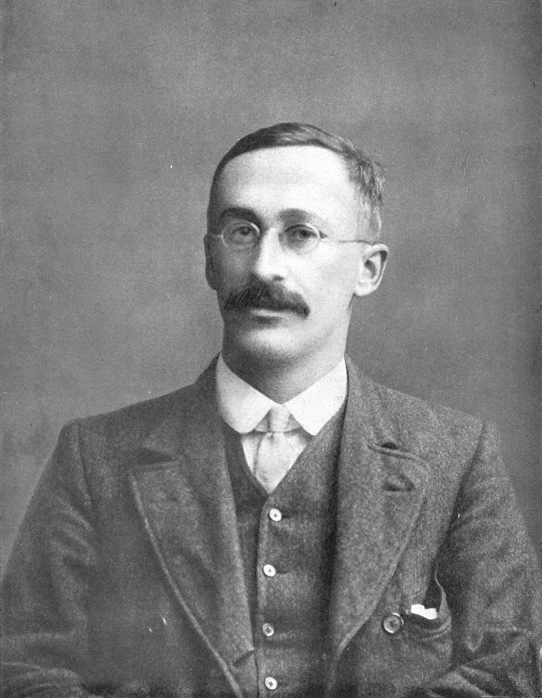
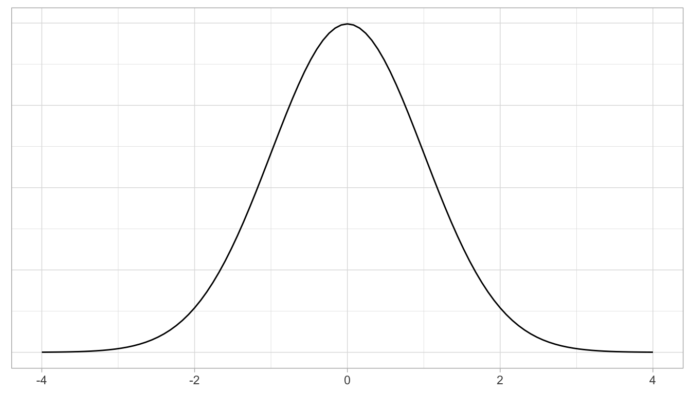
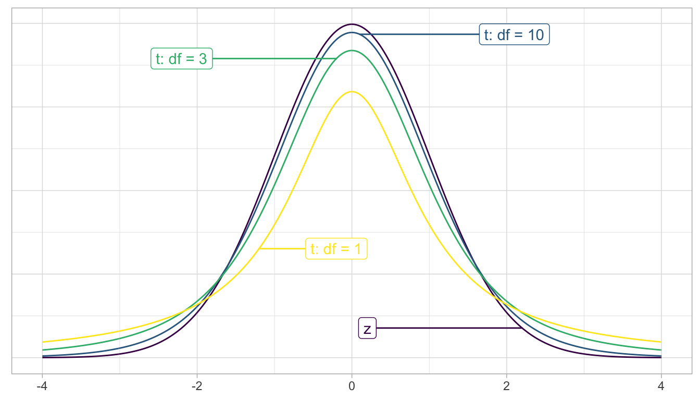

```{r xaringan-themer, include = FALSE}
library(xaringanthemer)
mono_accent(base_color = "#43418A")
```

```{r, include = FALSE}
library(ggplot2)
library(dplyr)
library(infer)
library(nycflights13)
library(ggplot2movies)
library(broom)

knitr::opts_chunk$set(warning = FALSE, message = FALSE, 
                      echo = TRUE, dpi = 300)
```

# Needed Packages 

```{r, message = FALSE, warning = FALSE}
library(mosaic)
library(tidyverse)
library(infer)
```

---

class: center, middle, frame

# Theory-Based Hypothesis Tests

---

# Theory vs Simulation

So far we have been focused on using technology and simulation-based methods in order to do and understand statistical inference and data analysis. 

- **Bootstrap resampling** for approximating a *sampling distribution* and constructing **confidence intervals**

- **Permutation tests** for constructing a *null distribution* and performing hypothesis tests for *any* parameter. 

--

However, more traditional *theory-based methods* have been around for decades, mostly because we didn't have the technology to perform any of the simulation-based methods covered this semester. 

- In fact, R was first created in 1993 and was not widely used until the 2000s!

- Theory-based methods are still used in a variety of fields and situations. 

---

# Some Stats History

.pull-left[
William Sealy Gosset worked as a chemist for the Guinness brewery in Ireland. 

- Gosset implemented the **t-test** as a way to monitor the quality of stout beer. 

- Gosset published this work in *Biometrika* (a top statistical journal) in 1908, but Guinness had a policy that forbade its chemists from publishing their findings while working for the company. 

- The pseudonum *Student* was used instead. 
]

.pull-right[
```{r, echo = FALSE, out.width = "75%"}

```
]

---

# Two-sample t-test

Ultimately any theory-based hypothesis test is as an *approximation* to the simulation-based hypothesis test procedures we've used so far. 

- Theory-based tests typically have several *assumptions* that we have to verify in order to use them. 

--

We'll focus on the **two-sample t-test** for the *difference between sample means*. 

- However, the *test statistic* we'll use isn't $\bar{x}_{1}-\bar{x}_{2}$; rather, the two-sample t-test uses the **t-statistic**. 

---

# Two-sample t-statistic

Recall that we use *z*-scores in order to **standardize** a variable: $$z=\frac{x-\mu}{\sigma}$$

This allows us to compare observations from different distributions. 

- **Examples**: 
    - Comparing ACT and SAT scores 
    - Comparing weather in different states (Is today's temperature in Boston warmer than the temperature in Orlando, relative to the respective distributions?)

--

The *z*-score **re-centers** a unimodal/symmetric (Normal) variable around 0. 

---

# Standard Normal Distribution

The distribution of *z*-scores for *every* observation in a Normal variable is the **standard Normal distribution** (or a *z-distribution*). 

.center[
```{r, echo = FALSE}

```
]

---

# Back to Movie Ratings

For the `movies_sample` dataset, how would we **standardize** $\bar{x}_{r}-\bar{x}_{a}$?

- Recall that this is the difference in *average* movie ratings between *romance* and *action* movies. 

--

From **Module 3**: 

- Assuming the sampling is *representative*, then the *sampling distribution* for $\bar{x}_{r}-\bar{x}_{a}$ will be centered at the (unknown) $\mu_{r}-\mu_{a}$. 

- The *standard deviation of the difference in sample means* is the **standard error**, $SE_{\bar{x}_{r}-\bar{x}_{a}}$. 

--

Putting this all together, the **two-sample t-statistic** is: $$t=\frac{(\bar{x}_{r}-\bar{x}_{a})-(\mu_{r}-\mu_{a})}{SE_{\bar{x}_{r}-\bar{x}_{a}}}=\frac{(\bar{x}_{r}-\bar{x}_{a})-(\mu_{r}-\mu_{a})}{\sqrt{\frac{s_{r}^{2}}{n_{r}}+\frac{s_{a}^{2}}{n_{a}}}}$$

---

# Using the t-statistic

In the *t-test*, we use the *t-statistic* similarly to how we used the **observed difference** in the simulation-based permutation tests. 

$$t=\frac{(\bar{x}_{r}-\bar{x}_{a})-(\mu_{r}-\mu_{a})}{SE_{\bar{x}_{r}-\bar{x}_{a}}}=\frac{(\bar{x}_{r}-\bar{x}_{a})-(\mu_{r}-\mu_{a})}{\sqrt{\frac{s_{r}^{2}}{n_{r}}+\frac{s_{a}^{2}}{n_{a}}}}$$

- Assuming $H_{0}:\mu_{r}-\mu_{a}=0$ as we did before, the right-hand side in the above formula becomes 0. 

---

# The t-distribution

Similarly to how we use the CLT to say that $\bar{X}\sim N(\mu, \sigma/\sqrt{n})$ for large $n$, it can be *mathematically proven* that the *t*-statistic follows a **t-distribution** with **degrees of freedom** roughly equal to $df=n_{r}+n_{a}-2$. 

- For larger sample sizes, the *df* increases and the *t*-distribution converges to the *standard Normal*. 

.center[
```{r, echo = FALSE, out.width = "75%"}

```
]

---

# The t-statistic

```{r, echo = FALSE, message = FALSE}
movies_sample = readr::read_csv("movies_sample.csv")
```

```{r}
favstats(rating ~ genre, data = movies_sample)[7:9]
# The [7:9] gives us just the mean, sd, n
# the 7th through 9th entries in favstats()
```

Plugging these into the *t*-statistic formula, $$t=\frac{(\bar{x}_{r}-\bar{x}_{a})-(0)}{\sqrt{\frac{s_{r}^{2}}{n_{r}}+\frac{s_{a}^{2}}{n_{a}}}}=\frac{(6.19-5.04)}{\sqrt{\frac{1.31^2}{100}+\frac{1.59^2}{100}}}=5.58$$

---

# The t-statistic

$$t=\frac{(\bar{x}_{r}-\bar{x}_{a})-(0)}{\sqrt{\frac{s_{r}^{2}}{n_{r}}+\frac{s_{a}^{2}}{n_{a}}}}=\frac{(6.19-5.04)}{\sqrt{\frac{1.31^2}{100}+\frac{1.59^2}{100}}}=5.58$$

We used the observed *sample difference in means* to calculate the **test statistic**, which is a *t-statistic* in a two-sample t-test. 

As we have done with permutation tests, next we have to use the test statistic to calculate the **p-value**. 

- How? Compare *t* to a **null distribution**. 

---

# Null Distribution: Simulation vs Theory

First, recall the *null distribution* for the permutation test of $\bar{x}_{r}-\bar{x}_{a}$ from earlier in the module:

```{r, fig.keep = "none"}
null_distribution_rating = movies_sample %>%
  specify(response = rating, explanatory = genre) %>%
  hypothesize(null = "independence") %>%
  generate(reps = 1000, type = "permute") %>%
  calculate(stat = "diff in means", order = c("Romance", "Action")) #<<
visualize(null_distribution_rating)
```

--

We can also *simulate* a null distribution for theory-based test statistics, such as the *t*-statistic:

```{r, fig.keep = "none"}
null_distribution_rating_t = movies_sample %>%
  specify(response = rating, explanatory = genre) %>%
  hypothesize(null = "independence") %>%
  generate(reps = 1000, type = "permute") %>%
  calculate(stat = "t", order = c("Romance", "Action")) #<<
visualize(null_distribution_rating_t)
```

---

# Theory-Based Null Distribution

However, because theory-based methods were used before computers were around, the traditional theory-based *t*-test doesn't look at a *simulated histogram* of the null distribution. 

- Instead, it looks at the *t*-distribution curve with $df=n_{r}+n_{a}-2=198$:

```{r, out.width = "35%"}
visualize(null_distribution_rating_t, method = "both", 
          dens_color = "red", fill = "gray") + 
  theme_bw()
```

---

# Theory-Based Null Distribution

```{r, warning = FALSE, out.width = "30%"}
visualize(null_distribution_rating_t, method = "both", 
          dens_color = "red", fill = "gray") + 
  shade_p_value(obs_stat = 5.58, direction = "both") + 
  theme_bw()
```

It seems that the theoretical curve does a good job of *approximating* the histogram. 

- To calculate the p-value, we need to calculate the total area under the *t-distribution curve* that is equal to or "more extreme" than the observed *t*-statistic (5.58). 

---

# Theory-Based p-value

```{r}
null_distribution_rating_t %>%
  get_p_value(obs_stat = 5.58, direction = "both")
```

OR, using a non-simulation-based approach:

```{r, eval = FALSE}
t.test(rating ~ genre, data = movies_sample)
```

---

# Conditions for two-sample t-test

Let's visit a warning message you might have seen when using `get_p_value()` with the *t*-test:

> `Check to make sure the conditions have been met for the theoretical method. {infer} currently does not check these for you.`

To be able to use *t*-tests and other theory-based statistical procedures there are a few **conditions** to check. 

--

1. Nearly Normal populations *or* large sample sizes (usually $n_{1}>30$ and $n_{2}>30$)

2. Both *samples* are selected independently *of each other*. 

3. All *observations* are independent from each other. 

--

Only **Condition 3** is questionable in the movie ratings example. For example, if *the same person rated multiple movies*, then the osbervations are not independent. 

---

# What happens if a condition isn't met?

If any of the conditions for a theory-based hypothesis test are not met, then we can't put much faith into any of the conclusions reached using these tests. 

- In these cases, we could instead use a **permutation test** since these don't require a list of conditions to check!

--

Run the following to load a dataset consisting of waiting times of 24 automobile oil changes, 12 from store "A" and 12 from store "B". 

```{r}
oil = data.frame(
  times = c(104, 102, 35, 911, 56, 325, 7, 9, 179, 59, 4, 19,
            25, 45, 10, 31, 187, 342, 531, 21, 28, 2104, 2, 12), 
  store = c(rep("A", 12), rep("B", 12))
  )
```

---

# What happens if a condition isn't met?

Clearly, the sample sizes in the `oil` dataset are small, and each separate distribution of waiting times is **right-skewed**. 

```{r, out.width = "30%"}
gf_density( ~ times, fill = ~ store, data = oil)
```

- Therefore it might be better to look at a hypothesis test for **difference between medians**. 

- But we can't do that with a *t*-test! Those are only for **means**!

---

# Practice

1. Using the `oil` dataset, conduct a **two-sample t-test** to see if the *average* waiting times are different between stores.

2. Conduct a **permutation test** to see if the *median* waiting times are different between stores. 

--

*Solution*

```{r, eval = FALSE}
favstats(times ~ store, data = oil)

t.test(times ~ store, data = oil)

median_diff = oil %>%
  specify(response = times, explanatory = store) %>%
  calculate(stat = "diff in medians", order = c("A", "B"))

oil %>%
  specify(response = times, explanatory = store) %>%
  hypothesize(null = "independence") %>%
  generate(reps = 1000) %>%
  calculate(stat = "diff in medians", order = c("A", "B")) %>%
  get_p_value(obs_stat = median_diff, direction = "both")
```

---

# Why doesn't the t-test work here?

```{r, out.width = "30%"}
oil %>%
  specify(response = times, explanatory = store) %>%
  hypothesize(null = "independence") %>%
  generate(reps = 1000) %>%
  calculate(stat = "t", order = c("A", "B")) %>%
  visualize(method = "both")
```

---

class: center, middle, frame

# When inference is not needed

---

# Back to the `flights` data frame

Sometimes, it isn't necessary to perform a statistical hypothesis test. 
- *Always* do **exploratory data analysis**!

--

```{r, eval = FALSE}
View(flights)
```

---

# Average Flight Times 

Assuming two flights leave from New York, which do you think is longer?
- The flight to **Boston**?
- The flight to **San Francisco**?

--

```{r}
bos_sfo = flights %>%
  na.omit() %>% # removes flights with missing info
  filter(dest %in% c("BOS", "SFO")) 
```

---

# Exploratory Data Analysis: Summary Statistics

```{r, comment = ""}
favstats(air_time ~ dest, data = bos_sfo)
```

Or...

```{r, eval = FALSE}
mean(air_time ~ dest, data = bos_sfo)
sd(air_time ~ dest, data = bos_sfo)
```

---

# Exploratory Data Analysis: Data Visualization

```{r, out.width = "45%"}
gf_boxplot(air_time ~ dest, data = bos_sfo) + 
  labs(y = "Air Time (in minutes")
```

---

# Conclusions

There is *no overlap at all* in the boxplots!

- This means that the air time for San Francisco flights is **statistically greater** than the air time for Boston flights (which isn't surprising). 

Hypothesis testing procedures *would not be necessary* for data such as these. 

- Always do **exploratory data analysis**!!!

---

# Summary

Here are the steps for *any* hypothesis test:

1. Calculate a **sample statistic** (or *observed effect*). 
    - mean, difference in means, proportion, difference in proportions, median, etc.
    
2. Simulate a world where the *null hypothesis is true*. 
    - Using `generate(reps = )` and `calculate()`
    
3. `visualize()` where the *osberved effect* appears in the simulated world where the *null hypothesis is true*. 

4. Calculate the *probability* that the observed effect (or something *more extreme*) could appear in this simulated world.

    - Using `get_p_value(obs_stat = , direction = )`

5. Decide if the observed effect is **statistically significant**. 
    - Compare the p-value to 0.05, the **level of significance**. 
    
--

Also: **Don't forget to include a confidence interval!**


