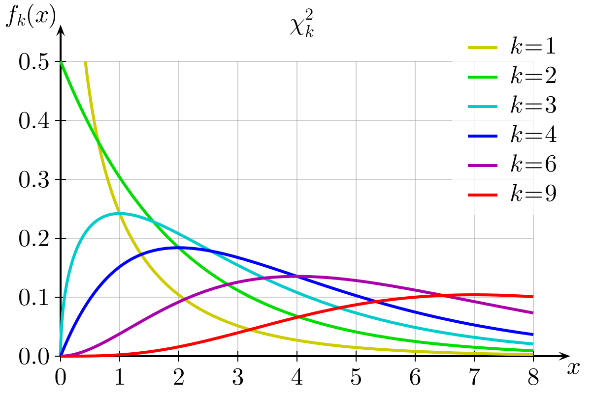

```{r xaringan-themer, include = FALSE}
library(xaringanthemer)
mono_accent(base_color = "#43418A")
```

```{r, include = FALSE}
library(tidyverse)
library(infer)
library(nycflights13)
library(mosaic)

knitr::opts_chunk$set(warning = FALSE, message = FALSE, 
                      echo = TRUE, dpi = 300)
```

<!--
pagedown::chrome_print("~/Dropbox/Teaching/03-Simmons Courses/MATH227-Intermediate Statistics/Lecture Slides/06-Chi_Square_Tests/06-Chi_Square_Tests.html")
-->

# Introduction

So far, we have performed **comparative analyses** that looked at a single *mean* or *proportion* (or some other statistic), or compared means or proportions **between two groups**. 

- proportion of "no opinion on offshore drilling" among college graduates vs. non-college graduates

- average IMDB.com rating between action and romance movies

- average income (or **median** income) between Cleveland, OH and Sacramento, CA

--

Regardless the setting, we want to make explicit the relationship between:

- an **outcome/response** variable *y*, also called the **dependent variable**, and

- an **explanatory** variable *x*, also called an **independent variable** or **covariate**

---

# Multiple Categories

What if we had the following:

.pull-left[
**Outcome/Response** (*y*)

- Do you think funding for space exploration is too little, about right, or too much? (*three levels*; *categorical*)
]

.pull-right[
**Explanatory** (*x*)

- Political party: Dem, Ind, Rep (*three levels*; *categorical*)
]

We cannot calculate a *difference between two proportions* here.  There are more than two groups!

- Luckily, we can perform a chi-square (&chi;<sup>2</sup>) test. 

---

# Needed Packages

```{r, eval = FALSE}
library(mosaic)
library(infer)
library(tidyverse)
```

---

class: center, middle, frame

# Goodness-of-Fit Tests

---

# Zodiac Signs

Does your zodiac sign predict how successful you will be?

The `Zodiac.csv` dataset (downloadable from the online campus) contains data from a study conducted by *Fortune* magazine. 

- Data consist of zodiac signs of 256 heads of the largest 400 companies

```{r, echo = FALSE, message = FALSE}
Zodiac <- read_csv("~/Dropbox/Teaching/03-Simmons Courses/STAT227-Statistical Design and Analysis/Data/Zodiac.csv")
```

```{r}
Zodiac
```

---

# Zodiac Signs (EDA)

```{r, comment = ""}
Zodiac_tab = tally( ~ Sign, data = Zodiac)
Zodiac_tab
```

```{r, eval = FALSE}
gf_bar( ~ Sign, data = Zodiac, fill = "steelblue") + 
  coord_flip()
```

--

```{r, eval = FALSE}
pie(Zodiac_tab) #LOL JK
```

---

# Zodiac Signs

**What do we notice?**

- There appears to be *some* variation in the number of births per sign (e.g., more *Pisces* than other signs). 

- Are the discrepancies in *counts* enough to claim that *successful* people are more likely to be born under some signs than others?

--

*Let's think about this another way.*

- If the 256 births were distributed **uniformly** across the 12 zodiac signs, how many would we *expect* to occur under each sign?

- $256/12=21.3$ per sign
    - How closely do the **observed** numbers of births per sign fit the **expected** numbers (i.e., the "null model")?

---

# Goodness-of-Fit Tests

In a **Goodness-of-Fit Test**, we are seeing how "good" (or, how *well*) a null model fits the **observed data**. 

- In the zodiac example, the null model consists of births that are *uniformly distributed over the 12 signs*. 


While this is technically a **hypothesis test**, there is no single parameter to estimate (such as the *proportion* of Scorpio). 

- Rather, there are 12 hypothesized proportions (or *counts*) to consider together. 

- $H_{0}$: Births are *uniformly distributed* over zodiac signs. 

- $H_{a}$: Births are *not uniformly distributed* over zodiac signs. 

---

# Assumptions for Goodness-of-Fit Tests

Typically these data are organized in summary tables of *counts*, rather than having an osbervation for each individual. 

1. **Categorical Data Condition**: The data must be categorical. 
    - Usually straightforward to check.

2. **Independence Assumption**: The counts of the categories of the categorical variable should be *independent* of each other. 
    - The birthdates of the 256 company heads are (probably) randomly distributed throughout the year. 

3. **Sample Size Assumption**: There should be *at least 5 expected individuals* in each category. 
    - "Expected" referring to what we would *expect* to see under the **null hypothesis**. 

---

# Chi-Square Statistic

The **chi-square statistic** is a *test statistic* for categorical variables: $$\chi^{2}=\sum_{i=1}^{k}\frac{(O_{i}-E_{i})^{2}}{E_{i}}$$

where $O_{i}$ is the *observed* value in cell *i*, $E_{i}$ is the *expected* value in cell *i*, and *k* is the total number of cells. 

--

Under $H_{0}$, the test statistic follows a **chi-square** distribution. 

- In other words, the **chi-square** distribution is the **null distribution** for a goodness-of-fit test. 

- The distribution is right-skewed, and it is *always positive*. (i.e., $\chi^{2}>0$)

---

# Chi-Square Distribution

.center[
```{r, echo = FALSE, out.width = "75%"}

```
]

---

# Degrees of Freedom

The *shape* of the distribution depends on the number of **degrees of freedom** (*df*). 

- Assuming the null hypothesis is true (always a first step in hypothesis testing), $$df=\text{number of categories}-1$$
 

For the zodiac example, $$df=12-1 = 11$$

---

# Chi-Square Statistic and p-value

In the zodiac example, $$\chi^{2}=\sum_{i=1}^{k}\frac{(O_{i}-E_{i})^{2}}{E_{i}}=\frac{(29-21.3)^2}{21.3}+\cdots+\frac{(18-21.3)^2}{21.3}=5.09$$

--

Recall: 

> **p-value**: The probability of obtaining a test statistic just as extreme or more extreme than the observed test statistic *assuming the null hypothesis (H<sub>0</sub>) is true*

In a **goodness-of-fit test**:

- The **p-value** corresponds to the area under the $\chi^{2}$ curve with $df=11$ *greater than our observed test statistic* (5.09). 

---

# The p-value

```{r, echo = FALSE, out.width = "50%"}
ggplot(data.frame(x = c(0, 30)), aes(x = x)) +
  stat_function(fun = dchisq, args = list(df = 11)) + 
  stat_function(fun = dchisq, xlim = c(5.09, 30), geom = "area", args = list(df = 11), fill = "lavender") + 
  geom_vline(xintercept = 5.09, col = "blue", linetype = "dashed", size = 1) +
  labs(x = "Test Statistic", y = "Density") + 
  theme_bw()
```

```{r}
pchisq(5.09, df = 11, lower.tail = FALSE)
```

---

# The p-value

The p-value for this hypothesis test is **0.927**. 

This means that, *if the zodiac signs of executives were in fact distributed uniformly*, an observed chi-square value of **5.09 or higher** would occur about 93% of the time.

- This is not unusual at all!

**Conclusion**

We *fail to reject the null hypothesis*, and conclude that these data show virtually *no evidence of non-uniform distribution* of zodiac signs among executives. 

---

# The Role of df in p-value

Unlike *Normal* and *t* distributions (from theory-based hypothesis tests, for example), the $\chi^{2}$ distribution is **skewed**. 

- As the *number of categories* (and hence, the *df*) increases, the degree of skewness in the $\chi^{2}$ distribution changes. 

While $\chi^{2}=5.09$ is *not extreme* in the distribution with $df=11$, it might appear much *more extreme* in a distribution with smaller *df*, or *less extreme* with even higher *df*. 

---

# The p-value of 5.09 when df = 3

```{r, echo = FALSE, out.width = "50%"}
ggplot(data.frame(x = c(0, 30)), aes(x = x)) +
  stat_function(fun = dchisq, args = list(df = 3)) + 
  stat_function(fun = dchisq, xlim = c(5.09, 30), geom = "area", args = list(df = 3), fill = "lavender") + 
  geom_vline(xintercept = 5.09, col = "blue", linetype = "dashed", size = 1) +
  labs(x = "Test Statistic", y = "Density") + 
  theme_bw()
```

---

# The p-value of 5.09 when df = 30

```{r, echo = FALSE, out.width = "50%"}
ggplot(data.frame(x = c(0, 50)), aes(x = x)) +
  stat_function(fun = dchisq, args = list(df = 20)) + 
  stat_function(fun = dchisq, xlim = c(5.09, 50), geom = "area", args = list(df = 20), fill = "lavender") + 
  geom_vline(xintercept = 5.09, col = "blue", linetype = "dashed", size = 1) +
  labs(x = "Test Statistic", y = "Density") + 
  theme_bw()
```

---

```{r, echo = FALSE, eval = FALSE}
# Weldon's Dice

Walter Frank Raphael Weldon (1860-1906) was an English evolutionary biologist.

In 1894, he <s>had nothing better to do</s> rolled 12 dice 26,306 times, and recorded the number of 5s and 6s (which he considered to be a "success").

- It was observed that 5s and 6s occurred *more often than expected*, and it was hypothesized that this was probably due to the construction of the dice.
    - Inexpensive dice have hollowed-out pips, so the face with 6 pips is
lightest.

--

.center[
#```{r, echo = FALSE, out.width = "25%"}

#```
]

---

# Labby's Dice

.center[
#```{r, echo = FALSE, out.width = "50%"}

#```
]

In 2009, Zacariah Labby (University of Chicago) repeated Weldon's experiment using a homemade dice-throwing, pip-counting machine.
- [http://www.youtube.com/watch?v=95EErdouO2w](http://www.youtube.com/watch?v=95EErdouO2w)

There were 150 images to process manually each day. At this rate, Weldon's experiment was repeated in a little more than
*six full days*!

---

# Summarizing Labby's Results

.center[
#```{r, echo = FALSE}
knitr::kable(data.frame(Outcome = c("1", "2", "3", "4", "5", "6", "Total"), 
                        Observed = c("53,222", "52,118", "52,465", "52,338", "52,244", "53,285", "315,672"), 
                        Expected = c(rep("52,612", 6), "315,672")), 
             format = "html", align = "c")
#```
]

Do these data provide convincing evidence of an inconsistency between the observed and expected counts?

--

$H_{0}$: $p_{1}=p_{2}=\cdots=p_{6}=1/6$ 

$H_{a}$: at least one $p_{i}\neq1/6$

---

# Test Statistic

For this exercise, $$\chi^{2}=\sum_{i=1}^{k}\frac{(O_{i}-E_{i})^{2}}{E_{i}}=24.73$$

- How many degrees of freedom?

--

.center[
#```{r, echo = FALSE, out.width = "40%"}
ggplot(data.frame(x = c(0, 30)), aes(x = x)) +
     stat_function(fun = dchisq, args = list(df = 5)) + 
  geom_vline(xintercept = 24.73, col = "blue", linetype = "dashed", size = 1) +
  labs(x = "Test Statistic", y = "Density") + 
  theme_bw()
#```
]

---

# It turns out...

The 1-6 axis is consistently shorter than the other two (2-5 and 3-4), thereby supporting the hypothesis that the faces with one and six pips are *larger* than the other faces.

The original claim that 5s and 6s appear more often due to carved-out pips is not supported by these data.
- Dice used in casinos have flush faces, where the pips are filled in with a plastic of the same density as the surrounding material, and are precisely balanced.

.center[
#```{r, echo = FALSE, out.width = "50%"}

#```
]

---
```

# Dog Data!!!

Is **bite frequency** *distributed uniformly* among dog breeds in New York City?

Run the following code to install the `nycdogs` R package:

```{r, eval = FALSE}
devtools::install_github("kjhealy/nycdogs")
```

**OR** download the `nyc_bites.csv` and `nyc_license.csv` datasets from Moodle. 

---

# `nyc_bites` data

```{r, echo = FALSE}
library(nycdogs)
```

```{r, eval = FALSE}
View(nyc_bites)
```

```{r}
bite_tab = nyc_bites %>%
  count(breed, sort = TRUE) %>%
  slice(1:8) # Extract only the TOP 8!
bite_tab
```

---

# Goodness-of-Fit Test

Let's use only the species with bite counts over 200:

```{r}
nyc_bites_200 = nyc_bites %>%
  filter(breed %in% bite_tab$breed)
```

$H_{0}$: Bite count is *unformly distributed* across dog breed. 

$H_{a}$: Bite count is *not unformly distributed* across dog breed. 

Perform the **chi-square goodness-of-fit test**!

---

# Solution

Under $H_{0}$, the test statistic follows a $\chi^{2}$ distribution with $df = 8-1=7$. 

```{r}
chisq.test(
  tally( ~ breed, data = nyc_bites_200)
)
```

With $\chi^{2}=4497$ (!!!) and p-value < 0.05, we reject $H_{0}$ and conclude that bite count is *not unformly distributed* across dog breed. 

---

# Just checking...

The observed $\chi^{2}=4497$ was **huge**! What do you think was the reason why?

--

.center[
```{r, echo = FALSE}

```
]

---

class: center, middle, frame

# (Theory-Based) Chi-Square Test for Independence

---

# Chi-Square Test for Independence

What we have done so far with the **goodness of fit test** is look at a *single categorical variable* with multiple levels. 

The statistics behind a &chi;<sup>2</sup> test easily extend to *multiple* categorical variables.
- This is called a &chi;<sup>2</sup> **test for independence**.

.pull-left[
**Outcome/Response** (*y*)

- Do you think funding for space exploration is too little, about right, or too much? (*three levels*; *categorical*)
]

.pull-right[
**Explanatory** (*x*)

- Political party: Dem, Ind, Rep (*three levels*; *categorical*)
]

---

# GSS Data

Download/Import the `gss.csv` dataset, which contains data on 149 GSS respondents. 

The [General Social Survey](http://gss.norc.org/) (GSS) is a sociological survey that keeps records of the concerns, experiences, attitudes, and practices of residents of the United States. 

```{r, echo = FALSE, warning = FALSE, message = FALSE}
gss <- readr::read_csv("~/Dropbox/Teaching/03-Simmons Courses/STAT227-Statistical Design and Analysis/Data/gss.csv")
```

```{r, eval = FALSE}
View(gss)
```

---

# Exploratory Data Analysis

We are interested in the relationship between **political party** and **opinions on space funding**.
- Data are located in the `party` and `NASA` variables.

```{r, comment = ""}
select(gss, party, NASA)
```

---

# Exploratory Data Analysis

First, let's generate a **contingency table** of responses for each variable. 

```{r, comment = ""}
gss_table = tally(NASA ~ party, data = gss)
gss_table
```

Are **political party** and **opinions on space funding** *independent*?

--

If they were, we would expect (for example): $$P(\text{Too much funding})=P(\text{Too much funding} | \text{Democrat})$$

- In other words, the probability of **any person** believing we spend *too much* on space funding is equal to the probability of a **Democrat** believing we spend *too much* on space funding. 

---

# Exploratory Data Analysis

It might be easier to detect any trends by constructing a **barplot**:

```{r, out.width = "50%"}
gf_bar( ~ party, fill = ~ NASA, data = gss) + 
  labs(fill = "NASA Funding")
```

---

# Exploratory Data Analysis

```{r, out.width = "50%"}
gf_bar( ~ party, fill = ~ NASA, data = gss, 
        position = "fill") + 
  labs(fill = "NASA Funding")
```

---

# Exploratory Data Analysis

It doesn't look like there are major differences in how Democrats, Independents, and Republicans support space exploration. 

- But let's investigate this further using a **chi-square test for independence**!

--

$H_{0}$: There is **no relationship** between political party and attitude towards space exploration (i.e., these variables are **independent**). 

$H_{a}$: There is **a relationship** between political party and attitude towards space exploration.

---

# Assumptions and Conditions

.center[
```{r, echo = FALSE}
knitr::kable(gss_table, format = "html")
```
]

In order to perform a **chi-square test for independence**, we assume:

--

1. The variables are **categorical**. 

2. Observations are **independent** (i.e., each individual is independent of one another and does not influence another's views).

3. An individual does not belong to multiple levels of the same variable (e.g., no one is both a Democrat and Republican). 

4. Each **expected cell count** is at least 5. 
    - Only important for the *theory-based* test...

---

# Expected Counts

For the **goodness of fit test**, expected counts were calculated using the assumption that each level of a single category was *equally likely* (i.e., the null hypothesis). 

For a **test for independence**, expected counts are calculated using the assumption that each level **within each category** is *equally likely*. 

- For example, the proportion of *Democrats* who think funding for space exploration is **too little** is the same as the proportion of *Democrats* who think funding for space exploration is **about right** or **too much**. 

In a test for independence, **expected counts** are calculated using the following: For each cell, $$E=\frac{(\text{Row total})(\text{Column total})}{\text{Sample size}}$$

---

# Expected Counts

.center[
```{r, echo = FALSE}
knitr::kable(data.frame(Funding = c("Too Little", "About Right", "Too Much"), 
                        Dem = c("8", "22", "13"), Ind = c("13", "37", "22"), Rep = c("9", "17", "8")), 
             format = "html", align = "c")
```
]

--

The **expected counts** are given in parentheses:

.center[
```{r, echo = FALSE}
knitr::kable(data.frame(Funding = c("Too Little", "", "About Right", "", "Too Much", ""), 
                        Dem = c("8", "(8.7)", "22", "(21.9)", "13", "(12.4)"), 
                        Ind = c("13", "(14.5)", "37", "(36.7)", "22", "(20.8)"), 
                        Rep = c("9", "(6.8)", "17", "(17.3)", "8", "(9.8)")), 
             format = "html", align = "c")
```
]

---

# Test Statistic and p-value

The **test statistic** for a test for independence might look familiar: $$\chi^{2}=\sum_{i=1}^{k}\frac{(O_{i}-E_{i})^{2}}{E_{i}}$$

The only difference is the **degrees of freedom**: $$df=(\text{number of rows}-1)(\text{number of columns}-1)$$
- In this example, $df=(3-1)(3-1)=4$. 

--

```{r, comment = ""}
chisq.test(gss_table)
```

- At the 0.05 level of significance, **fail to reject the null**. We cannot conclude that opinion on NASA funding is dependent on political party. 

---

class: center, middle, frame

# (Simulation-Based) Chi-Square Test for Independence

---

# Permutation Chi-Square Tests (with R)

.center[
```{r, echo = FALSE, out.width = "20%"}
knitr::include_graphics("infer_hex.png")
```

```{r, echo = FALSE, out.width = "80%"}
knitr::include_graphics("help_calculate.png")
```
]

---

# Reminder: `infer`

.center[
```{r, echo = FALSE}
knitr::include_graphics("infer.png")
```
]

---

# One Permutation

Let's take one permutation from the `gss` data:

```{r, eval = FALSE}
one.perm = gss %>%
  specify(response = NASA, explanatory = party) %>%
  hypothesize(null = "independence") %>%
  generate(reps = 1, type = "permute")
View(one.perm)
```

---

# One Permutation

Now let's calculate the &chi;<sup>2</sup> statistic for the *single permutation*:

```{r, echo = FALSE}
set.seed(12)
one.perm = gss %>%
  specify(response = NASA, explanatory = party) %>%
  hypothesize(null = "independence") %>%
  generate(reps = 1, type = "permute")
```

```{r, comment = ""}
one.perm %>%
  calculate(stat = "Chisq")
```

--

Remember, this is in a world where the *null is true*. So we should expect the statistic to be relatively small. 

.center[
```{r, echo = FALSE, out.width = "25%"}
ggplot(data.frame(x = c(0, 30)), aes(x = x)) +
     stat_function(fun = dchisq, args = list(df = 4)) + 
  geom_vline(xintercept = 5.56, col = "blue", linetype = "dashed", size = 1) +
  labs(x = "Test Statistic", y = "Density") + 
  theme_bw()
```
]

---

# Many Permutations

As before, let's generate 1,000 (or more) permutations!

```{r, echo = FALSE}
set.seed(12)
```

```{r}
null_distribution_NASA = gss %>%
  specify(response = NASA, explanatory = party) %>%
  hypothesize(null = "independence") %>%
  generate(reps = 1000, type = "permute") %>%
  calculate(stat = "Chisq")
```

---

# Visualize the Null Distribution

```{r, out.width = "50%"}
visualize(null_distribution_NASA) + 
  shade_p_value(obs_stat = 1.33, direction = "greater") #<<
```

---

# Side Note: Obtaining the Test Statistic

We obtained the test statistic $\chi^{2}=1.33$ when we used `chisq_test()` earlier. 
- If you want to skip that step and just stick with `infer` pipelines, you can just comment out a couple lines:

```{r, comment = ""}
chisq_stat = gss %>%
  specify(response = NASA, explanatory = party) %>%
  #hypothesize(null = "independence") %>%
  #generate(reps = 1000, type = "permute") %>%
  calculate(stat = "Chisq")
chisq_stat
```

This calculates &chi;<sup>2</sup> for the **original sample**, rather than for each simulated permutation of the sample. 

---

# p-value

We can use `get_p_value()` to get the P-value:

```{r, comment = ""}
gss %>%
  specify(response = NASA, explanatory = party) %>%
  hypothesize(null = "independence") %>%
  generate(reps = 1000, type = "permute") %>%
  calculate(stat = "Chisq") %>%
  get_p_value(obs_stat = 1.33, direction = "greater") #<<
```

--

Compare this with the P-value obtained using the **theoretical test**:

```{r, echo = FALSE, comment = ""}
chisq.test(gss_table)
```

---

# More Dog Data!!!

Is there an *association* between dog breed and NYC borough?

Import the `nyc_license` dataset, either by loading the `nycdogs` package or downloading `nyc_license.csv` from the course webpage. 

```{r, eval = FALSE}
View(nyc_license)
```

---

# More Dog Data!!!

Let's look at only the *five most popular dog breeds*, and the *five most populous NYC boroughs*:

```{r}
nyc_license_ex = nyc_license %>%
  filter(breed_rc %in% c("Yorkshire Terrier", "Shih Tzu", 
                         "Labrador (or Crossbreed)", "Pit Bull (or Mix)", 
                         "Chihuahua")) %>%
  filter(borough %in% c("Manhattan", "Brooklyn", "Queens", 
                        "Bronx", "Staten Island"))
```

1. Perform EDA (i.e., construct a **contingency table** and *appropriate visualizations*).

2. Perform the **test for independence**. 
    - State the test statistic, p-value, and conclusion. 

