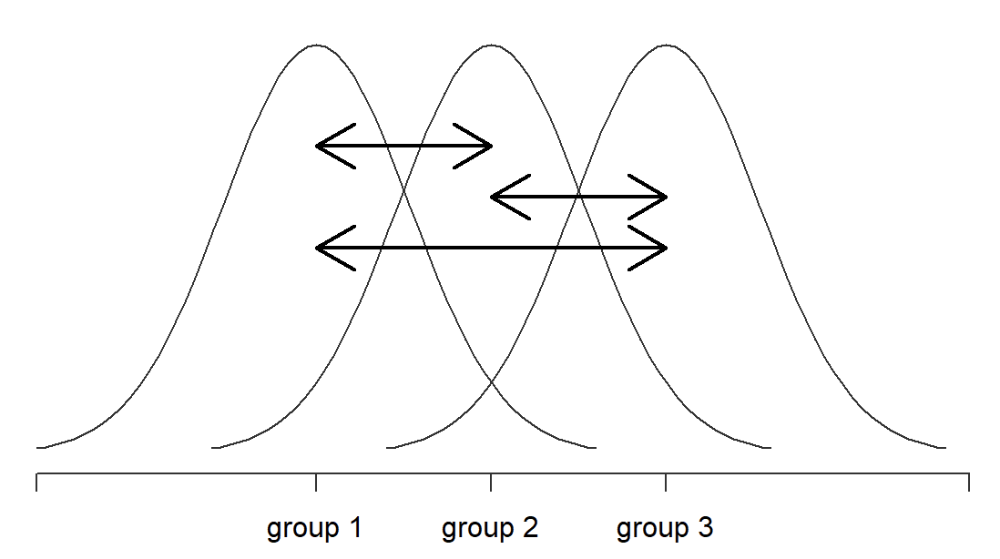
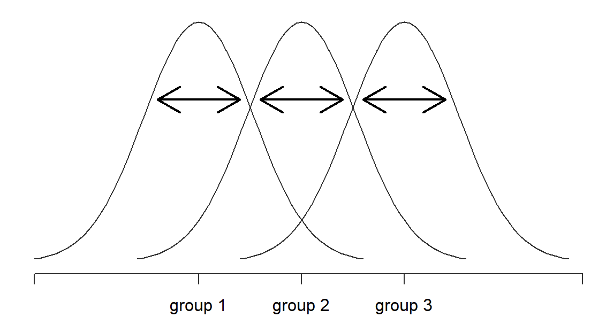
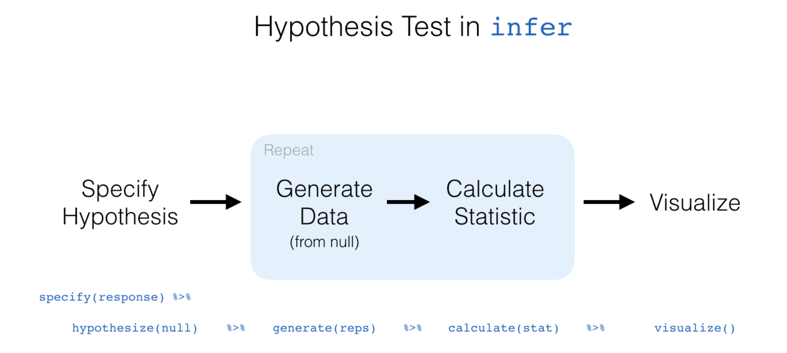

```{r xaringan-themer, include = FALSE}
library(xaringanthemer)
mono_accent(base_color = "#43418A")
```

```{r, include = FALSE}
library(tidyverse)
library(mosaic)
library(infer)
library(skimr)
library(gapminder)
library(lsr)

knitr::opts_chunk$set(warning = FALSE, message = FALSE, 
                      echo = TRUE, dpi = 300)
```

<!--
pagedown::chrome_print("~/Dropbox/Teaching/03-Simmons Courses/MATH227-Intermediate Statistics/Lecture Slides/07-One_Way_ANOVA/07-One_Way_ANOVA.html")
-->

class: center, middle, frame

# One-Way ANOVA

---

# Needed Packages

```{r, warning = FALSE, message = FALSE}
library(tidyverse)
library(mosaic)
library(infer)
library(skimr)
library(gapminder)
library(lsr)
```

- Install `lsr`!
---

# Motivating Example

It is known that life expectancy is not the same across countries and continents. 

- This is related to *many* factors. 

**Two questions:**

1. Are there *significant differences* in life expectancy **between** continents?

2. Are there *significant differences* in life expectancy **within** continents?

---

# `gapminder` data frame

We'll use the `gapminder` data frame, within the `gapminder` R package. 
- This data frame contains developmental statistics for 142 countries measured in five-year intervals between 1952 and 2007. 

**The set-up**:

1. Life expectancy (`lifeExp`) is the **outcome variable** (*y*). 

2. Continent (`continent`) is the **explanatory variable** (*x*). 

    - Note that `continent` is *categorical* with more than two levels. 
  
---

# Exploratory Data Analysis

First, run this code to extract the data from 2007 (don't worry about the syntax for this class):
```{r}
gapminder2007 = gapminder %>%
  filter(year == 2007 & continent != "Oceania") %>% 
  select(country, continent, lifeExp, gdpPercap) %>%
  mutate(continent = factor(continent))
```

--

Let's use `skim()` to get summary statistics for each variable at once. 

- Feel free to use other summary statistic functions if you wish!


```{r, eval = FALSE}
skim(gapminder2007)
```

---

# Summary Statistics

**Some findings**

- Africa has the most countries in the dataset with 52. 

- The median life expectancy (`p50`) is 71.94. This means that half of the countries in this dataset (71 countries) have a life expectancy *less than* 71.94!

- GDP per capita (measured in USD, inflation-adjusted) has a median of <span>&#36;</span>5,981.20 and a mean of <span>&#36;</span>11,421 (!!!)
    - Clearly, this distribution is **right-skewed**. 

---

# Summary Statistics (by continent)

A better way to summarize life expectancy might be to **group by** continent.. 

```{r, comment = ""}
favstats(lifeExp ~ continent, data = gapminder2007)
```

--

- The middle 50% of life expectancy (on the country level) within each of the Americas, Asia, and Europe is is roughly similar. 

- Africa's life expectancy by country is much more *left-skewed*. 
    - The mean isn't much less than the other continents, but the median is *substantially* smaller. 

---

# Practice

Create side-by-side boxplots that compare `lifeExp` between `continent`. 

--

*Solution*

```{r, out.width = "35%"}
gf_boxplot(lifeExp ~ continent, data = gapminder2007) + 
  labs(y = "Life Expectancy")
```

---

# Research Question

Is there a difference in the **average** life expectancy among the five continents?

- To compare the means of *two groups*, we used a **permutation test** for the *difference between two means* (or the theory-based *t*-test, provided a few assumptions and conditions are met). 

--

- To compare the means of *more than two groups*, we will use a test called the **one-way analysis of variance (ANOVA)**.
    - The "one-way" refers to *one* explanatory variable (in this case, `continent`).

---

# ANOVA

The **ANOVA** is used to assess whether the mean of the outcome variable (*y*) is different for different levels of a categorical explanatory variable (*x*).

Let $\mu_{i}$ be the mean of group $i$. 

- $H_{0}$: The mean outcome is **the same** across each category. $$\mu_{1}=\mu_{2}=\cdots=\mu_{k}$$

- $H_{a}$: *At least one* mean is **different** from the others. 

--

*Conditions*

1. The observations should be **independent** *within* and *between* groups. 
    
2. The observations *within* each group should be **approximately normal**. 

    - Check histograms or boxplots for symmetric/unimodal distributions. 
    
3. The **variability** *across each group* should be about equal. 

    - Especially if the sample sizes differ between groups. 
    
---

# Testing Between Only Two Groups

Why might it be inappropriate in this context to simply run a hypothesis test comparing average life expectancy between *Europe* and *Africa* using a 5% significance level?

--

This is called **p-hacking**! 

- Naturally, we would pick pairs of groups with the largest differences in a formal test between two means. 
    - This leads to an inflated *Type I Error* rate. 
    
- Just because there is a large difference between two groups does not necessarily mean that there is a real underlying  effect. 

---

# The ANOVA Table

To perform a one-way ANOVA (also called the **F-test**), we will construct a one way ANOVA table and *reverse engineer* it. 

```{r, comment = ""}
anova_table = aov(lifeExp ~ continent, data = gapminder2007)
summary(anova_table)
```

--

- "Sum Sq" is short for **Sum of Squares**, and "Mean Sq" is short for **Mean Square**. 

- The `continent` row gives information on the variability **between** continents. 
- The `Residuals` row gives information on the variability **within** continents. 

---

# Sum of Squares (Between)

The two **sum of squares** (12,679 and 7,491) are based on the values in this table below. 

.center[
```{r, echo = FALSE}
knitr::kable(data.frame(Continent = c("Africa", "Americas", "Asia", "Europe", "TOTAL"), 
                        Mean.lifeExp = c(54.81, 73.61, 70.73, 77.65, 66.81), 
                        SD.lifeExp = c(9.63, 4.44, 7.96, 2.98, 12.05), 
                        n = c(52, 25, 33, 30, 140)), 
             format = "html", align = "c")
```
]

The sum of squares *between* continents (12,679) is a measure of the variability among the *k* = 4 continents and the overall mean life expectancy (66.81). 

--

**Some math**: 
\begin{align*}
SS_{between}&=52(54.81-66.81)^{2}+25(73.61-66.81)^{2}\\
&\ \ \ \ +33(70.73-66.81)^{2}+30(77.65-66.81)^{2}\\ 
&=12,679
\end{align*}

---

# Sum of Squares (Within)

The two **sum of squares** (12,679 and 7,491) are based on the values in this table below. 

.center[
```{r, echo = FALSE}
knitr::kable(data.frame(Continent = c("Africa", "Americas", "Asia", "Europe", "TOTAL"), 
                        Mean.lifeExp = c(54.81, 73.61, 70.73, 77.65, 66.81), 
                        SD.lifeExp = c(9.63, 4.44, 7.96, 2.98, 12.05), 
                        n = c(52, 25, 33, 30, 140)), 
             format = "html", align = "c")
```
]

The sum of squares *within* continents (7,491) is a composite measure of the variability in the values within each continent. 

--

**Some math**

\begin{align*}
SS_{within}&=(52-1)s_{1}^{2}+(25-1)s_{2}^{2}+(33-1)s_{3}^{2}+(30-1)s_{4}^{2}\\
&=51(9.63)^{2}+24(4.44)^{2}+32(7.96)^{2}+29(2.98)^{2}\\
&=7,491
\end{align*}

---

# Sum of Squares

In general when comparing *k* groups, $$SS_{between}=\sum_{i=1}^{k}n_{i}(\bar{y}_{i}-\bar{y})^{2}$$
and 
\begin{align*}
SS_{within}&=\sum_{i=1}^{k}(n_{i}-1)s_{i}^{2}\\
&=\sum_{i=1}^{k}\sum_{j=1}^{n_{i}}(y_{ij}-\bar{y})^{2}
\end{align*}
using the formula for $s_{i}^{2}$. 

---

# Unpacking Sum of Squares

If all of the group means were **identical**: $$\bar{y}_{1}=\bar{y}_{2}=\bar{y}_{3}=\bar{y}_{4}=\bar{y}$$
then $SS_{between}=0$, implying there is *zero observed variability between group means*.

--

If observations within each group were **identical**: $$y_{11}=y_{12}=\cdots=y_{1n_{1}},\qquad y_{21}=y_{22}=\cdots=y_{2n_{2}},\qquad \text{etc.}$$
then $SS_{within}=0$, implying there is *zero observed variability within groups*. 

--

As the group means get *farther apart*, the deviations $(\bar{y}_{i}-\bar{y})$ increase in absolute value. 

- This gives us greater evidence favoring **rejecting the null hypothesis**. 

---

# Unpacking Sum of Squares

From *Navarro, Chapter 14*:

**Between Groups** variation

.center[
```{r, echo = FALSE}

```
]

---

# Unpacking Sum of Squares

From *Navarro, Chapter 14*:

**Within Groups** variation

.center[
```{r, echo = FALSE}

```
]

---

# Unpacking Sum of Squares

We have found out that the *total variability* associated with the response variable (life expectancy, in this example) can be broken down into:

- Sum of the variation due to differences in sample means *between groups*

- Sum of the variation due to differences among observations *within groups*

How does this tell us if the **average** life expectancy is different between continents?!

--

If the **null hypothesis** were true, we would expect all of the sample means to be pretty similar (i.e., a small $SS_{between}$ relative to $SS_{within}$).

- So if $SS_{between}$ is *large* relative to $SS_{within}$, we would have reason to suspect that the population means for different groups are not *all identical* to each other. 

---

# Degrees of Freedom

```{r, echo = FALSE, comment = ""}
anova.table = aov(lifeExp ~ continent, data = gapminder2007)
summary(anova.table)
```

Associated with each sum of squares is a number of **degrees of freedom** (*df*). 

- For $SS_{between}$ (the `continent` row), $df=\text{number of groups}-1=3$. 

- For $SS_{within}$ (the `Residuals` row), $df=n-\text{number of groups}=140-4=136$.

--

Dividing each of $SS_{between}$ and $SS_{within}$ by their corresponding *df* gives a **mean square**:

- $MS_{between}=12679/3=4226$

- $MS_{within}=7491/136=55$

---

# Test Statistic

The **test statistic** for a one-way ANOVA is $$F=\frac{MS_{between}}{MS_{within}}=\frac{4226}{55}=76.73$$

--

Under the null hypothesis, the test statistic is said to come from an **F-distribution**, in which the shape depends on the two $df$ values. 

Here is the F-distribution for $df_{1}=3$ and $df_{2}=136$:
.center[
```{r, echo = FALSE, out.width = "35%"}
ggplot(data.frame(x = c(0, 20)), aes(x = x)) +
     stat_function(fun = df, args = list(df1 = 3, df2 = 136)) + 
  #geom_vline(xintercept = 76.73, col = "blue", linetype = "dashed", size = 1) +
  labs(x = "Test Statistic", y = "Density") + 
  theme_bw()
```
]

---

# Test Statistic

$$F=\frac{MS_{between}}{MS_{within}}=\frac{4226}{55}=76.73$$

- Think of $MS_{between}$ as a measure of variability *between groups*, and $MS_{within}$ as a measure of variability *within groups*. 

- Under the null hypothesis, the variability between and within groups should be about equal. 

In general the **expected value** of an *F*-distribution is: $$\frac{df_{2}}{df_{2}-2}$$
- In this example, the *expected value* is $136/(136-2)=1.015$. 

---

# p-value

```{r, echo = FALSE, comment = ""}
anova.table = aov(lifeExp ~ continent, data = gapminder2007)
summary(anova.table)
```

The p-value is given in the ANOVA table, and is evident both by the large value of $F$ and its place in the graph of the *null distribution* on the previous slide. 

We can **reject the null hypothesis** and conclude that *at least one* of the four examined continents has an average life expectancy that is significantly different from the others. 

---

# Effect Size

A common (and slightly more *interpretable*) statistic used in ANOVA is called the **effect size** - specifically, $\eta^{2}$ (**eta squared**): $$\eta^{2}=\frac{SS_{between}}{SS_{between}+SS_{within}}$$

In the `gapminder` example, $SS_{within}=12679$ and $SS_{between}+SS_{within}=12679+7491=20170$, so... $$\eta^{2}=\frac{12679}{20170}=0.6286$$

--

**Interpretation**: The *proportion of variability* in the response variable (`lifeExp`) that can be explained by the explanatory variable (`continent`). 

- $\eta^{2}=0$ means there is *no relationship* between the two variables. 
- $\eta^{2}=1$ means that the relationship is *perfect*. 

---

# Effect Size

You can add up the $SS_{between}$ and $SS_{within}$ by hand from the `aov()` table to calculate $\eta^{2}$. 

Alternatively, the `etaSquared()` function in the `lsr` package will calculate this for you, as long as you provide the function with your `aov()` table:
```{r}
etaSquared(anova.table)
```

---

# Checking the Equal Variance Condition

Condition #3 on a previous slide stated that the variability *across each group* should be about equal. 

- This is questionable based on the side-by-side boxplots we made earlier, but there is a general rule of thumb to check this. 

--

.center[
```{r, echo = FALSE}
knitr::kable(data.frame(Continent = c("Africa", "Americas", "Asia", "Europe"), 
                        Mean.lifeExp = c(54.81, 73.61, 70.73, 77.65), 
                        SD.lifeExp = c(9.63, 4.44, 7.96, 2.98), 
                        n = c(52, 25, 33, 30)), 
             format = "html", align = "c")
```
]

Let $S_{max}$ be the largest standard deviation and $S_{min}$ be the smallest. Then the equal variability condition is valid if: $$\frac{S_{max}}{S_{min}}<2$$

---

# Checking the Equal Variance Condition

.center[
```{r, echo = FALSE}
knitr::kable(data.frame(Continent = c("Africa", "Americas", "Asia", "Europe"), 
                        Mean.lifeExp = c(54.81, 73.61, 70.73, 77.65), 
                        SD.lifeExp = c(9.63, 4.44, 7.96, 2.98), 
                        n = c(52, 25, 33, 30)), 
             format = "html", align = "c")
```
]

- In this example, $S_{max}/S_{min}=9.73/2.98=3.27$, so this condition might not be valid... 

--

What do we do?!

.center[
```{r, echo = FALSE, out.width = "25%"}

```
]

---

class: center, middle, frame

# Permutation F-Tests

---

# Reminder: `infer`

`infer` to the rescue!

```{r, echo = FALSE, out.width = "15%"}
knitr::include_graphics("infer_hex.png")
```

.center[
```{r, echo = FALSE, out.width = "85%"}

```

]

---

# One Permutation

Let's take one permutation from the `gapminder2007` data:

```{r, echo = FALSE}
set.seed(12)
```

```{r, eval = FALSE}
one.perm = gapminder2007 %>%
  specify(response = lifeExp, explanatory = continent) %>%
  hypothesize(null = "independence") %>%
  generate(reps = 1, type = "permute")
View(one.perm)
```

```{r, echo = FALSE}
one.perm = gapminder2007 %>%
  specify(response = lifeExp, explanatory = continent) %>%
  hypothesize(null = "independence") %>%
  generate(reps = 1, type = "permute")
```

---

# What's going on here?

.pull-left[
```{r, echo = FALSE, comment = ""}
one.perm
```
]

.pull-right[
If the average life expectancy in each continent was equal (i.e., if life expectancy and continent were **independent**)...

- ...then we might as well *shuffle* the different countries and their life expectancies between continents. 

Each `continent`/`lifeExp` pairing in `one.perm` is a random *permutation* from the original data.
]

---

# One Permutation

Now let's calculate the *F* statistic for the *single permutation*:

```{r, comment = ""}
one.perm %>%
  calculate(stat = "F")
```

--

Chances are, your *F* statistic was small. 

- Remember, `one.perm` comes from a world where continent and life expectancy are *independent*. So the *F* statistic should be small!

---

# Many Permutations

As before, let's generate 1,000 (or more) permutations!

```{r, echo = FALSE}
set.seed(12)
```

```{r}
null_distribution_F = gapminder2007 %>%
  specify(response = lifeExp, explanatory = continent) %>%
  hypothesize(null = "independence") %>%
  generate(reps = 1000, type = "permute") %>%
  calculate(stat = "F")
```

---

# Visualize the Null Distribution

```{r, out.width = "50%", warning = FALSE}
visualize(null_distribution_F, method = "both")
```

---

# Visualize the Null Distribution

```{r, out.width = "50%"}
visualize(null_distribution_F) + 
  shade_p_value(obs_stat = 76.73, direction = "greater") #<<
```

---

# P-value

Let's use `get_p_value()`:

```{r, comment = ""}
gapminder2007 %>% 
  specify(response = lifeExp, explanatory = continent) %>%
  hypothesize(null = "independence") %>%
  generate(reps = 1000, type = "permute") %>%
  calculate(stat = "F")  %>%
  get_p_value(obs_stat = 76.73, direction = "greater")
```

--

Compare this with the P-value obtained using the **theoretical test**:

```{r, echo = FALSE, comment = ""}
anova.table = aov(lifeExp ~ continent, data = gapminder2007)
summary(anova.table)
```

---

# Conclusion

Using a permutation F-test, *we reject the null hypothesis* that the average life expectancies of each continent are equal. 

- We have sufficient evidence to conclude that at least one mean is different. 

You might be asking yourselves something...

--

**Which mean is different?!**

---

class: center, middle, frame

# Multiple Comparisons and Post-Hoc Tests

---

# Post-ANOVA Analyses

If you run an ANOVA with more than two groups and *reject the null hypothesis* (i.e., a significant effect), all this tells you is that **at least one group mean is different from the rest**. 

- A natural follow-up question to ask is: **Which groups are different from one another?**

--

Recall the null hypothesis from the `gapminder` example: $$H_{0}:\mu_{Africa}=\mu_{America}=\mu_{Asia}=\mu_{Europe}$$

In this null hypothesis, we are actually claiming **six** *different things simultaneously*:
- The average life expectancies of Africa and America are equal. 
- The average life expectancies of Africa and Asia are equal. 
- ...and so on!

---

# Post-ANOVA Analyses

If any of those six claims are false, then we **reject the null**. But which claim(s) are false?

Given that we have six different **pairs of means** to compare, we could just run separate "post-hoc" hypothesis tests for two means!

- Either six **two-sample t-tests**, or six **permutation tests**

---

# Running "Pairwise" Tests

Let's compare the average life expectancy of Africa and America, $\mu_{Africa}$ and $\mu_{America}$. 

To do this, we have to take the `gapminder2007` data and `filter()` those two continents:

```{r}
gapminder2007_AfAm = filter(gapminder2007, 
                            continent %in% c("Africa", "Americas"))
```

--

Next, run a two-sample *t*-test:

```{r, eval = FALSE}
t.test(lifeExp ~ continent, data = gapminder2007_AfAm)
```

---

# Running "Pairwise" Tests

Or, run a *permutation test*:

```{r, comment = ""}
# Sample statistic
xbar.diff = gapminder2007_AfAm %>%
  specify(formula = lifeExp ~ continent) %>%
  calculate(stat = "diff in means", order = c("Africa", "Americas"))
```

```{r, comment = ""}
# Hypothesis test
gapminder2007_AfAm %>%
  specify(response = lifeExp, explanatory = continent) %>%
  hypothesize(null = "independence") %>%
  generate(reps = 1000, type = "permute") %>%
  calculate(stat = "diff in means", order = c("Africa", "Americas")) %>%
  get_p_value(obs_stat = xbar.diff, direction = "both")
```

---

# Problems with Many Pairwise Tests

It wouldn't take *much* time to run all six pairwise comparisons to find *which group means* are different. 

However, there are some *problems* with this:

- It is **tedious**. 

    - Imagine if we had **ten** means to compare instead of **six**. That would mean $\binom{10}{2}=45$ pairwise comparisons!
    
--

- This is **p-hacking**, or fishing through many pairwise comparisons until we find the significant ones. 

    - p-hacking, like *pie charts*, is **bad**!

--

- We set $\alpha$, or the *significance level* to be 0.05 in each test!

    - Remember, $alpha$ is also the probability of **Type I Error** (falsely rejecting a null hypothesis). 

---

# p-hacking

.center[
```{r, echo = FALSE}
knitr::include_graphics("p_hacking.png")
```
]

---

# Study Design

15 subjects (!) recruited to take part in a study on "dieting"
- Aged 19-67 years

- Randomly assigned to one of three diet groups:
    - low carb group
    - low carb plus 1.5 oz chocolate group
    - control group (no changes made to diet)
    
- Weighed each morning for 21 days
    
--

**Results**

The *low carb plus 1.5 oz chocolate* group lost weight 10% faster than the low carb group!!!

- This group also had statistically significantly better cholesterol and well-being measures. 

---

# What REALLY happened?

The researchers measured **18 different things**: weight, cholesterol, sodium, blood protein levels, sleep, well-being, etc.

- If you measure many things on a small number of people, you have a very high chance of obtaining a *significant result*!

--

Think of each measurement as a "lottery ticket," where "winning" is attaining *statistical significance*. 

For 18 separate "tests", 
\begin{align*}
P(\text{winning})&=1-P(\text{losing on all 18 tests})\\
&=1-(1-0.05)^{18}=0.6027857
\end{align*}

There is a **60% chance** of having a *statistically significant result* (p-value < 0.05) just by chance!

---

# Post-Hoc Tests

Let's focus a bit more on the *third problem* of conducting many pairwise tests:
- We set $\alpha$, or the *significance level* to be 0.05 in each test!

We had only six pairwise comparisons. 
- But if we had 45 comparisons, we could *expect* at least to *incorrectly reject a null hypothesis* in at least two or three tests just by chance alone!
    
--

**A solution?**

Use a **correction for multiple comparisons**, which is an adjustment to the p-value for each post-hoc test. 

There are many methods to correct for multiple comparisons, but we will use **Tukey's HSD (Honestly Significant Difference) test**. 

- Another is the **Bonferroni correction**, which simply multiplies each *pairwise P-value* by the number of total comparisons.

---

# Tukey's HSD

```{r, comment = ""}
anova_table = aov(lifeExp ~ continent, data = gapminder2007)
TukeyHSD(anova_table)
```

- To find the pairs of means that are *significantly different* find the confidence intervals that do not contain the *null value* of 0, or p-values $<0.05$.

---

# Tukey's HSD

```{r, out.width = "50%"}
plot(TukeyHSD(anova.table))
```

---

# Tukey's HSD (Details)

When using a correction for multiple comparisons, the 5% level of significance and the confidence level (95%) apply to the **family consisting of all pairwise comparisons**. 

In this example, the **family level of significance**, $\alpha=0.05$, is defined as: $$P(\text{at least one Type I Error in the six tests})=0.05$$

--

**Note**: Tukey's HSD, and all **post-hoc tests**, should be performed *after* a significant F-test.


