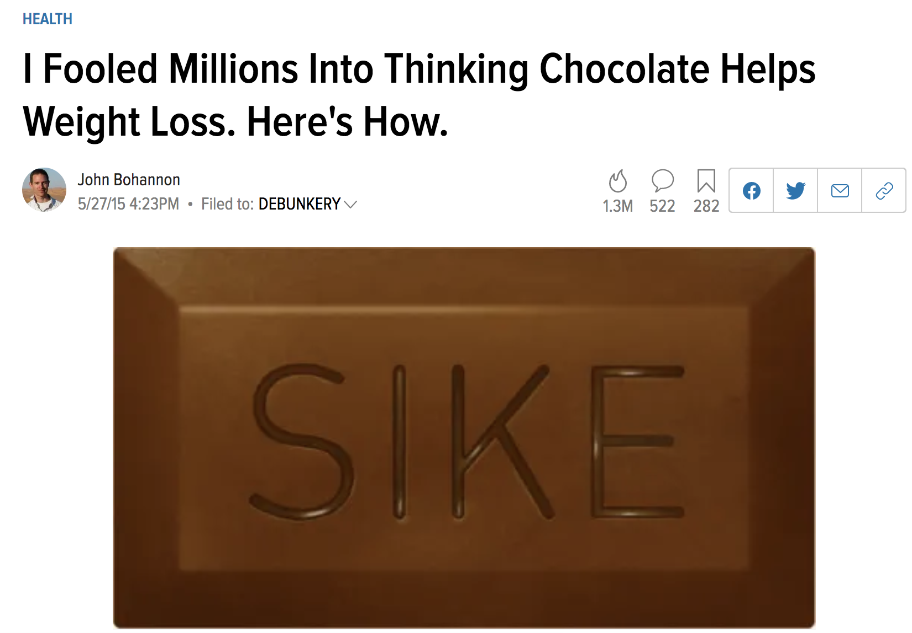

```{r xaringan-themer, include = FALSE}
library(xaringanthemer)
mono_accent(base_color = "#43418A")
```

```{r, include = FALSE}
library(tidyverse)
library(mosaic)
library(infer)

knitr::opts_chunk$set(warning = FALSE, message = FALSE, 
                      echo = TRUE, dpi = 300)
```

<!--
pagedown::chrome_print("~/Dropbox/Teaching/03-Simmons Courses/MATH227-Intermediate Statistics/Lecture Slides/07-One_Way_ANOVA/07-One_Way_ANOVA.html")
-->

class: center, middle, frame

# One-Way ANOVA

---

# Needed Packages

```{r, warning = FALSE, message = FALSE}
library(tidyverse)
library(mosaic)
library(infer)
```

---

# Motivating Example

It is known that "*danceability*" (and other music-related metrics) are not the same across different *songs* and *genres*. 

- This is related to *many* factors. 

**Two questions:**

1. Are there *significant differences* in danceability **between** genres?

2. Are there *significant differences* in danceability **within** genres?

---

# `spotify_songs` data 

We'll use a smaller version of the `spotify_songs` data from [TidyTuesday](https://github.com/rfordatascience/tidytuesday/blob/master/data/2020/2020-01-21/readme.md)

- This dataset contains song statistics for over 30,000 songs scraped from Spotify. 

We'll select 250 songs at random:

```{r}
set.seed(227) # RUN THIS!!!
spotify_songs = read.csv('https://raw.githubusercontent.com/rfordatascience/tidytuesday/master/data/2020/2020-01-21/spotify_songs.csv')
spotify_songs = spotify_songs %>%
  slice_sample(n = 250) 
```

**The set-up**:

1. Danceability (`danceability`) is the **outcome variable** (*y*). 

2. Genre (`playlist_genre`) is the **explanatory variable** (*x*). 

    - Note that `playlist_genre` is *categorical* with more than two levels. 
  
---

# Exploratory Data Analysis

```{r}
favstats( ~ danceability, data = spotify_songs) %>%
  select(median, mean, sd, n)
```


```{r}
favstats(danceability ~ playlist_genre, data = spotify_songs) %>%
  select(playlist_genre, median, mean, sd, n)
```

- Rap and Latin music have the highest mean danceability, whereas rock has the lowest. 

- Similar levels of variability within each genre. 

---

# Dataviz

```{r, dpi = 300, out.width = "50%"}
gf_boxplot(danceability ~ playlist_genre, data = spotify_songs) + 
  labs(x = "", y = "Danceability") + 
  theme_minimal()
```

---

# Dataviz

```{r, dpi = 300, out.width = "50%"}
gf_density( ~ danceability, fill = ~ playlist_genre, data = spotify_songs) + 
  labs(x = "Danceability", fill = "Genre") + 
  theme_minimal()
```

---

# Research Question

Is there a difference in the **average** danceability among the six genres?

- To compare the means of *two groups*, we used a **permutation test** for the *difference between two means* (or the theory-based *t*-test, provided a few assumptions and conditions are met). 

--

- To compare the means of *more than two groups*, we will use a test called the **one-way analysis of variance (ANOVA)**.
    - The "one-way" refers to *one* explanatory variable (in this case, `playlist_genre`).

---

# ANOVA

The **ANOVA** is used to assess whether the mean of the outcome variable (*y*) is different for different levels of a categorical explanatory variable (*x*).

Let $\mu_{i}$ be the mean of group $i$. 

- $H_{0}$: The mean outcome is **the same** across each category. $$\mu_{1}=\mu_{2}=\cdots=\mu_{k}$$

- $H_{a}$: *At least one* mean is **different** from the others. 

--

*Conditions*

1. The observations should be **independent** *within* and *between* groups. 
    
2. The observations *within* each group should be **approximately normal**. 

    - Check histograms or boxplots for symmetric/unimodal distributions. 
    
3. The **variability** *across each group* should be about equal. 

    - Especially if the sample sizes differ between groups. 

---

# The ANOVA Table

To perform a one-way ANOVA (also called the **F-test**), we will construct a one way ANOVA table and *reverse engineer* it. 

```{r, comment = ""}
anova_table = aov(danceability ~ playlist_genre, data = spotify_songs)
summary(anova_table)
```

--

- "Sum Sq" is short for **Sum of Squares**, and "Mean Sq" is short for **Mean Square**. 

- The `playlist_genre` row gives information on the variability **between** genres. 
- The `Residuals` row gives information on the variability **within** genre. 

---

# Sum of Squares (Between)

The two **sum of squares** (1.4 and 4.019) are based on the values in this table below. 

.center[
```{r, echo = FALSE}
knitr::kable(data.frame(Genre = c("EDM", "Latin", "Pop", "R&B", "Rap", "Rock", "TOTAL"), 
                        Mean.dance = c(0.65, 0.72, 0.65, 0.66, 0.74, 0.51, 0.65), 
                        SD.dance = c(0.12, 0.12, 0.13, 0.13, 0.15, 0.12, 0.15), 
                        n = c(38, 40, 44, 48, 34, 46, 250)), 
             format = "html", align = "c")
```
]

The sum of squares *between* genres (1.4) is a measure of the variability among the *k* = 6 genres and the overall mean danceability (0.65). 

--

\begin{align*}
SS_{between}&=38(0.65-0.65)^{2}+40(0.72-0.65)^{2}+44(0.65-0.65)^{2}+48(0.66-0.65)^{2}\\ 
&\ \ \ \ +34(0.74-0.65)^{2} + 46(0.51-0.65)^{2}\\
&\approx 1.4
\end{align*}

---

# Sum of Squares (Within)

The two **sum of squares** (1.4 and 4.019) are based on the values in this table below. 

.center[
```{r, echo = FALSE}
knitr::kable(data.frame(Genre = c("EDM", "Latin", "Pop", "R&B", "Rap", "Rock", "TOTAL"), 
                        Mean.dance = c(0.65, 0.72, 0.65, 0.66, 0.74, 0.51, 0.65), 
                        SD.dance = c(0.12, 0.12, 0.13, 0.13, 0.15, 0.12, 0.15), 
                        n = c(38, 40, 44, 48, 34, 46, 250)), 
             format = "html", align = "c")
```
]

The sum of squares *within* genres (4.019) is a composite measure of the variability in the values within each genre. 

--

\begin{align*}
SS_{within}&=(38-1)s_{1}^{2}+(40-1)s_{2}^{2}+(44-1)s_{3}^{2}+(48-1)s_{4}^{2}+(34-1)s_{5}^{2}+(46-1)s_{6}^{2}\\
&=37(0.12)^{2}+39(0.12)^{2}+43(0.13)^{2}+47(0.13)^{2}+33(0.15)^{2}+45(0.12)^{2}\\
&\approx 4.019
\end{align*}

---

# Sum of Squares

In general when comparing *k* groups, $$SS_{between}=\sum_{i=1}^{k}n_{i}(\bar{y}_{i}-\bar{y})^{2}$$
and 
\begin{align*}
SS_{within}&=\sum_{i=1}^{k}(n_{i}-1)s_{i}^{2}\\
&=\sum_{i=1}^{k}\sum_{j=1}^{n_{i}}(y_{ij}-\bar{y})^{2}
\end{align*}
using the formula for $s_{i}^{2}$. 

---

# Unpacking Sum of Squares

If all of the group means were **identical**: $$\bar{y}_{1}=\bar{y}_{2}=\bar{y}_{3}=\bar{y}_{4}=\bar{y}_{5}=\bar{y}_{6}=\bar{y}$$
then $SS_{between}=0$, implying there is *zero observed variability between group means*.

If observations within each group were **identical**: $$y_{11}=y_{12}=\cdots=y_{1n_{1}},\qquad y_{21}=y_{22}=\cdots=y_{2n_{2}},\qquad \text{etc.}$$
then $SS_{within}=0$, implying there is *zero observed variability within groups*. 

--

As the group means get *farther apart*, the deviations $(\bar{y}_{i}-\bar{y})$ increase in absolute value. 

- This gives us greater evidence favoring **rejecting the null hypothesis**. 

---

# Unpacking Sum of Squares (Navarro, Ch. 14)

**Between Groups** variation

.center[
```{r, echo = FALSE}
knitr::include_graphics("var_between.png")
```
]

**Within Groups** variation

.center[
```{r, echo = FALSE}
knitr::include_graphics("var_within.png")
```
]

---

# Unpacking Sum of Squares

We have found out that the *total variability* associated with the response variable (danceability, in this example) can be broken down into:

- Sum of the variation due to differences in sample means *between groups*

- Sum of the variation due to differences among observations *within groups*

How does this tell us if the **average** danceability is different between genres?!

--

If the **null hypothesis** were true, we would expect all of the sample means to be pretty similar (i.e., a small $SS_{between}$ relative to $SS_{within}$).

- So if $SS_{between}$ is *large* relative to $SS_{within}$, we would have reason to suspect that the population means for different groups are not *all identical* to each other. 

---

# Degrees of Freedom

```{r, echo = FALSE, comment = ""}
anova_table = aov(danceability ~ playlist_genre, data = spotify_songs)
summary(anova_table)
```

Associated with each sum of squares is a number of **degrees of freedom** (*df*). 

- For $SS_{between}$ (the `playlist_genre` row), $df=\text{number of groups}-1=5$. 

- For $SS_{within}$ (the `Residuals` row), $df=n-\text{number of groups}=250-6=244$.

--

Dividing each of $SS_{between}$ and $SS_{within}$ by their corresponding *df* gives a **mean square**:

- $MS_{between}=1.4/5=0.28$

- $MS_{within}=4.019/244=0.016$

---

# Test Statistic

The **test statistic** for a one-way ANOVA is $$F=\frac{MS_{between}}{MS_{within}}=\frac{0.28}{0.016}=17$$

Under the null hypothesis, the test statistic is said to come from an **F-distribution**, in which the shape depends on the two $df$ values. 

Here is the F-distribution for $df_{1}=5$ and $df_{2}=244$:
.center[
```{r, echo = FALSE, out.width = "35%"}
ggplot(data.frame(x = c(0, 20)), aes(x = x)) +
     stat_function(fun = df, args = list(df1 = 5, df2 = 244)) + 
  #geom_vline(xintercept = 76.73, col = "blue", linetype = "dashed", size = 1) +
  labs(x = "Test Statistic", y = "Density") + 
  theme_bw()
```
]

---

# Test Statistic

$$F=\frac{MS_{between}}{MS_{within}}=\frac{0.28}{0.016}=17$$

- Think of $MS_{between}$ as a measure of variability *between groups*, and $MS_{within}$ as a measure of variability *within groups*. 

- Under the null hypothesis, the variability between and within groups should be about equal. 

---

# p-value

```{r, echo = FALSE, comment = ""}
anova_table = aov(danceability ~ playlist_genre, data = spotify_songs)
summary(anova_table)
```

The p-value is given in the ANOVA table, and is evident both by the large value of $F$ and its place in the graph of the *null distribution* on the previous slide. 

We can **reject the null hypothesis** and conclude that *at least one* of the six examined genres has an average danceability that is significantly different from the others. 

---

# Checking the Equal Variance Condition

Condition #3 on a previous slide stated that the variability *across each group* should be about equal. 

--

.center[
```{r, echo = FALSE}
knitr::kable(data.frame(Genre = c("EDM", "Latin", "Pop", "R&B", "Rap", "Rock", "TOTAL"), 
                        Mean.dance = c(0.65, 0.72, 0.65, 0.66, 0.74, 0.51, 0.65), 
                        SD.dance = c(0.12, 0.12, 0.13, 0.13, 0.15, 0.12, 0.15), 
                        n = c(38, 40, 44, 48, 34, 46, 250)), 
             format = "html", align = "c")
```
]

Let $S_{max}$ be the largest standard deviation and $S_{min}$ be the smallest. Then the equal variability condition is valid if: $$\frac{S_{max}}{S_{min}}<2$$

---

# Checking the Equal Variance Condition

.center[
```{r, echo = FALSE}
knitr::kable(data.frame(Genre = c("EDM", "Latin", "Pop", "R&B", "Rap", "Rock", "TOTAL"), 
                        Mean.dance = c(0.65, 0.72, 0.65, 0.66, 0.74, 0.51, 0.65), 
                        SD.dance = c(0.12, 0.12, 0.13, 0.13, 0.15, 0.12, 0.15), 
                        n = c(38, 40, 44, 48, 34, 46, 250)), 
             format = "html", align = "c")
```
]

- In this example, $S_{max}/S_{min}=0.15/0.12=1.25$, so this should be okay... 

--

But what if it wasn't?!

.center[
```{r, echo = FALSE, out.width = "15%"}
knitr::include_graphics("blush_emoji.png")
```
]

---

class: center, middle, frame

# Permutation F-Tests

---

# Reminder: `infer`

`infer` to the rescue!

```{r, echo = FALSE, out.width = "15%"}
knitr::include_graphics("infer_hex.png")
```

.center[
```{r, echo = FALSE, out.width = "85%"}
knitr::include_graphics("infer_pipeline.png")
```

]

---

# One Permutation

Let's take one permutation from the `spotify_songs` data:

```{r, echo = FALSE}
set.seed(12)
```

```{r, eval = FALSE}
one_perm = spotify_songs %>%
  specify(response = danceability, explanatory = playlist_genre) %>%
  hypothesize(null = "independence") %>%
  generate(reps = 1, type = "permute")
View(one_perm)
```

```{r, echo = FALSE}
one_perm = spotify_songs %>%
  specify(response = danceability, explanatory = playlist_genre) %>%
  hypothesize(null = "independence") %>%
  generate(reps = 1, type = "permute")
```

---

# What's going on here?

.pull-left[
```{r, echo = FALSE, comment = ""}
one_perm
```
]

.pull-right[
If the average danceability for each genre was equal (i.e., if danceability and genre were **independent**)...

- ...then we might as well *shuffle* the different songs and their danceabilities between genres. 

]

---

# One Permutation

Now let's calculate the *F* statistic for the *single permutation*:

```{r, comment = ""}
one_perm %>%
  calculate(stat = "F")
```

Chances are, your *F* statistic was small. 

- Remember, `one_perm` comes from a world where genre and danceability are *independent*. So the *F* statistic should be small!

---

# Many Permutations

As before, let's generate 1,000 (or more) permutations!

```{r, echo = FALSE}
set.seed(12)
```

```{r}
null_distribution_F = spotify_songs %>%
  specify(response = danceability, explanatory = playlist_genre) %>%
  hypothesize(null = "independence") %>%
  generate(reps = 1000, type = "permute") %>%
  calculate(stat = "F")
```

---

# Visualize the Null Distribution

```{r, out.width = "50%", warning = FALSE}
visualize(null_distribution_F, method = "both")
```

---

# Visualize the Null Distribution

```{r, out.width = "50%"}
visualize(null_distribution_F) + 
  shade_p_value(obs_stat = 17, direction = "greater") #<<
```

---

# P-value

Let's use `get_p_value()`:

```{r, comment = ""}
null_distribution_F %>%
  get_p_value(obs_stat = 17, direction = "greater")
```


Compare this with the P-value obtained using the **theoretical test**:

```{r, echo = FALSE, comment = ""}
anova_table = aov(danceability ~ playlist_genre, data = spotify_songs)
summary(anova_table)
```

---

# Conclusion

Using a permutation F-test, *we reject the null hypothesis* that the average danceability for each genre are equal. 

- We have sufficient evidence to conclude that at least one mean is different. 

You might be asking yourselves something...

**Which mean is different?!**

---

class: center, middle, frame

# Multiple Comparisons and Post-Hoc Tests

---

# Post-ANOVA Analyses

If you run an ANOVA with more than two groups and *reject the null hypothesis* (i.e., a significant effect), all this tells you is that **at least one group mean is different from the rest**. 

- A natural follow-up question to ask is: **Which groups are different from one another?**

--

Recall the null hypothesis from the `gapminder` example: $$H_{0}:\mu_{edm}=\mu_{latin}=\mu_{pop}=\mu_{r\&b}=\mu_{rap}=\mu_{rock}$$

In this null hypothesis, we are actually claiming **15** *different things simultaneously*:
- The average danceability of EDM and Latin songs are equal. 
- The average danceability of EDM and Pop are equal. 
- ...and so on!

---

# Post-ANOVA Analyses

If any of those 15 claims are false, then we **reject the null**. But which claim(s) are false?

Given that we have 15 different **pairs of means** to compare, we could just run separate "post-hoc" hypothesis tests for two means!

- Either 15 **two-sample t-tests**, or 15 **permutation tests**

---

# Running "Pairwise" Tests

Let's compare the average danceability of EDM and Pop, $\mu_{edm}$ and $\mu_{pop}$. 

To do this, we have to take the `spotify_songs` data and `filter()` those two genres:

```{r}
spotify_edm_pop = spotify_songs %>%
  filter(playlist_genre %in% c("edm", "pop"))
```

Next, run a two-sample *t*-test:

```{r, eval = FALSE}
t.test(danceability ~ playlist_genre, data = spotify_edm_pop)
```

---

# Running "Pairwise" Tests

Or, run a *permutation test*:

```{r, comment = ""}
# Sample statistic
xbar_diff = spotify_edm_pop %>%
  specify(response = danceability, explanatory = playlist_genre) %>%
  calculate(stat = "diff in means", order = c("edm", "pop"))
```

```{r, comment = ""}
# Hypothesis test
spotify_edm_pop %>%
  specify(response = danceability, explanatory = playlist_genre) %>%
  hypothesize(null = "independence") %>%
  generate(reps = 1000, type = "permute") %>%
  calculate(stat = "diff in means", order = c("edm", "pop")) %>%
  get_p_value(obs_stat = xbar_diff, direction = "both")
```

---

# Problems with Many Pairwise Tests

It wouldn't take *too much* time to run all 15 pairwise comparisons to find *which group means* are different. 

However, there are some *problems* with this:

- It is **incredibly tedious**. 

    - Imagine if we had **ten** means to compare instead of **six**. That would mean $\binom{10}{2}=45$ pairwise comparisons!
    
--

- This is **p-hacking**, or fishing through many pairwise comparisons until we find the significant ones. 

    - p-hacking, like *pie charts*, is **bad**!


- We set $\alpha$, or the *significance level* to be 0.05 in each test!

    - Remember, $alpha$ is also the probability of **Type I Error** (falsely rejecting a null hypothesis). 

---

# p-hacking

.center[
```{r, echo = FALSE}

```
]

---

# Study Design

15 subjects (!) recruited to take part in a study on "dieting"
- Aged 19-67 years

- Randomly assigned to one of three diet groups:
    - low carb group
    - low carb plus 1.5 oz chocolate group
    - control group (no changes made to diet)
    
- Weighed each morning for 21 days
    
--

**Results**

The *low carb plus 1.5 oz chocolate* group lost weight 10% faster than the low carb group!!!

- This group also had statistically significantly better cholesterol and well-being measures. 

---

# What REALLY happened?

The researchers measured **18 different things**: weight, cholesterol, sodium, blood protein levels, sleep, well-being, etc.

- If you measure many things on a small number of people, you have a very high chance of obtaining a *significant result*!

Think of each measurement as a "lottery ticket," where "winning" is attaining *statistical significance*. 

For 18 separate "tests", 
\begin{align*}
P(\text{winning})&=1-P(\text{losing on all 18 tests})\\
&=1-(1-0.05)^{18}=0.6027857
\end{align*}

There is a **60% chance** of having a *statistically significant result* (p-value < 0.05) just by chance!

---

# Post-Hoc Tests

Let's focus a bit more on the *third problem* of conducting many pairwise tests:
- We set $\alpha$, or the *significance level* to be 0.05 in each test!

We had 15 pairwise comparisons. 
- But if we had 45 comparisons, we could *expect* at least to *incorrectly reject a null hypothesis* in at least two or three tests just by chance alone!
  

**A solution?**

Use a **correction for multiple comparisons**, which is an adjustment to the p-value for each post-hoc test. 

There are many methods to correct for multiple comparisons, but we will use **Tukey's HSD (Honestly Significant Difference) test**. 

- Another is the **Bonferroni correction**, which simply multiplies each *pairwise P-value* by the number of total comparisons.

---

# Tukey's HSD

```{r, comment = ""}
anova_table = aov(danceability ~ playlist_genre, data = spotify_songs)
TukeyHSD(anova_table)
```


---

# Tukey's HSD (Details)

When using a correction for multiple comparisons, the 5% level of significance and the confidence level (95%) apply to the **family consisting of all pairwise comparisons**. 

In this example, the **family level of significance**, $\alpha=0.05$, is defined as: $$P(\text{at least one Type I Error in the 15 tests})=0.05$$


**Note**: Tukey's HSD, and all **post-hoc tests**, should be performed *after* a significant F-test.


