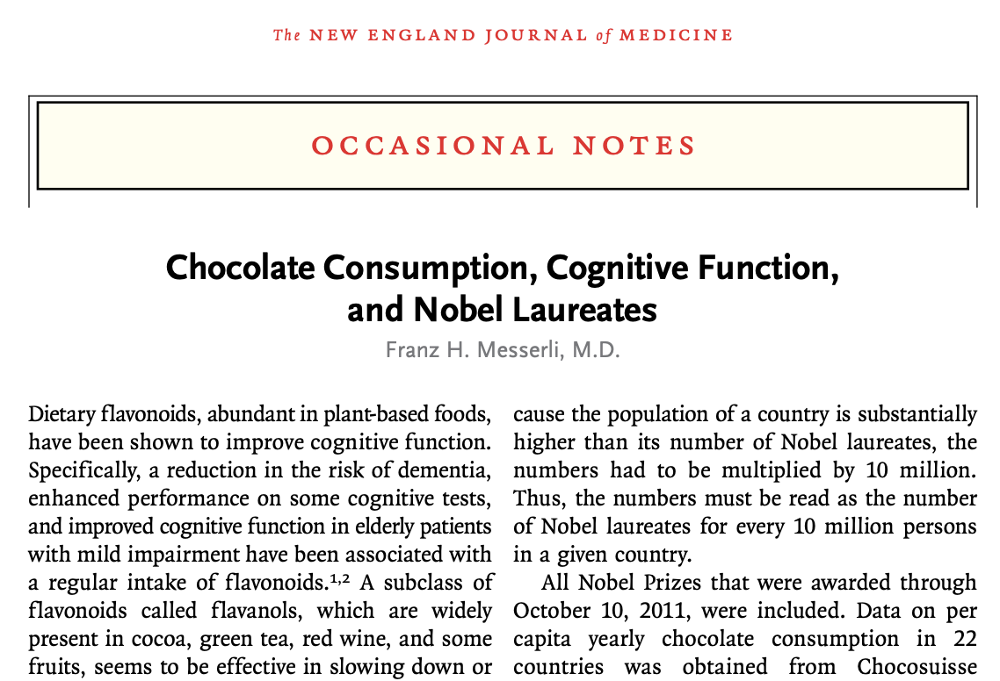
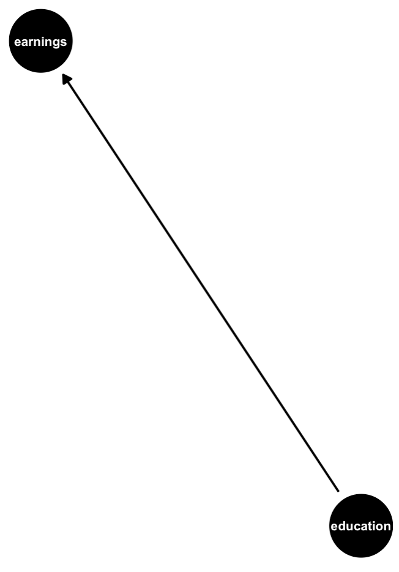
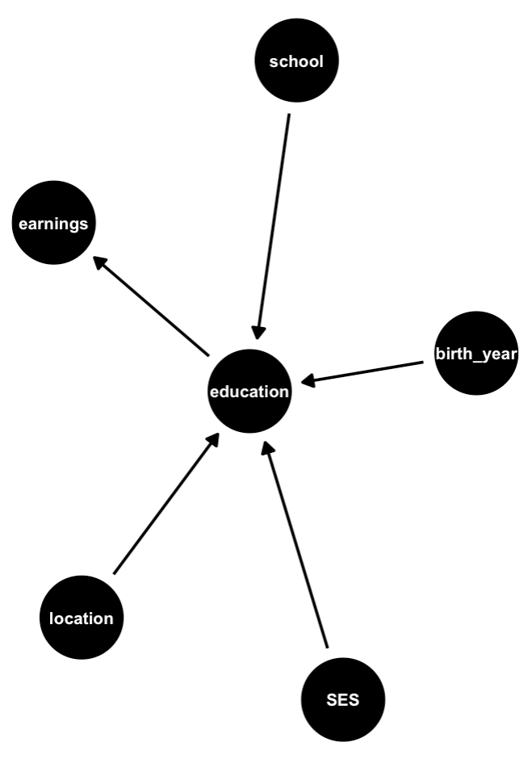
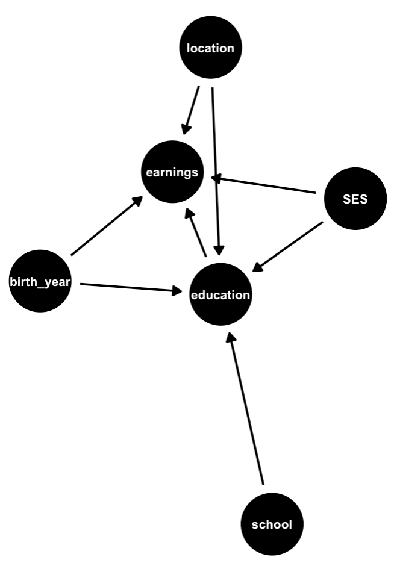
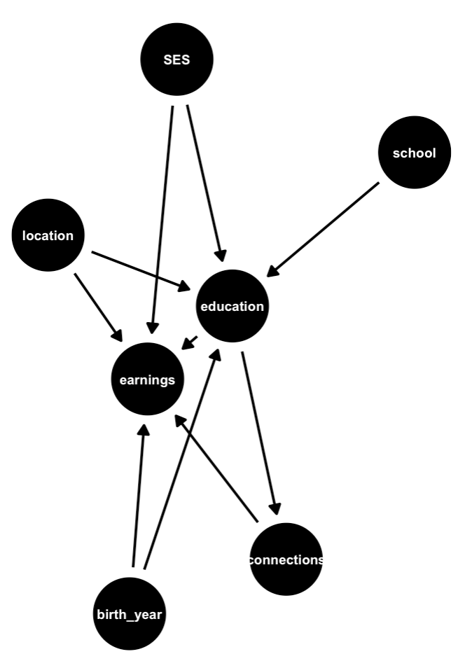
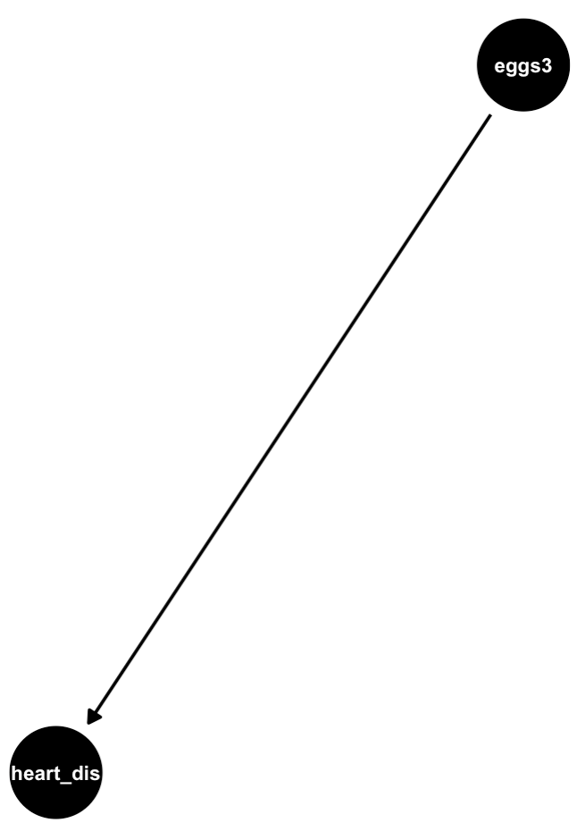
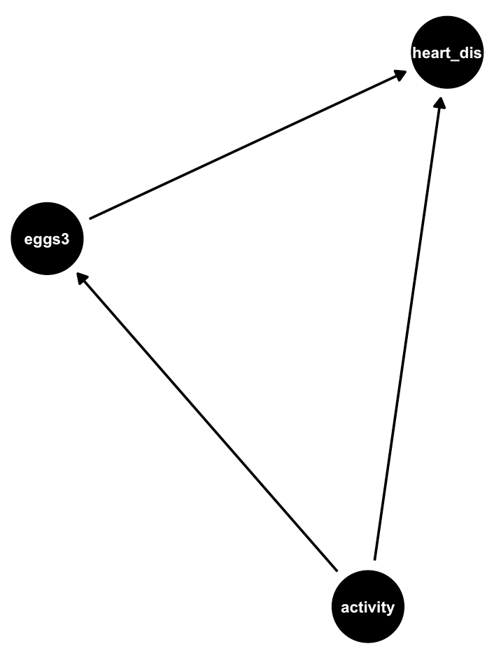
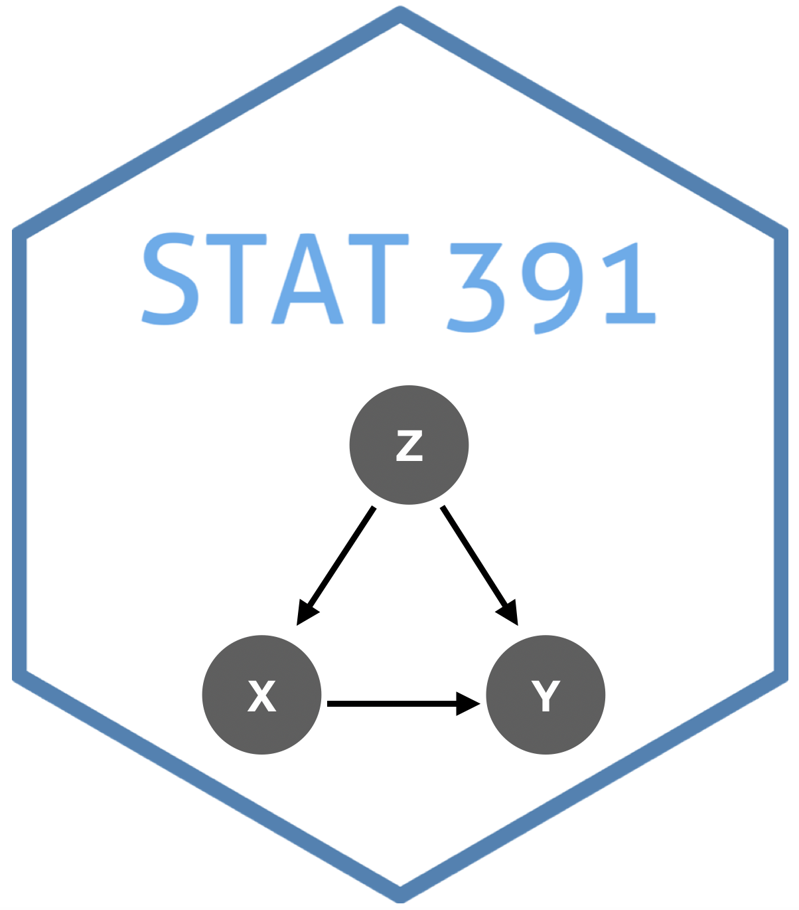

```{r xaringan-themer, include = FALSE}
library(xaringanthemer)
mono_accent(base_color = "#43418A")
```

```{r, include = FALSE}
library(ggdag)
library(tidyverse)

knitr::opts_chunk$set(warning = FALSE, message = FALSE, 
                      echo = TRUE, dpi = 300)
```

# Needed Packages

```{r, eval = FALSE}
library(ggdag)
library(tidyverse)
```

---

# Correlation and Causation

.center[
```{r, echo = FALSE}

```
]

---

# Correlation and Causation

```{r, echo = FALSE, message = FALSE, warning = FALSE}
nobel_chocolate <- read_csv("~/Dropbox/Teaching/03-Simmons Courses/STAT227-Statistical Design and Analysis [ONLINE]/Data/nobel_chocolate.csv")
```

```{r, echo = FALSE, out.width = "45%"}
nobel_chocolate %>%
  ggplot(aes(x = Chocolate, y = Laureates10_million)) + 
  geom_point() + 
  geom_smooth(method = "lm", se = FALSE) +
  labs(x = "Chocolate Consumption, 2017 (kg/year/capita)", 
       y = "Nobel Laureates per 10 million") +
  theme_bw()
```

```{r, echo = FALSE, eval = FALSE}
gf_point(Laureates10_million ~ Chocolate, data = nobel_chocolate) + 
  labs(x = "Chocolate Consumption, 2017 (kg/year/capita)", y = "Nobel Laureates per 10 million")
```

---

# Correlation and Causation

```{r}
lm(Laureates10_million ~ Chocolate, data = nobel_chocolate)
```

For every kilogram of chocolate consumed per year/capita, there is an associated increase of 3.8 Nobel laureates per 10 million, on average!

---

# Correlation and Causation

From *Time*:

.center[
```{r, echo = FALSE, out.width = "70%"}

```
]

> “Obviously, these findings are hypothesis-generating only and will have to be tested in a prospective, randomized trial,” Messerli writes with a wink, noting that the data doesn’t prove that eating chocolate actually causes superior intellectual function. It could be, for instance, that smarter people simply eat more chocolate.

---

# Correlation and Causation

"**Correlation does not imply causation**" is a mantra typically heard throughout statistics courses. 

More technically, this is explained through the **common cause principle** (Reichenbach, 1956):

- If two variables *X* and *Y* are **statistically dependent**, then either: 
    - (a) *X* causes *Y*, 
    - (b) *Y* causes *X*, or 
    - (c) a third variable, *Z* causes both *X* and *Y*. 

--

In the case of (c), we say that *X* and *Y* are **independent** given *Z*.

---

# Which one?

Which part of the **common cause principle** is true?! How can we find out?

- Conduct an **experiment**. 

This is **"easy"**. 

- We just force half the countries represented in the data to eat more chocolate, and see if they end up with more Nobel Laureates! 

--

.center[

]

--

Except... **we can't**. But **causal inference** can help us reach causal conclusions even without an experiment!

---

class: center, middle, frame

# The Causal Hierarchy

---

# The Causal Hierarchy

Pearl (2019) defined a **causal hierarchy** involving three levels:

1. Association
    - **Seeing**; "How would seeing *X* change my belief in *Y*?

2. Intervention
    - **Doing**; "What if I do *X*?"

3. Counterfactuals 
    - **Imagining**; "What if I acted differently?"

---

class: center, middle

# Association: Seeing

---

# Seeing

For the majority of the semester, we have been **seeing**. This is the most basic level of the causal hierarchy. 

- We have seen variables that may or may not be **associated**. 

To illustrate different types of **associations**, we will use the `SAT` dataset from Moodle. Run the following:

```{r, echo = FALSE, message = FALSE}
SAT <- read_csv("~/Dropbox/Teaching/03-Simmons Courses/STAT227-Statistical Design and Analysis/Data/SAT.csv")
```

```{r, eval = FALSE}
View(SAT)
```

```{r, echo = FALSE}
SAT = SAT %>%
  mutate(frac_cat = ifelse(frac < 25, "25% or less", 
                           ifelse(frac < 50, "25% to 50%", "50% or more")))
```

---

# Marginal Association 

.pull-left[
```{r, echo = FALSE, eval = FALSE}
xyplot(sat ~ salary, data = SAT, type = c("p", "r"), 
       xlab = "Average Teacher Salary (in $thousands, by state)", 
       ylab = "Average SAT Score (by state)", 
       pch = 20)
```

```{r, echo = FALSE}
SAT %>%
  ggplot(aes(x = salary, y = sat)) + 
  geom_point() + 
  geom_smooth(method = "lm", se = FALSE) + 
  labs(x = "Average Teacher Salary (in $thousands, by state)", 
       y = "Average SAT Score (by state)") + 
  theme_bw()
```

]

.pull-right[
```{r}
lm_sat1 = lm(sat ~ salary, data = SAT)
summary(lm_sat1)$coef[,c(1,2)]
```

For every 1,000 dollars in salary, there is an associated *decrease* of, on average, 5.54 in SAT score. 
]

---

# Conditional Independence

.pull-left[
```{r, echo = FALSE, eval = FALSE}
xyplot(sat ~ salary, data = SAT, type = c("p", "r"), groups = frac_cat, 
       xlab = "Average Teacher Salary (in $thousands, by state)", 
       ylab = "Average SAT Score (by state)", 
       pch = 20, auto.key = list(title="Fraction of test takers", cex = 1))
```

```{r, echo = FALSE}
SAT %>%
  ggplot(aes(x = salary, y = sat, color = frac_cat)) + 
  geom_point() + 
  geom_smooth(method = "lm", se = FALSE) + 
  labs(x = "Average Teacher Salary (in $thousands, by state)", 
       y = "Average SAT Score (by state)", 
       color = "Percent Test Takers") + 
  theme_bw()
```
]

.pull-right[
```{r}
lm_sat2 = lm(sat ~ salary + frac_cat, data = SAT)
summary(lm_sat2)$coef[,c(1,2)]
```

**For a fixed percentage of test takers**: For every 1,000 dollars in salary, there is an associated *increase* of, on average, 0.783 in SAT score. 
]

---

# Marginal vs. Conditional Association

.pull-left[
```{r, echo = FALSE, eval = FALSE}
xyplot(sat ~ salary, data = SAT, type = c("p", "r"), 
       xlab = "Average Teacher Salary (in $thousands, by state)", 
       ylab = "Average SAT Score (by state)", 
       pch = 20)
```

```{r, echo = FALSE}
SAT %>%
  ggplot(aes(x = salary, y = sat)) + 
  geom_point() + 
  geom_smooth(method = "lm", se = FALSE) + 
  labs(x = "Average Teacher Salary (in $thousands, by state)", 
       y = "Average SAT Score (by state)") + 
  theme_bw()
```


- `salary` (*X*) and `sat` (*Y*) are *negatively* associated. This association is **marginal** because we did not take into account the third variable, `frac_cat` (*Z*). 
]

--

.pull-right[
```{r, echo = FALSE, eval = FALSE}
xyplot(sat ~ salary, data = SAT, type = c("p", "r"), groups = frac_cat, 
       xlab = "Average Teacher Salary (in $thousands, by state)", 
       ylab = "Average SAT Score (by state)", 
       pch = 20, auto.key = list(title="Fraction of test takers", cex = 1))
```

```{r, echo = FALSE}
SAT %>%
  ggplot(aes(x = salary, y = sat, color = frac_cat)) + 
  geom_point() + 
  geom_smooth(method = "lm", se = FALSE) + 
  labs(x = "Average Teacher Salary (in $thousands, by state)", 
       y = "Average SAT Score (by state)", 
       color = "Percent Test Takers") + 
  theme_bw()
```

- When we **condition** on *Z*, we find that there is no longer a strong relationship between *X* and *Y*. 
]

---

# Directed Acyclic Graph (DAGs)

We can visualize the statistical dependencies between different variables by using a **directed acyclic graph (DAG)** 

In the `SAT` example, we found that:

- `salary` and `sat` are **marginally associated**, but...

- `salary` and `sat` are **conditionally independent** *given Z*. 

---

# Marginal Association (DAG)

.pull-left[
```{r, echo = FALSE, eval = FALSE}
xyplot(sat ~ salary, data = SAT, type = c("p", "r"), 
       xlab = "Average Teacher Salary (in $thousands, by state)", 
       ylab = "Average SAT Score (by state)", 
       pch = 20)
```

```{r, echo = FALSE}
SAT %>%
  ggplot(aes(x = salary, y = sat)) + 
  geom_point() + 
  geom_smooth(method = "lm", se = FALSE) + 
  labs(x = "Average Teacher Salary (in $thousands, by state)", 
       y = "Average SAT Score (by state)") + 
  theme_bw()
```
]

.pull-right[
```{r}
dag1 = dagify(sat ~ salary)
ggdag(dag1) + 
  theme_dag()
```
]

---

# Conditional Independence (DAG)

.pull-left[
```{r, echo = FALSE, eval = FALSE}
xyplot(sat ~ salary, data = SAT, type = c("p", "r"), groups = frac_cat, 
       xlab = "Average Teacher Salary (in $thousands, by state)", 
       ylab = "Average SAT Score (by state)", 
       pch = 20, auto.key = list(title="Fraction of test takers", cex = 1))
```

```{r, echo = FALSE}
SAT %>%
  ggplot(aes(x = salary, y = sat, color = frac_cat)) + 
  geom_point() + 
  geom_smooth(method = "lm", se = FALSE) + 
  labs(x = "Average Teacher Salary (in $thousands, by state)", 
       y = "Average SAT Score (by state)", 
       color = "Percent Test Takers") + 
  theme_bw()
```
]

.pull-right[
```{r}
dag2 = dagify(sat ~ frac_cat, 
              salary ~ frac_cat)
ggdag(dag2, text_size = 3) + 
  theme_dag()
```
]

---

# More on DAGs

**DAGs** serve as a relatively simple way to diagram relationships between variables. 

**What is the causal effect of an additional year of education on earnings?**

1. List variables
    - i.e., anything that is relevant: Things that are caused by (or cause) more education

2. Draw arrows

---

# List Variables

.center[
**Education** $\longrightarrow$ **Earnings**
]

- Location (school?)

- Ability (how could we measure this?)

- Demographics/SES

- Birth year/generation

- Connections (*"I know a guy, who knows a guy, who..."*)

**What else?**

---

# Draw Arrows

```{r, eval = FALSE, out.width = "50%"}
dag_earnings = dagify(earnings ~ education)
ggdag(dag_earnings, text_size = 2.5) + 
  theme_dag()
```

```{r, echo = FALSE, out.width = "30%"}

```

**Education (causes?) earnings**

---

# Draw Arrows

```{r, eval = FALSE, out.width = "50%"}
dag_earnings = dagify(earnings ~ education, 
                      education ~ location + school + birth_year + SES)
ggdag(dag_earnings, text_size = 2.5) + 
  theme_dag()
```

```{r, echo = FALSE, out.width = "27%"}

```

**Several things (cause?) education**

---

# Draw Arrows

```{r, eval = FALSE, out.width = "50%"}
dag_earnings = dagify(earnings ~ education, 
                      education ~ location + school + birth_year + SES, 
                      earnings ~ birth_year + SES + location)
ggdag(dag_earnings, text_size = 2.5) + 
  theme_dag()
```

```{r, echo = FALSE, out.width = "27%"}

```

**Several things (cause?) earnings**

---

# Draw Arrows

```{r, eval = FALSE, out.width = "50%"}
dag_earnings = dagify(earnings ~ education + birth_year + SES + location + connections, 
                      education ~ location + school + birth_year + SES, 
                      connections ~ education)
ggdag(dag_earnings, text_size = 2.3) + 
  theme_dag()
```

```{r, echo = FALSE, out.width = "27%"}

```

**Education (probably causes?) connections, which (causes?) earnings**

---

# Draw Arrows

.center[
```{r, echo = FALSE, out.width = "75%"}
knitr::include_graphics("charlie_meme.jpg")
```
]

---

# A (probably) non-causal relationship

**Yearly number of people who drowned by falling in a pool** 
- is *correlated* ( $r=0.67$) with 

**Yearly number of Nicholas Cage films**

.pull-left[
```{r, echo = FALSE, out.width = "75%"}

```
]

.pull-right[
```{r, echo = FALSE, out.width = "75%"}

```
]

*Try to draw a DAG for this relationship!*

---

class: center, middle

# Intervention: Doing

---

# Doing

So far, we have described what we have **seen**. 

- In which direction are variables in a DAG associated?

- Are variables independent? Conditionally independent?

--

Now, let's interpret the arrows in a DAG as having a **causal** meaning. 

- But what is a **causal effect**?

> *Pearl et al.*: A variable *X* has a **causal influence** on *Y* if changing *X* leads to changes in *Y*. 

---

# Causal Effects

> *Pearl et al.*: A variable *X* has a **causal influence** on *Y* if changing *X* leads to changes in *Y*. 

How can we find **causal effects**? It sounds hard! Too many lurking variables/confounders!

**Goal**: Isolate specific effects. 

--

.center[
```{r, echo = FALSE, out.width = "75%"}

```
]

---

# Does eating eggs cause heart disease?

```{r, echo = FALSE, eval = FALSE}
dag_eggs = dagify(heart_dis ~ eggs3)
ggdag(dag_eggs, text_size = 2.7) + 
  theme_dag()
```

.center[
```{r, echo = FALSE, out.width = "35%"}

```
]

But... there is *rarely* a **single path** between *treatment* (eating at least 3 eggs) and *outcome* (heart disease). 

---

# Any backdoor paths?

```{r, echo = FALSE, eval = FALSE}
dag_eggs = dagify(heart_dis ~ eggs3 + activity, 
                  eggs3 ~ activity)
ggdag(dag_eggs, text_size = 2.7) + 
  theme_dag()
```

.center[
```{r, echo = FALSE, out.width = "35%"}

```
]

Any **edge** (i.e., arrow) pointing to `eggs3` and *later* to `heart_dis` is a **backdoor**. 

---

# Closing Backdoors

.pull-left[
```{r, echo = FALSE, out.width = "80%"}

```
]

.pull-right[
To find the *effect* of **eating three eggs a day** on **risk of heart disease**, we need to **close all backdoors**. 


- Find the part of `eggs3` *explained by* `activity`, and **subtract it out**. 

- Find the part of `heart_disease` *explained by* `activity`, and **subtract it out**. 
]

--

Removing differences in individuals **predicted by activity** (i.e., holding activity **constant**) allows us to compare individuals **as if they had the same activity level**. 

---

# How to adjust?

One way to *control* for activity level is to include the term in a regression analysis!<sup>*</sup> $$\widehat{heart.disease}=b_{0}+b_{1}(eggs3)+b_{2}(activity)$$

.footnote[[*] One technically would need a logistic regression model here, since `heart_disease` is categorical (yes or no). Take STAT 229 for details! ]

--

A few other ways to *adjust*:

- **Subclassification**: Generate estimates for different *subgroups*

- **Matching** (see Anthony's dissertation...): Subset data to get *balanced* "treatment" and "control" groups

- **Weighting**: Re-weight sample such that "treatment" is independent of possible confounders

- Combinations of different methods

---

class: center, middle, frame

# Counterfactuals: Imagining

---

# Imagining

.pull-left[
**Should you have taken STAT 227 or not?!**

```{r, echo = FALSE, out.width = "50%"}

```

```{r, echo = FALSE, out.width = "50%"}
knitr::include_graphics("thinking_emoji.jpeg")
```

]

--

.pull-right[
> **Fundamental Problem of Causal Inference** (Holland, 1986): We only ever observe one realization. 

Because you chose to take STAT 227, you cannot *not choose* to take STAT 227. 

- Though humans think this way all the time! We reason **counterfactually**. 
]

---

# Potential Outcome Framework

Let $Y_{i}$ denote your *love for statistics* (on a scale of, say, 1--10). Furthermore, let
$$T_{i}=\begin{cases}1,&\text{if you took STAT 227}\\ 0,&\text{if you did not take STAT 227}\end{cases}$$

--

- The **potential outcome** $Y_{i}(0)$ is individual $i$'s *love for statistics* if they *did not* take STAT 227. 
- The **potential outcome** $Y_{i}(1)$ is individual $i$'s *love for statistics* if they *did* take STAT 227. 

--

Under some *strict assumptions*, an estimate of the **causal effect** of STAT 227 on love for statistics is $$\frac{1}{n}\sum_{i=1}^{n}[Y_{i}(1)-Y_{i}(0)]$$

---

# Fundamental Problem of Causal Inference

**Potential Outcomes**: $Y_{i}(0)$ and $Y_{i}(1)$ for each individual

**Problem**: Only one $Y_{i}$ is observed for each individual! What do we do?
- Take my **special topics course** in the spring!

--

.center[
```{r, echo = FALSE, out.width = "35%"}

```
]


