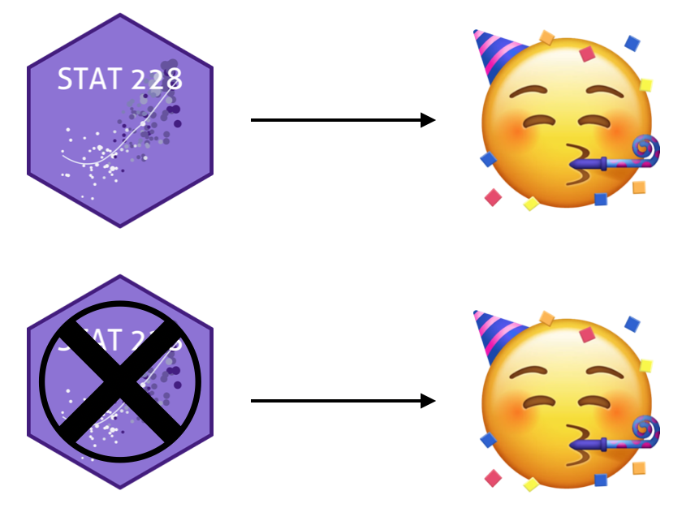
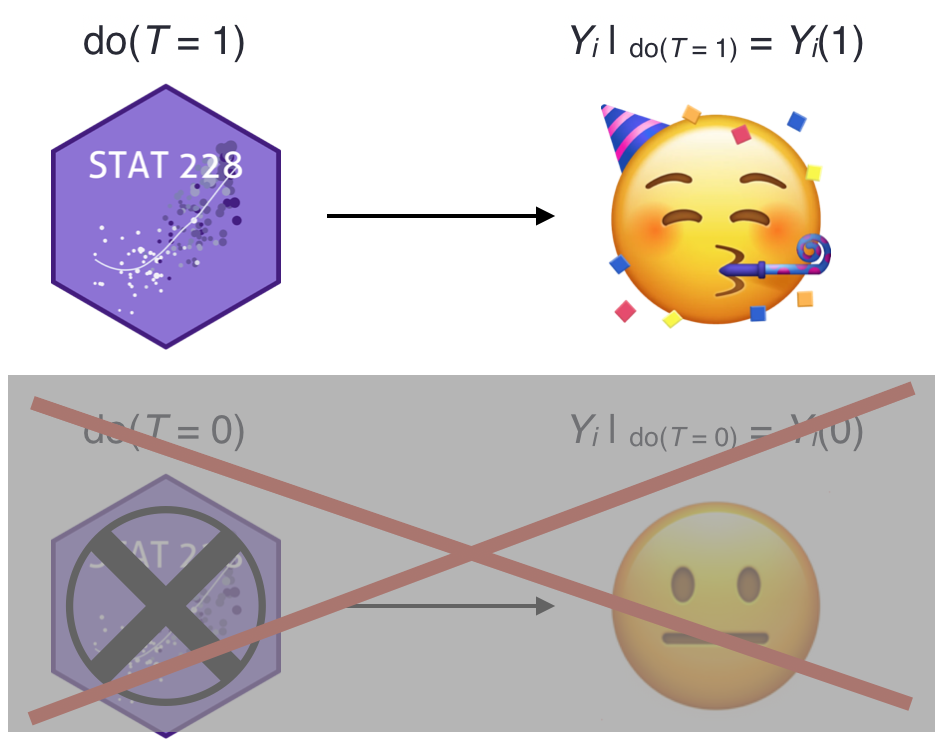
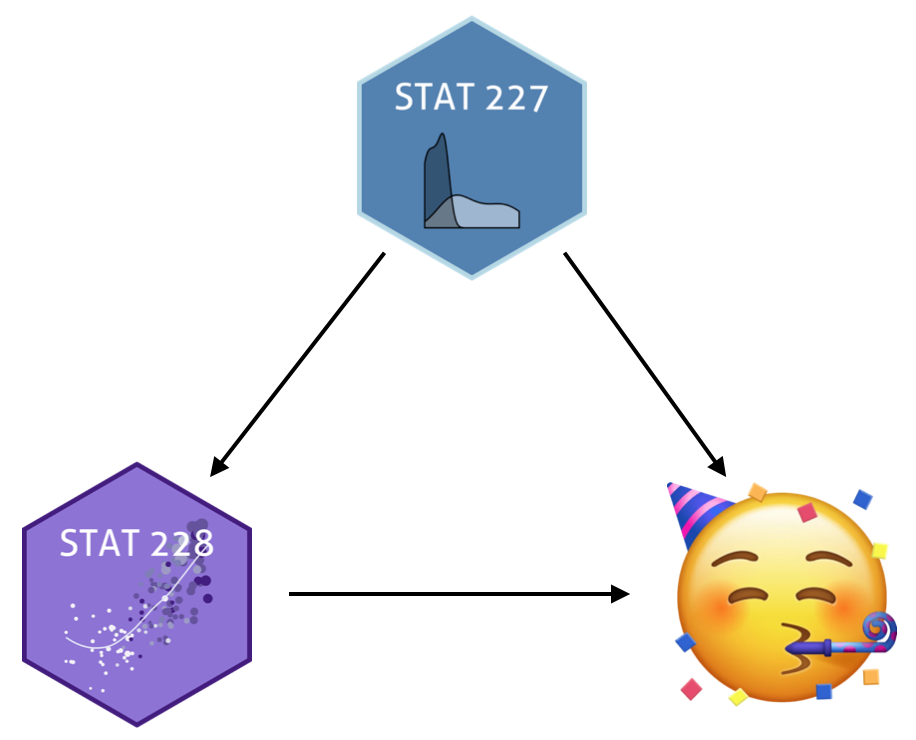
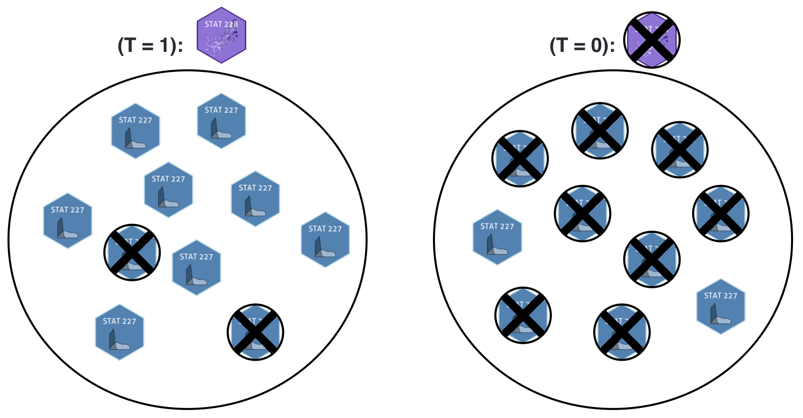
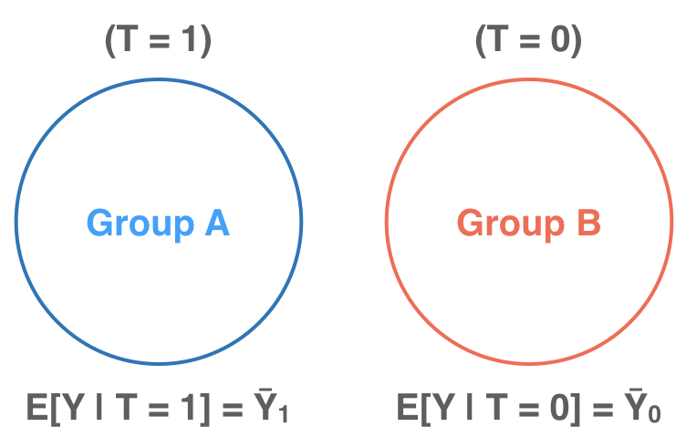
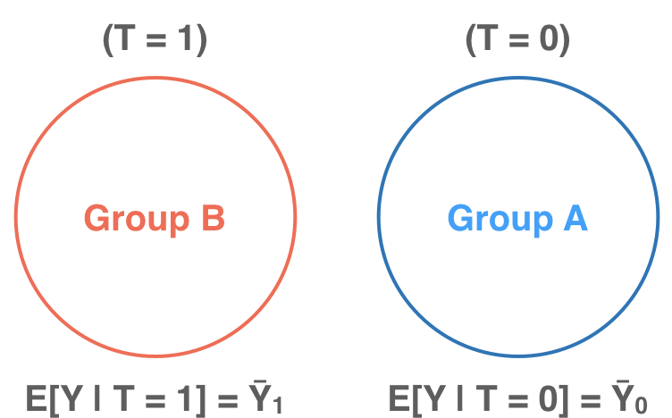
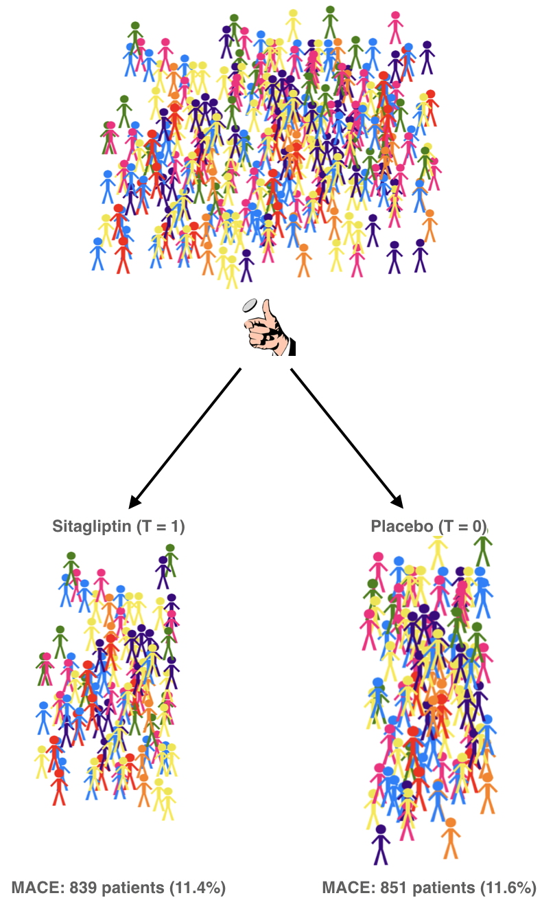

```{r xaringan-themer, include = FALSE}
library(xaringanthemer)
mono_accent(base_color = "#5E5E5E") #3E8A83?
options(htmltools.preserve.raw = FALSE)
```

```{r, include = FALSE}
library(tidyverse)
library(broom)
library(patchwork)
library(ggdag)
library(gt)
library(reactable)
```

```{r, echo = FALSE}
knitr::opts_chunk$set(
  message = FALSE, warning = FALSE
)
```

<!--
pagedown::chrome_print("~/Dropbox/Teaching/03-Simmons Courses/MATH228-Introduction to Data Science/Lecture Slides/01-Introduction/01-Introduction.html")
-->

# What is causal inference?

**Infer**ring **causal** effects of any *treatment*/*policy*/*intervention* (etc.)

--

.center[
```{r, echo = FALSE, dpi = 300, fig.width=9, fig.height=4.5, out.width="100%"}
example_dag = dagify(y ~ x, 
                     labels = c("y" = "Outcome", 
                                "x" = "Intervention"),
                     coords = list(x = c(x = 1, y = 2), 
                                   y = c(x = 1, y = 1)))
ggdag(example_dag, text = FALSE, use_labels = "label", seed = 12) + 
  theme_dag()
```
]

--

- **Effect** of metformin + sulfonylurea on CVD symptoms in T2D patients
- **Effect** of climate change policies on emissions
- **Effect** of coffee on cancer risk

---

class: center, middle, frame

# The Rubin Causal Model

---

# The Rubin Causal Model

.pull-left[
.display2[An approach to causal inference based on *potential outcomes*]

- $[Y(0), Y(1)]$

- $[Y^0, Y^1]$

]

.pull-right[

```{r, echo = FALSE}

```

> [**Donald Rubin**](https://statistics.fas.harvard.edu/people/donald-b-rubin)

]

.center[
## What are potential outcomes?
]

--

[Click: **One of the most important statistical ideas of the past 50 years**](https://statmodeling.stat.columbia.edu/2020/12/09/what-are-the-most-important-statistical-ideas-of-the-past-50-years/)

- According to Andrew Gelman

---

# Potential Outcomes

**Intuition**

*Inferring the (causal) effect of an intervention on some outcome*

.pull-left[
```{r, echo = FALSE, dpi = 250}
knitr::include_graphics("emoji_neutral.png")
```

- *A student, pre-STAT 228*
]

--

.pull-right[
```{r, echo = FALSE, dpi = 250}
knitr::include_graphics("stat228_potential.png")
```

.display2[A causal effect!]
]

---

# Potential Outcomes

**Intuition**

*Inferring the (causal) effect of an intervention on some outcome*

.pull-left[
```{r, echo = FALSE, dpi = 250}
knitr::include_graphics("emoji_neutral.png")
```

- *A student, pre-STAT 228*
]

.pull-right[
```{r, echo = FALSE, dpi = 250}

```

.display1[No causal effect...]
]

---

# Potential Outcomes

.display1[Notation]

.pull-left[
- *T*: observed **treatment** (binary)
    - STAT 228 (1)
    - no STAT 228 (0)

- *Y*: observed **outcome**
    - *Love of statistics* (1-10)

- *i*: denotes *specific observation*
    - Example: $Y_{i}$
]

--

.pull-right[
```{r, echo = FALSE, dpi = 250}
knitr::include_graphics("stat228_do_calc.png")
```
]

--

.display1[More Notation]

- $Y_{i}(1)$: **potential outcome** *conditional on treatment*
- $Y_{i}(0)$: **potential outcome** *conditional on no treatment*

--

.center[
**Causal Effect**: $Y_{i}(1)-Y_{i}(0)$
]

---

# Fundamental Problem of Causal Inference

.center[
```{r, echo = FALSE, dpi = 250}
knitr::include_graphics("emoji_thinking.jpeg")
```
]

--

> [(Holland, 1986)](http://www.cs.columbia.edu/~blei/fogm/2019F/readings/Holland1986.pdf): We only ever observe one realization. 

**If you chose to take STAT 228, you cannot simultaneously *not choose* to take it!**

.pull-left[
```{r, echo = FALSE, dpi = 250}

```
]

--

.pull-right.center[
**Causal Effect**: $Y_{i}(1)-$❓️
]

---

# Potential Outcomes (in a table)

.center[
```{r, echo = FALSE}
po_data = tibble(
  Student = 1:8, 
  Treated = c(TRUE, TRUE, TRUE, FALSE, TRUE, FALSE, FALSE, FALSE), 
  Outcome = c(8, 7.5, 8.5, 6, 7.5, 8, 10, 8), 
  Y1 = c("8", "7.5", "8.5", "?", "7.5", "?", "?", "?"), 
  Y0 = c("?", "?", "?", "6", "?", "8", "10", "8"), 
  delta = c("?", "?", "?", "?", "?", "?", "?", "?")
) %>%
  mutate(`Outcome<br>with treatment` = Y1,
         `Outcome<br>without treatment` = Y0,
         Effect = delta) %>%
  select(-Y1, -Y0, -delta)

po_data %>% 
  gt::gt() %>%
  cols_align(
    align = "center", 
    columns = TRUE
  ) %>%
  tab_style(
    style = list(
      cell_text(color = "red", weight = "bold")
      ),
    locations = cells_body(
      columns = vars(`Outcome<br>with treatment`),
      rows = `Outcome<br>with treatment` != "?")
  ) %>%
  tab_style(
    style = list(
      cell_text(color = "red", weight = "bold")
      ),
    locations = cells_body(
      columns = vars(`Outcome<br>without treatment`),
      rows =`Outcome<br>without treatment` != "?") 
  ) %>%
  tab_style(
    style = list(
      cell_text(color = "red", weight = "bold")
      ),
    locations = cells_body(
      columns = vars(Effect), 
      rows = Effect == "?")
  ) 
```
]

--

- $Y_{i}$: **Outcome** for student *i*
    - $Y_{i}(1)$: **Outcome** with treatment (only *observed* for some)
    - $Y_{i}(0)$: **Outcome** without treatment (only *observed* for some)
    
- $Y_{i}(1)-Y_{i}(0)=$ ❓

---

# Fundamental Problem of Causal Inference

Remember, we can only *observe* $Y_{i}(1)$ if person $i$ actually received the treatment!

- What can we do to estimate a **causal effect**? 🤔🤔🤔

--

.display2[Average Treatment Effect (ATE)]

$$\large\text{ATE}=E[Y(1)-Y(0)]=E[Y(1)]-E[Y(0)]=❓\normalsize$$

.center-small[
```{r, echo = FALSE}
po_data = tibble(
  Student = 1:8, 
  Treated = c(TRUE, TRUE, TRUE, FALSE, TRUE, FALSE, FALSE, FALSE), 
  Outcome = c(8, 7.5, 8.5, 6, 7.5, 8, 10, 8), 
  Y1 = c("8", "7.5", "8.5", "?", "7.5", "?", "?", "?"), 
  Y0 = c("?", "?", "?", "6", "?", "8", "10", "8"), 
  delta = c("?", "?", "?", "?", "?", "?", "?", "?")
) %>%
  mutate(`Outcome<br>with treatment` = Y1,
         `Outcome<br>without treatment` = Y0,
         Effect = delta) %>%
  select(-Y1, -Y0, -delta)

po_data %>% 
  gt::gt() %>%
  cols_align(
    align = "center", 
    columns = TRUE
  ) %>%
  tab_style(
    style = list(
      cell_text(color = "red", weight = "bold")
      ),
    locations = cells_body(
      columns = vars(`Outcome<br>with treatment`),
      rows = `Outcome<br>with treatment` != "?")
  ) %>%
  tab_style(
    style = list(
      cell_text(color = "red", weight = "bold")
      ),
    locations = cells_body(
      columns = vars(`Outcome<br>without treatment`),
      rows =`Outcome<br>without treatment` != "?") 
  ) %>%
  tab_style(
    style = list(
      cell_text(color = "red", weight = "bold")
      ),
    locations = cells_body(
      columns = vars(Effect), 
      rows = Effect == "?")
  ) 
```
]

---

# Average Treatment Effect (ATE)

$$\large\text{ATE}=E[Y(1)-Y(0)]=E[Y(1)]-E[Y(0)]=❓\normalsize$$

.center-small[
```{r, echo = FALSE}
po_data = tibble(
  Student = 1:8, 
  Treated = c(TRUE, TRUE, TRUE, FALSE, TRUE, FALSE, FALSE, FALSE), 
  Outcome = c(8, 7.5, 8.5, 6, 7.5, 8, 10, 8), 
  Y1 = c("8", "7.5", "8.5", "?", "7.5", "?", "?", "?"), 
  Y0 = c("?", "?", "?", "6", "?", "8", "10", "8"), 
  delta = c("?", "?", "?", "?", "?", "?", "?", "?")
) %>%
  mutate(`Outcome<br>with treatment` = Y1,
         `Outcome<br>without treatment` = Y0,
         Effect = delta) %>%
  select(-Y1, -Y0, -delta)

po_data %>% 
  gt::gt() %>%
  cols_align(
    align = "center", 
    columns = TRUE
  ) %>%
  tab_style(
    style = list(
      cell_text(color = "black", weight = "bold"), 
      cell_fill(color = "dodgerblue", alpha = 0.4)
      ),
    locations = cells_body(
      columns = vars(`Outcome<br>with treatment`),
      rows = `Outcome<br>with treatment` != "")
  ) %>%
  tab_style(
    style = list(
      cell_text(color = "black", weight = "bold"), 
      cell_fill(color = "hotpink", alpha = 0.4)
      ),
    locations = cells_body(
      columns = vars(`Outcome<br>without treatment`),
      rows =`Outcome<br>without treatment` != "") 
  ) %>%
  tab_style(
    style = list(
      cell_text(color = "red", weight = "bold")
      ),
    locations = cells_body(
      columns = vars(Effect), 
      rows = Effect == "?") 
  ) 
```
]

- $\color{#418FF7}{E[Y\mid T = 1]=\frac{1}{4}(8+7.5+8.5+7.5)=7.875}$
- $\color{#ED73B2}{E[Y\mid T = 0]=\frac{1}{4}(6+8+10+8)=8}$

--

.center[
## Is the causal effect 7.875 - 8 = -0.125?
]

---

# NO!!!

.pull-left[


]

.pull-right[


]

---

# Average Treatment Effect (ATE)

$$\text{ATE}=E[Y(1)]-E[Y(0)]\boldsymbol\neq E[Y\mid T=1]-E[Y\mid T=0]$$

- $E[Y\mid T=1]-E[Y\mid T=0]$ shows an **associative difference**
    - (a *correlation is not causation* difference...)

.center-small[
```{r, echo = FALSE}
po_data = tibble(
  Student = 1:8, 
  Treated = c(TRUE, TRUE, TRUE, FALSE, TRUE, FALSE, FALSE, FALSE), 
  Outcome = c(8, 7.5, 8.5, 6, 7.5, 8, 10, 8), 
  Y1 = c("8", "7.5", "8.5", "?", "7.5", "?", "?", "?"), 
  Y0 = c("?", "?", "?", "6", "?", "8", "10", "8"), 
  delta = c("?", "?", "?", "?", "?", "?", "?", "?")
) %>%
  mutate(`Outcome<br>with treatment` = Y1,
         `Outcome<br>without treatment` = Y0,
         Effect = delta) %>%
  select(-Y1, -Y0, -delta)

po_data %>% 
  gt::gt() %>%
  cols_align(
    align = "center", 
    columns = TRUE
  ) %>%
  tab_style(
    style = list(
      cell_text(color = "black", weight = "bold"), 
      cell_fill(color = "dodgerblue", alpha = 0.4)
      ),
    locations = cells_body(
      columns = vars(`Outcome<br>with treatment`),
      rows = `Outcome<br>with treatment` != "?")
  ) %>%
  tab_style(
    style = list(
      cell_text(color = "black", weight = "bold"), 
      cell_fill(color = "hotpink", alpha = 0.4)
      ),
    locations = cells_body(
      columns = vars(`Outcome<br>without treatment`),
      rows =`Outcome<br>without treatment` != "?") 
  ) %>%
  tab_style(
    style = list(
      cell_text(color = "red", weight = "bold")
      ),
    locations = cells_body(
      columns = vars(Effect), 
      rows = Effect == "?") 
  ) 
```
]

--

The **observed outcomes**, $Y_{i}$, are *not necessarily* the same as $Y_{i}(1)$ or $Y_{i}(0)$. 

- $Y_{i}$ is only equal to the potential outcome corresponding to the *received treatment*.

---

# Average Treatment Effect (ATE)

Now *let's pretend* we know every potential outcome...

.center-small[
```{r, echo = FALSE}
po_data = tibble(
  Student = 1:8, 
  Treated = c(TRUE, TRUE, TRUE, FALSE, TRUE, FALSE, FALSE, FALSE), 
  Outcome = c(8, 7.5, 8.5, 6, 7.5, 8, 10, 8), 
  Y1 = c("8", "7.5", "8.5", "7", "7.5", "8", "9", "8.5"), 
  Y0 = c("6", "7", "8", "6", "7", "8", "10", "8"), 
  delta = c("2", "0.5", "0.5", "1", "0.5", "0", "-1", "0.5")
) %>%
  mutate(`Outcome<br>with treatment` = Y1,
         `Outcome<br>without treatment` = Y0,
         Effect = delta) %>%
  select(-Y1, -Y0, -Outcome, -delta)

po_data %>% 
  gt::gt() %>%
  cols_align(
    align = "center", 
    columns = TRUE
  ) %>%
  tab_style(
    style = list(
      cell_text(color = "#0174D9", weight = "bold")
      ),
    locations = cells_body(
      columns = vars(`Outcome<br>with treatment`),
      rows = Treated == TRUE)
  ) %>%
  tab_style(
    style = list(
      cell_text(color = "#0174D9", weight = "bold")
      ),
    locations = cells_body(
      columns = vars(`Outcome<br>without treatment`),
      rows = Treated == FALSE) 
  ) %>%
  tab_style(
    style = list(
      cell_text(color = "black", weight = "bold"), 
      cell_fill(color = "chartreuse", alpha = 0.4)
      ),
    locations = cells_body(
      columns = vars(Effect)) 
  ) 
```
]

\begin{align*}
ATE&=E[Y(1)]-E[Y(0)]\\
   &=\frac{2+0.5+0.5+1+0.5+0+(-1)+(0.5)}{8}\\
   &=\boxed{0.5}
\end{align*}

---

# Conditional Average Treatment Effect (CATE)

This is just the **ATE**, but in a *subgroup*. 

.center[
### Is STAT 228 more effective for certain course backgrounds?
]

--

.center-small[
```{r, echo = FALSE}
po_data = tibble(
  Student = 1:8, 
  STAT227 = c("Yes", "Yes", "Yes", "Yes", "No", "No", "No", "No"),
  Treated = c(TRUE, TRUE, TRUE, FALSE, TRUE, FALSE, FALSE, FALSE), 
  Outcome = c(8, 7.5, 8.5, 6, 7.5, 8, 10, 8), 
  Y1 = c("8", "7.5", "8.5", "7", "7.5", "8", "9", "8.5"), 
  Y0 = c("6", "7", "8", "6", "7", "8", "10", "8"), 
  delta = c("2", "0.5", "0.5", "1", "0.5", "0", "-1", "0.5")
) %>%
  mutate(`Outcome<br>with treatment` = Y1,
         `Outcome<br>without treatment` = Y0,
         Effect = delta) %>%
  select(-Y1, -Y0, -Outcome, -delta)

po_data %>% 
  gt::gt() %>%
  cols_align(
    align = "center", 
    columns = TRUE
  ) %>%
  tab_style(
    style = list(
      cell_text(color = "#0174D9", weight = "bold")
      ),
    locations = cells_body(
      columns = vars(`Outcome<br>with treatment`),
      rows = Treated == TRUE)
  ) %>%
  tab_style(
    style = list(
      cell_text(color = "#0174D9", weight = "bold")
      ),
    locations = cells_body(
      columns = vars(`Outcome<br>without treatment`),
      rows = Treated == FALSE) 
  ) %>%
  tab_style(
    style = list(
      cell_text(color = "black", weight = "bold"), 
      cell_fill(color = "chartreuse", alpha = 0.4)
      ),
    locations = cells_body(
      columns = vars(Effect)) 
  ) %>%
  tab_style(
    style = list(
      cell_fill(color = "mediumpurple1", alpha = 0.3)
      ),
    locations = cells_body(
      columns = vars(STAT227)) 
  ) 
```
]

--

$\small CATE_{\text{227}}=E[Y(1)-Y(0)\mid \text{STAT227}=\text{Yes}]=\frac{1}{4}(2+0.5+0.5+1)=\boxed{1}\normalsize$

$\small CATE_{\text{no227}}=E[Y(1)-Y(0)\mid \text{STAT227}=\text{No}]=\frac{1}{4}(0.5+0+(-1)+0.5)=\boxed{0}\normalsize$

---

# ATE on the Treated (ATT)

$$\large\text{ATT}=E[Y(1)-Y(0)\mid T = 1]\normalsize$$

.center[
### Is STAT 228 more effective for those who took STAT 228? 😐
]

--

.center-small[
```{r, echo = FALSE}
po_data = tibble(
  Student = 1:8, 
  STAT227 = c("Yes", "Yes", "Yes", "Yes", "No", "No", "No", "No"),
  Treated = c(TRUE, TRUE, TRUE, FALSE, TRUE, FALSE, FALSE, FALSE), 
  Outcome = c(8, 7.5, 8.5, 6, 7.5, 8, 10, 8), 
  Y1 = c("8", "7.5", "8.5", "7", "7.5", "8", "9", "8.5"), 
  Y0 = c("6", "7", "8", "6", "7", "8", "10", "8"), 
  delta = c("2", "0.5", "0.5", "1", "0.5", "0", "-1", "0.5")
) %>%
  mutate(`Outcome<br>with treatment` = Y1,
         `Outcome<br>without treatment` = Y0,
         Effect = delta) %>%
  select(-Y1, -Y0, -Outcome, -delta)

po_data %>% 
  gt::gt() %>%
  cols_align(
    align = "center", 
    columns = TRUE
  ) %>%
  tab_style(
    style = list(
      cell_text(color = "#0174D9", weight = "bold")
      ),
    locations = cells_body(
      columns = vars(Treated),
      rows = Treated == TRUE) 
  ) %>%
  tab_style(
    style = list(
      cell_text(color = "black", weight = "bold"), 
      cell_fill(color = "chartreuse", alpha = 0.4)
      ),
    locations = cells_body(
      columns = vars(Effect), 
      rows = Treated == TRUE) 
  )
```
]

--

- $\small ATT=E[Y(1)-Y(0)\mid T=1]=\frac{1}{4}(2+0.5+0.5+0.5)=\boxed{0.875}\normalsize$

---

# More on the ATT

.display1[Why might one use the ATT?]

- In some scenarios, we might be more interested in the causal effect of a treatment on the subset of individuals *who actually receive the treatment*!

--

From [Ho et al. (2007)](https://gking.harvard.edu/files/matchp.pdf):

> In our example, this is the average causal effect in districts in which the Democratic Party nominated the incumbent member of the House. From one perspective, we might want to know this treatment effect on the treated (the ATT) since obviously this is the group of districts where the treatment was applied. In other words, the ATT is the effect of the treatment actually applied. Medical studies typically use the ATT as the designated quantity of interest because they often only care about the causal effect of drugs for patients that receive or would receive the drugs. For another example, in job training programs, we are not normally interested in assigning employed people to have this training.  

---

# ATE vs ATT

.center[
### They sound similar, but they aren't always the same!
]

- $\large ATE = E[Y(1) - Y(0)]\normalsize$ 

- $\large ATT = E[Y(1) - Y(0)\mid T = 1]\normalsize$

--

.center[
## ATE = ATT + Treatment Selection Bias
]

If study participants are **randomized** into treatment groups, selection bias is zero. 

---

# Back to the "REAL" Data

.pull-left-small[
```{r, echo = FALSE}
po_data = tibble(
  Student = 1:8, 
  STAT227 = c("Yes", "Yes", "Yes", "Yes", "No", "No", "No", "No"),
  Treated = c(TRUE, TRUE, TRUE, FALSE, TRUE, FALSE, FALSE, FALSE), 
  Outcome = c(8, 7.5, 8.5, 6, 7.5, 8, 10, 8)
) 

po_data %>% 
  gt::gt() %>%
  cols_align(
    align = "center", 
    columns = TRUE
  ) 
```
]

.pull-right[
The **causal effect** is *not* the difference in mean `Outcome` between *treated* and *untreated*!

- Treatment is *not* **randomly assigned**. 

- We cannot see *unit level causal effects* because we cannot observe *both* **potential outcomes** for each unit. 
]

---

# Back to the "REAL" Data

.pull-left-small[
```{r, echo = FALSE}
po_data = tibble(
  Student = 1:8, 
  STAT227 = c("Yes", "Yes", "Yes", "Yes", "No", "No", "No", "No"),
  Treated = c(TRUE, TRUE, TRUE, FALSE, TRUE, FALSE, FALSE, FALSE), 
  Outcome = c(8, 7.5, 8.5, 6, 7.5, 8, 10, 8)
) 

po_data %>% 
  gt::gt() %>%
  cols_align(
    align = "center", 
    columns = TRUE
  ) 
```
]

.pull-right[
### Taking STAT 228 might be correlated with taking STAT 227

```{r, echo = FALSE, dpi = 300}

```
]

--

If **STAT 227** is a *confounder*, that means that those who *took STAT 228* differ from those who *did not take STAT 228* in some key way. 

---

# Confounding

- $\large E[Y(1)]-E[Y(0)]\neq E[Y\mid T = 1] - E[Y\mid T = 0]\normalsize$

.center[
### Why?
]

--

.center[
## The groups aren't comparable!
]

.center[
```{r, echo = FALSE, dpi = 250}

```
]

---

# ATEs in Regression

```{r}
stat228_data = tibble(
  stat227 = c("Yes", "Yes", "Yes", "Yes", "No", "No", "No", "No"), 
  stat228 = c("Yes", "Yes", "Yes", "No", "Yes", "No", "No", "No"), 
  Outcome = c(8, 7.5, 8.5, 6, 7.5, 8, 10, 8)
)
stat228_model = lm(Outcome ~ stat228 + stat227, data = stat228_data)
tidy(stat228_model)
```

$\widehat{Outcome}=8.27+0.417(\text{STAT228})-1.08(\text{STAT227})$

- $\hat{\beta}_{1}=0.417$: **Is this the ATE?**

--

.center[
## It's only one estimate of the ATE!
]

---

class: center, middle, frame

# Some Assumptions

---

# Correlation is not causation!

.center[
```{r, echo = FALSE, dpi = 200}
knitr::include_graphics("meme.jpg")
```
]

.center[
### Except when it is
]

> What assumptions would make the average treatment effect (ATE) EQUAL to the associative difference?

---

# Exchangeability

Also called: .display1[Unconfoundedness], .display2[Ignorability], or .display3[Independence]

$$ \Large [Y(1), Y(0)] \perp T$$

*What does this mean?!* 🤔🤔🤔

> The treatment has been assigned to individuals *independent* of their potential outcomes. Treatment assignment has **nothing to do** with potential benefits of the treatment. 

--

Is your decision to take a class *independent* of any *potential benefits* of the class?

- Probably not...

--

**IF** $[Y(1), Y(0)] \perp T$: 

$$E[Y(1)\mid T = 1] = E[Y(1)\mid T = 0] = E[Y(1)]$$

In this case, **potential outcomes** and **treatment assignment** are independent!

- But *usually*, we can't just take a simple **difference in means** and call it causal!!!

---

# Exchangeability

.center[
```{r, echo = FALSE, dpi = 250}

```
]

---

# Exchangeability

.center[
```{r, echo = FALSE, dpi = 250}

```
]

--

.display2[What this means] 👇

- $E[Y(1)\mid T = 1] = E[Y(1)\mid T = 0] = E[Y(1)]$

- $E[Y(0)\mid T = 0] = E[Y(0)\mid T = 1] = E[Y(0)]$

.display1[What this means] 👇

- Group A's **potential outcomes** for **T = 1** are *equal* to Group B's **potential outcomes** for **T = 1** (on average). 

- Group B's **potential outcomes** for **T = 0** are *equal* to Group A's **potential outcomes** for **T = 0** (on average). 

---

# Conditional Exchangeability

In many studies (e.g., .display1[observational studies]), **exchangeability** does not hold. 

- There is *usually* some reason for treatment selection that could **also** impact the outcome. 

- **Example**: .display2[Taking STAT 227] might be a **common cause** of...
    - **taking STAT 228**
    - an *increase* (😐 hopefully 😐) in **love of statistics**

--

By **controlling** for these common causes (e.g., holding constant in a regression model), we can hope to achieve .display1[conditional exchangeability]: $$ \Large [Y(1), Y(0)] \perp T\mid X$$

> Treatment assignment has **nothing to do** with potential benefits of the treatment, **within levels of the measured variables**.

- Also known as the **no unmeasured confounding** assumption!

---

class: center, middle, frame

# Matching on Covariates

---

# Randomized Controlled Trials (RCTs)

.pull-left[
```{r, echo = FALSE, dpi = 350, out.width = "80%"}

```
]

.pull-right[
.display1[The potential outcomes are **exchangeable**!]

$$[Y(1),Y(0)]\perp T$$
Though RCTs can be .display2[infeasible] for a number of reasons. 

- .display3[Money] 🤑🤑🤑
- .display3[Ethics] 😇
- .display3[Logistics] 📆
- .display3[Restricted Population] 🚫
]

---

# Observational Studies

.pull-left[
```{r, echo = FALSE, dpi = 350, out.width = "80%"}
knitr::include_graphics("obs_study.png")
```
]

.pull-right[
The causal pathway between **treatment** and **outcome** is no longer .display1[identifiable]!

- There exist .display2[confounders] that have associations with *both* the treatment and outcome. 

- .display3[Treatment is not allocated at RANDOM!]
]

---

# R Workshop Observational Study

```{r, echo = FALSE, warning = FALSE}
set.seed(391)
fake_score_t <- tibble(Person = 1:10, 
                       Group = "Treatment",
                       Age = round(c(19, 22, 21, 20, 24, 27, 30, 26, 32, 23), 0),
                       Score = round(c(rnorm(5, mean = 85, sd = 3),
                                       rnorm(5, mean = 95, sd = 3)), 0))
fake_score_c <- tibble(Person = 11:30, 
                       Group = "Control",
                       Age = round(c(19, 22, 25, 27, 32, 20, 30, 21, 24, 26, 
                                     26, 24, 37, 45, 50, 48, 32, 23, 39, 36), 0),
                       Score = round(c(rnorm(10, mean = 83, sd = 3), 
                                       rnorm(10, mean = 93, sd = 3)), 0))

fake_scores <- bind_rows(fake_score_t, fake_score_c) %>% 
  sample_frac(1)
```

.center[
.display2[Does an R workshop cause a STAT test score to increase among employees at a tech company?]

.display1[Snapshot of sample] 👇👇👇
]

.center[
```{r, echo = FALSE, message = FALSE}
fake_scores %>% 
  group_by(Group) %>%
  slice_min(Person, n = 5) %>%
  ungroup() %>%
  gt::gt() %>%
  cols_align(
    align = "center", 
    columns = TRUE
  ) 
```

]

---

# R Workshop Observational Study

.center[
.display2[Does an R workshop cause a STAT test score to increase among employees at a tech company?]

.display1[Snapshot of sample] 👇👇👇
]

.center[
```{r, echo = FALSE, message = FALSE}
fake_scores %>% 
  group_by(Group) %>%
  slice_min(Person, n = 5) %>%
  ungroup() %>%
  rename(Y = Score) %>%
  mutate(`Y(1)` = c("?", "?", "?", "?", "?", "85", "83", "86", "82", "82"), 
         `Y(0)` = c("85", "82", "85", "86", "83", "?", "?", "?", "?", "?"), 
         Effect = c("?", "?", "?", "?", "?", "?", "?", "?", "?", "?")) %>%
  gt::gt() %>%
  cols_align(
    align = "center", 
    columns = TRUE
  ) %>%
  tab_style(
    style = list(
      cell_text(color = "black", weight = "bold"), 
      cell_fill(color = "hotpink", alpha = 0.2)
      ),
    locations = cells_body(
      columns = vars(`Y(1)`),
      rows =`Y(1)` == "?") 
  ) %>%
  tab_style(
    style = list(
      cell_text(color = "black", weight = "bold"), 
      cell_fill(color = "dodgerblue", alpha = 0.2)
      ),
    locations = cells_body(
      columns = vars(`Y(1)`),
      rows =`Y(1)` != "?") 
  ) %>%
  tab_style(
    style = list(
      cell_text(color = "black", weight = "bold"), 
      cell_fill(color = "hotpink", alpha = 0.2)
      ),
    locations = cells_body(
      columns = vars(`Y(0)`),
      rows =`Y(0)` == "?") 
  ) %>%
  tab_style(
    style = list(
      cell_text(color = "black", weight = "bold"), 
      cell_fill(color = "dodgerblue", alpha = 0.2)
      ),
    locations = cells_body(
      columns = vars(`Y(0)`),
      rows =`Y(0)` != "?") 
  )
```

]

---

# R Workshop Observational Study

.center-small[
```{r, echo = FALSE}
fake_scores %>%
  group_by(Group) %>%
  arrange(Person) %>%
  ungroup() %>%
  reactable(showPagination = TRUE, groupBy = "Group", 
            columns = list(
              Age = colDef(aggregate = "mean"), 
              Score = colDef(aggregate = "mean")
            ))
```
]

--

.pull-left[
```{r, message = FALSE}
fake_scores %>%
  group_by(Group) %>%
  summarize(mean_score = mean(Score))
```

```{r}
88.1 - 89.0
```

.center[
😳😳😳
]
]

--

.pull-right[
```{r, echo = FALSE, message=FALSE, fig.dim=c(5.8, 5.2), out.width="100%", dpi = 300}
fake_scores %>%
  ggplot(aes(x = Age, 
             fill = Group)) + 
  geom_density(alpha = 0.3) +
  labs(y = "Density") +
  theme_minimal()
```
]

---

# Is Age confounding?

.pull-left[
```{r, message = FALSE}
fake_scores %>%
  group_by(Group) %>%
  summarize(mean_age = mean(Age))
```
]

.pull-right[
```{r, echo = FALSE, message=FALSE, fig.dim=c(5.8, 5.2), out.width="100%", dpi = 300}
fake_scores %>%
  ggplot(aes(x = Age, y = Score)) + 
  geom_point() +
  geom_smooth() + 
  theme_minimal()
```
]

--

.center[
.display2[Age seems to be associated with both treatment and score.]
]

---

# Where we stand

1. .display1[We have missing *potential outcomes* and therefore cannot obtain unit-level treatment effects.]

2. .display2[*Age* is clearly confounding; it is associated with (i) whether an individual participates in the R Workshop, and (ii) the STAT score (outcome). ]

3. .display3[There is *some overlap* among *age* in both treatment groups. ]

--

<br></br>

We still cannot magically go back in time and generate those missing potential outcomes! 😞

.display1[But...]

- What if we *imputed* the missing potential outcomes by *conditioning on age*? 🤔

---

class: center, middle, frame

# Exact Matching

---

# How does it work?

.display2[Exact matching] works by filling in missing potential outcomes for each **treated individual** using a **control individual** that is "closest" to the treated individual for some *X* confounder(s). 

--

.pull-left[
```{r, echo = FALSE, message = FALSE}
fake_scores %>% 
  filter(Group == "Treatment") %>%
  arrange(Person) %>%
  gt::gt() %>%
  cols_align(
    align = "center", 
    columns = TRUE
  ) %>%
  tab_style(
    style = list(
      cell_text(color = "black", weight = "bold"), 
      cell_fill(color = "hotpink", alpha = 0.2)
      ),
    locations = cells_body(
      columns = vars(Score)
  )) %>%
  tab_style(
    style = list(
      cell_fill(color = "chartreuse", alpha = 0.2)
      ),
    locations = cells_body(
      columns = vars(Age)
  ))
```
]

--

.pull-right[
```{r, echo = FALSE, message = FALSE}
tibble(Person = c("11", "12", "18", "16", "19, 22", "14", "17", "20, 21", "15", "28"), 
       Group = rep("Control", 10), 
       Age = c(19, 22, 21, 20, 24, 27, 30, 26, 32, 23), 
       Score = c(85, 82, 85, 86, 93, 86, 84, 87, 83, 94)) %>%
  gt::gt() %>%
  cols_align(
    align = "center", 
    columns = TRUE
  ) %>%
  tab_style(
    style = list(
      cell_text(color = "black", weight = "bold"), 
      cell_fill(color = "dodgerblue", alpha = 0.2)
      ),
    locations = cells_body(
      columns = vars(Score)
  )) %>%
  tab_style(
    style = list(
      cell_fill(color = "chartreuse", alpha = 0.2)
      ),
    locations = cells_body(
      columns = vars(Age)
  ))
```
]

---

# Covariate Balance

Let's see how the distribution of `age` looks in the **matched** sample:

.center[
```{r, echo = FALSE, dpi = 300, out.width = "60%"}
matched_sample = tibble(Group = c(rep("Treatment", 10), rep("Control", 10)), 
                        Age = c(19, 22, 21, 20, 24, 27, 30, 26, 32, 23, 
                                19, 22, 21, 20, 24, 27, 30, 26, 32, 23)) 
matched_sample %>%
  ggplot(aes(x = Age, fill = Group)) + 
  geom_density(alpha = 0.3) +
  labs(y = "Density") +
  facet_wrap( ~ Group) + 
  theme_minimal() +
  theme(legend.position = "none")
```
]

---

# How does it work?

.center[
```{r, echo = FALSE, message = FALSE}
fake_scores %>% 
  filter(Group == "Treatment") %>%
  arrange(Person) %>%
  rename(Y = Score) %>%
  mutate(`Y(1)` = Y, 
         `Y(0)` = c(85, 82, 85, 86, 93, 86, 84, 87, 83, 94), 
         Effect = `Y(1)` - `Y(0)`) %>%
  gt::gt() %>%
  cols_align(
    align = "center", 
    columns = TRUE
  ) %>%
  tab_style(
    style = list(
      cell_text(color = "black", weight = "bold"), 
      cell_fill(color = "hotpink", alpha = 0.2)
      ),
    locations = cells_body(
      columns = vars(`Y(0)`)) 
  ) %>%
  tab_style(
    style = list(
      cell_text(color = "black", weight = "bold"), 
      cell_fill(color = "dodgerblue", alpha = 0.2)
      ),
    locations = cells_body(
      columns = vars(`Y(1)`)) 
  ) %>%
  tab_style(
    style = list(
      cell_text(color = "black", weight = "bold"), 
      cell_fill(color = "chartreuse", alpha = 0.2)
      ),
    locations = cells_body(
      columns = vars(Effect)) 
  )
```

# ATT (estimated) = 1.6 😎😎😎
]

---

# Some Notes

We just performed .display2[exact matching] to 

- (i) impute missing potential outcomes and 
- (ii) generate an *estimate* of the **ATT** (average treatment effect **on the treated**)

--

Remember, the *treated* individuals still have only one **observed** outcome!. 

- We *imputed* each $Y(0)$ by using the **observed** outcomes of *control* individuals with the **EXACT** same `age` as their match in the treatment group. 

--

By matching on the *confounder* `age`, we have achieved **exact** *covariate balance* on `age`. 

- Conditional on `age`, the two groups are **exchangeable**: $$[Y(1), Y(0)]\perp T\mid X$$

---

# More than one match

But what if a treated individual has .display1[more than one] "closest" match from the control group?

.pull-left[
```{r, echo = FALSE, message = FALSE}
fake_scores %>% 
  filter(Group == "Treatment") %>%
  arrange(Person) %>%
  slice(5) %>%
  gt::gt() %>%
  cols_align(
    align = "center", 
    columns = TRUE
  ) %>%
  tab_style(
    style = list(
      cell_text(color = "black", weight = "bold"), 
      cell_fill(color = "hotpink", alpha = 0.2)
      ),
    locations = cells_body(
      columns = vars(Score)
  )) %>%
  tab_style(
    style = list(
      cell_fill(color = "chartreuse", alpha = 0.2)
      ),
    locations = cells_body(
      columns = vars(Age)
  ))
```
]

.pull-right[
```{r, echo = FALSE, message = FALSE}
fake_scores %>% 
  filter(Group == "Control") %>%
  arrange(Person) %>%
  slice(9, 12) %>% # Persons 19 and 22
  gt::gt() %>%
  cols_align(
    align = "center", 
    columns = TRUE
  ) %>%
  tab_style(
    style = list(
      cell_text(color = "black", weight = "bold"), 
      cell_fill(color = "hotpink", alpha = 0.2)
      ),
    locations = cells_body(
      columns = vars(Score)
  )) %>%
  tab_style(
    style = list(
      cell_fill(color = "chartreuse", alpha = 0.2)
      ),
    locations = cells_body(
      columns = vars(Age)
  ))
```
]

--

.pull-right[
.display2[Take the *average* of the outcomes for the "closest" matches! 👇]

```{r, echo = FALSE, message = FALSE}
tibble(Person = c("11", "12", "18", "16", "19, 22", "14", "17", "20, 21", "15", "28"), 
       Group = rep("Control", 10), 
       Age = c(19, 22, 21, 20, 24, 27, 30, 26, 32, 23), 
       Score = c(85, 82, 85, 86, 93, 86, 84, 87, 83, 94)) %>%
  slice(5) %>%
  gt::gt() %>%
  cols_align(
    align = "center", 
    columns = TRUE
  ) %>%
  tab_style(
    style = list(
      cell_text(color = "black", weight = "bold"), 
      cell_fill(color = "dodgerblue", alpha = 0.2)
      ),
    locations = cells_body(
      columns = vars(Score)
  )) %>%
  tab_style(
    style = list(
      cell_fill(color = "chartreuse", alpha = 0.2)
      ),
    locations = cells_body(
      columns = vars(Age)
  ))
```

]

---

# Recap

We used .display1[exact matching] to create a .display2[matching estimator] to estimate the .display3[ATT] in an *observational study* comparing two treatment groups. 

- In the (fake) study of effects of an R Workshop on a STAT score among tech company employees, `age` was a **confounder**. 

- The two treatment groups were *different* (on `age`) in ways that were likely directly related to their potential outcomes. 

- In the matched sample, the .display1[R Workshop] and .display3[Control] groups were **balanced** on `age`. 

--

We performed .display1[exact matching], so individuals are matched *only if* their covariate values are EQUAL. 

- What if covariate values are *close*, or there are *many* covariates? 🤔

---

class: center, middle, frame

# Approximate Matching

---

# Limitations of Exact Matching

**Exact matching** can break down when we are matching on a *large* number of covariates. 

- It's much less likely for two individuals to be exactly the same on (for example) 10 characteristics, compared to one!

🤔👉 In this case, how can we determine .display1["closeness"] between two individuals to be matched?

--

.pull-left[
```{r, echo = FALSE, message = FALSE}
fake_scores %>% 
  filter(Group == "Treatment") %>%
  arrange(Person) %>%
  slice(5) %>%
  gt::gt() %>%
  cols_align(
    align = "center", 
    columns = TRUE
  ) %>%
  tab_style(
    style = list(
      cell_text(color = "black", weight = "bold"), 
      cell_fill(color = "hotpink", alpha = 0.2)
      ),
    locations = cells_body(
      columns = vars(Score)
  )) %>%
  tab_style(
    style = list(
      cell_fill(color = "chartreuse", alpha = 0.2)
      ),
    locations = cells_body(
      columns = vars(Age)
  ))
```
]

.pull-right[
```{r, echo = FALSE, message = FALSE}
fake_scores %>% 
  filter(Group == "Control") %>%
  arrange(Person) %>%
  slice(3) %>% # Person 13
  gt::gt() %>%
  cols_align(
    align = "center", 
    columns = TRUE
  ) %>%
  tab_style(
    style = list(
      cell_text(color = "black", weight = "bold"), 
      cell_fill(color = "hotpink", alpha = 0.2)
      ),
    locations = cells_body(
      columns = vars(Score)
  )) %>%
  tab_style(
    style = list(
      cell_fill(color = "chartreuse", alpha = 0.2)
      ),
    locations = cells_body(
      columns = vars(Age)
  ))
```
]

<br></br>

.center[
### "Distance" = 25 - 24 = 1
]

---

# Limitations of Exact Matching

**Exact matching** can break down when we are matching on a *large* number of covariates. 

- It's much less likely for two individuals to be exactly the same on (for example) 10 characteristics, compared to one!

🤔👉 In this case, how can we determine .display1["closeness"] between two individuals to be matched?

```{r, echo = FALSE, message = FALSE}
library(scales)
set.seed(391)
n_people <- 1000
r_workshop_scores <- tibble(
  id = 1:n_people, 
  education = round(rescale(rnorm(n_people, mean = 5, sd = 2), to = c(1, 10)), 0), 
  age = round(rnorm(n_people, 40, 5), 0),
  income_base = rbeta(1000, shape1 = 1, shape2 = 5) *100 + 50
) %>%
  mutate(income = rescale(round(income_base + education*7 + age*1 + rnorm(n_people, mean = 0, sd = 1), 2), 
                          to = c(75, 250)),
         intro_stats_score = 1*education + 0.25*income + 0.1*age + rnorm(n_people, mean = 0, sd = 1),
         intro_stats = rbinom(n_people, 1, 
                              rescale(intro_stats_score, to = c(0.05, 0.95))),
         r_workshop_score = (-0.075*income) + (-0.01*education) + (-0.75*intro_stats) + (-0.5*age) + rnorm(n_people, mean = 0, sd = 1), 
         r_workshop_prob = rescale(r_workshop_score, to = c(0.05, 0.95)),
         r_workshop = rbinom(n_people, 1, r_workshop_prob)) %>%
  mutate(score_base = (5*r_workshop) + (0.005*income) + (0.5*education) + (2*intro_stats) + (0.01*age) + rnorm(n_people, mean = 0, sd = 1),
         score = round(rescale(score_base, to = c(75, 100))), 0) %>%
  select(id, r_workshop, intro_stats, education, income, age, score)

set.seed(391)
r_workshop_scores %>%
  rename(ID = id, `R Workshop` = r_workshop, 
         `Intro Stats` = intro_stats, Education = education, 
         Income = income, Age = age, Score = score) %>%
  sample_n(5) %>%
  gt::gt() %>%
  cols_align(
    align = "center", 
    columns = TRUE
  ) %>%
  tab_style(
    style = list(
      cell_text(color = "black", weight = "bold"), 
      cell_fill(color = "hotpink", alpha = 0.2)
      ),
    locations = cells_body(
      columns = vars(Score)
  )) %>%
  tab_style(
    style = list(
      cell_fill(color = "dodgerblue", alpha = 0.2)
      ),
    locations = cells_body(
      columns = vars(`R Workshop`)
  ))
```

.center[
### What is the "distance" now?
]

---

# Nearest-Neighbor Covariate Matching

In .display2[nearest-neighbor matching], we find *untreated* observations that are similar (i.e., **very close**) to *treated* observations based on .display1[confounders]. 

--

There are a lot of fairly technical ways to measure "distance" between **vectors** of covariates. 

- .display1[Euclidean Distance]: $$||X_{i}-X_{j}||=\sqrt{(X_{i}-X_{j})'(X_{i}-X_{j})}$$

- .display2[Mahalanobis Distance]: $$\sqrt{(X_{i}-X_{j})'\boldsymbol\Sigma^{-1}(X_{i}-X_{j})}$$

.center[
🚨🚨🚨 .display3[Don't worry, R will do all of this for us!]
]

---

# MatchIt R package

```{r}
library(MatchIt)
match_model = matchit(r_workshop ~ education + income + age + intro_stats, 
                       data = r_workshop_scores, 
                       method = "nearest",
                       distance = "mahalanobis", 
                       replace = TRUE)
summary(match_model)$sum.all[, 1:4]
```

--

```{r}
summary(match_model)$sum.matched[, 1:4]
```

```{r}
matched_data = match.data(match_model)
```

---

# Finding the Matching Estimator

Once we have the .display2[matched dataset], we could plug this into an `lm()` to see what the ATT is!

```{r}
model_matched_data = lm(score ~ r_workshop, data = matched_data)
tidy(model_matched_data)
```


